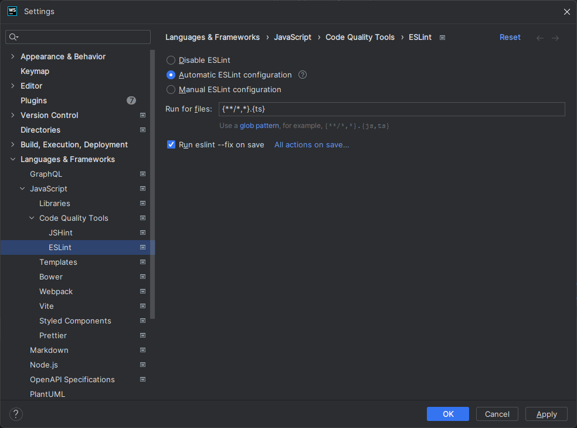
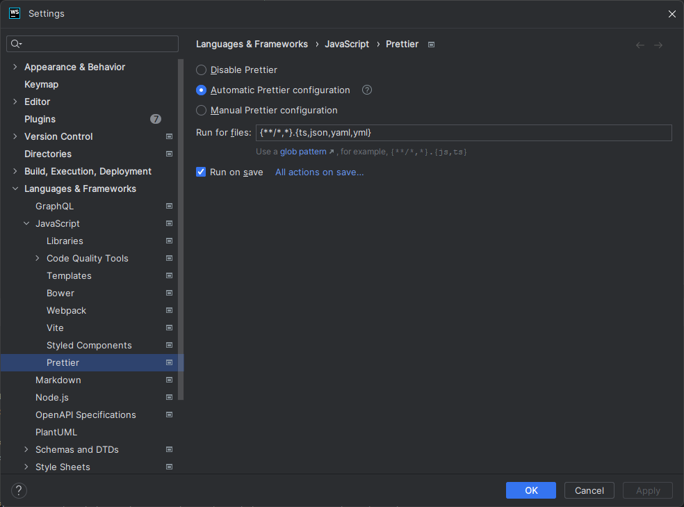

---
tags:
- Contributing
---

# Setup

This document holds instructions on the development setup.

## Node.js

We use [Node.js](https://nodejs.org){target=_blank} version `18.15.0`.
To install node, use [nvm](https://github.com/nvm-sh/nvm){target=_blank} or [nvm-windows](https://github.com/coreybutler/nvm-windows){target=_blank}.

```shell linenums="1"
curl -o- https://raw.githubusercontent.com/nvm-sh/nvm/v0.39.3/install.sh | bash
source ~/.bashrc

nvm install 18.15.0
nvm use 18.15.0
```

## Yarn 

We use [Yarn 2 (Modern)](https://yarnpkg.com/){target=_blank}.
Install it as follows.

```shell linenums="1"
corepack enable
```

## Repository

The repository is a monorepo consisting of the CLI, server, docs, tests, etc.
Clone it as follows.

```shell linenums="1"
git clone https://github.com/opentosca/opentosca-vintner.git
cd opentosca-vintner
git lfs install
git lfs pull
yarn --immutable
```

## Large Files

Larges files, such as binaries or archives used in examples, are added using [git lfs](https://git-lfs.com){target=_blank}.
This includes the file extensions `.bin`, `.gz`, `.tar`, `.zip`, `.xz`, and `.jar`.

## Signed Commits

Commits are required to be signed.
Therefore, register a signing key as follows.

- [Generating a new GPG key](https://docs.github.com/en/authentication/managing-commit-signature-verification/generating-a-new-gpg-key){target=_blank}
- [Adding a GPG key to your GitHub account](https://docs.github.com/en/authentication/managing-commit-signature-verification/adding-a-gpg-key-to-your-github-account){target=_blank}
- [Telling Git About Your Signing Key](https://docs.github.com/en/authentication/managing-commit-signature-verification/telling-git-about-your-signing-key){target=_blank}
- [Signing Commits](https://docs.github.com/en/authentication/managing-commit-signature-verification/signing-commits){target=_blank}

Enable auto-signing inside the repository.

```shell linenums="1"
git config commit.gpgsign true
```

## JetBrains

!!! Warning
    WebStorm Version 2022.3.3 seems to have problems with breakpoints when `src/resolver/graph.ts` is involved.
    However, WebStorm Version 2022.3.2 works fine.

We use [WebStorm](https://www.jetbrains.com/webstorm){target=_blank}, which is [free for students](https://www.jetbrains.com/community/education/#students){target=_blank}.
Install Webstorm using [JetBrains Toolbox](https://www.jetbrains.com/toolbox-app){target=_blank}.

### ESLint

Open the Project Settings using `Ctrl + Alt + S`.
ESLint should be configured as given in the figure below with the following pattern.

```text linenums="1"
{**/*,*}.{ts}
```

<figure markdown>
  {class=figure}
  <figcaption>Figure 1: IntelliJ ESLint Settings</figcaption>
</figure>

### Prettier

Open the Project Settings using `Ctrl + Alt + S`.
Prettier should be configured as given in the figure below with the following pattern.

```text linenums="1"
{**/*,*}.{ts,json,yaml,yml}
```

<figure markdown>
  {class=figure}
  <figcaption>Figure 2: IntelliJ Prettier Settings</figcaption>
</figure>


## Excluded Directories

The following directories should be excluded from search by the IDE.

- `.nyc_output`
- `docs/.venv`
- `build`
- `build-docs`
- `coverage`
- `yarn`
- `dist`
- `node_modules`