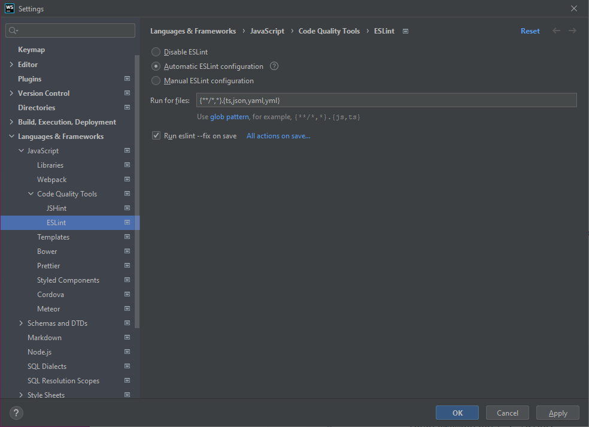
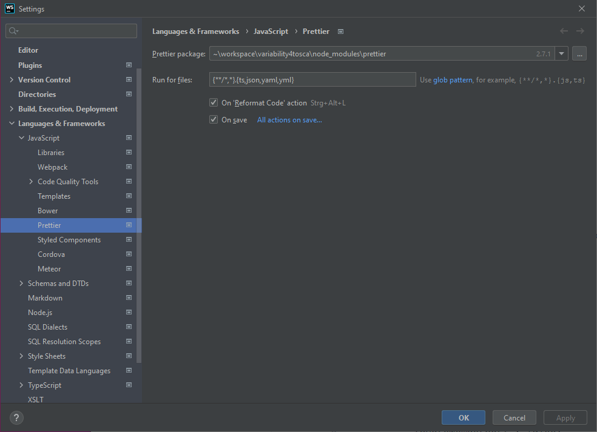

# Development

Contributions are very much welcome.
But please follow the following guidelines and our [Code of Conduct](code-of-conduct.md){target=_blank}.

## Repository

The repository is a monorepo consisting of the CLI, server, docs and tests using the following commands. 
We are using  [Yarn 1 (Classic)](https://classic.yarnpkg.com/lang/en/){target=_blank}.

```shell linenums="1"
git clone https://github.com/opentosca/opentosca-vintner
cd opentosca-vintner
git lfs install
git lfs pull
yarn --frozen-lockfile
```

## Large Files

Larges files, such as binaries or archives used in examples, are added using [git lfs](https://git-lfs.com){target=_blank}.
This includes the following file extensions `.bin`, `.gz`, `.tar`, `.xz`, and `.zip`.

## Branch Naming Convention

Branches should be names as follows

- `fix/short-title` for bug fixes
- `docs/short-title` for documentations
- `feature/short-title` for features
- `refactor/short-title` for refactoring
- `project/short-title` for thesis, EnPro or StuPro

## Squash and Merge

Please squash your commits into a single commit with a short but meaningful message and delete the branch afterwards.
The commit message should not have a link to the merge request.

## Signed Commits

Commits are required to be signed.
Therefore, you need to register a signing key.
For more information see
[Generating a new GPG key](https://docs.github.com/en/authentication/managing-commit-signature-verification/generating-a-new-gpg-key){target=_blank},
[Adding a GPG key to your GitHub account](https://docs.github.com/en/authentication/managing-commit-signature-verification/adding-a-gpg-key-to-your-github-account){target=_blank},
[Telling Git About Your Signing Key](https://docs.github.com/en/authentication/managing-commit-signature-verification/telling-git-about-your-signing-key){target=_blank}
and [Signing Commits](https://docs.github.com/en/authentication/managing-commit-signature-verification/signing-commits){target=_blank}.

You can enable auto-signing for a specific repository with the following command

```shell linenums="1"
git config commit.gpgsign true
```

## JetBrains

!!! Warning
    WebStorm Version 2022.3.3 seems to have problems with breakpoints when `src/resolver/graph.ts` is involved.
    However, WebStorm Version 2022.3.2 works fine.

We recommend to use [IntelliJ IDEA](https://www.jetbrains.com/idea){target=_blank}
or [WebStorm](https://www.jetbrains.com/webstorm){target=_blank} installed
using [JetBrains Toolbox](https://www.jetbrains.com/toolbox-app){target=_blank}.
Both are [for free](https://www.jetbrains.com/community/education/#students){target=_blank} for students.
Open the Project Settings using `Ctrl + Alt + S` to configure ESLint and Prettier.

ESLint should be configured as given in the figure below with the following pattern.

```text linenums="1"
{**/*,*}.{ts}
```

<figure markdown>
  {class=figure}
  <figcaption>Figure 1: IntelliJ ESLint Settings</figcaption>
</figure>

Prettier should be configured as given in the figure below with the following pattern.

```text linenums="1"
{**/*,*}.{ts,json,yaml,yml}
```

<figure markdown>
  {class=figure}
  <figcaption>Figure 2: IntelliJ Prettier Settings</figcaption>
</figure>

## Command Line Interface

!!! Info
    `yarn cli` uses `src/cli/index.ts` while `yarn vintner` uses `build/cli/index.js`.
    Therefore, run `yarn cli` to execute the current code without building it first.

The CLI is build using [commander.js](https://github.com/tj/commander.js){target=_blank}.
The entry point is `src/cli/index.ts`.
To execute a CLI command during development, run

```shell linenums="1"
yarn cli [command] [options]
```

## Server

The server is build using [express](https://github.com/expressjs/express){target=_blank}.
The entry point is `src/server/index.ts`.
To run a development server on [http://localhost:3000](http://localhost:3000){target=_blank} with live-reload, run

```shell linenums="1"
yarn server:serve
```

## Docs

{{ linux_only_notice() }}

The documentation is powered by [Material for MkDocs](https://squidfunk.github.io/mkdocs-material){target=_blank}.
Corresponding files are located in the `docs` directory.
Custom macros are implemented in `docs/macros.py` using [mkdocs-macros](https://mkdocs-macros-plugin.readthedocs.io){target=_blank}.

We expect that Python and [pandoc](https://pandoc.org){target=_blank} is already installed.
To install [pandoc](https://pandoc.org){target=_blank} on Ubuntu you might run

```shell linenums="1"
sudo apt-get install pandoc
```

With the following command you can install `mkdocs-material` along with its requirements globally on your system.

```shell linenums="1"
yarn docs:install
```

To start a local development server on [http://localhost:8000](http://localhost:8000){target=_blank}, run

```shell linenums="1"
yarn docs:serve
```

Once the server is running, run the following command to open the docs in your browser

```shell linenums="1"
yarn docs:open
```

To generate the documentation for the CLI and REST API, run the following command.
This command is also executed during the `release` workflow and, therefore, overwrites respective files.

```shell linenums="1"
yarn docs:generate:interface
```

The documentation is build and published using GitHub Pages on pushes to the `main` branch.

## Autogenerated Markdown

Some Markdown files are autogenerated, e.g., [Dependencies](dependencies.md){target=_blank} or [Interface](interface.md){target=_blank}.
To warn the developer, include the following custom marco at the top of the template

```text linenums="1"

{{ autogenerated_notice('yarn docs:generate:licenses') }}

```

This will render the following warning, if the docs are served using `yarn docs:serve`.

{{ autogenerated_notice('yarn docs:generate:licenses', True) }}

Behind the scenes, the following Markdown is injected.

```text linenums="1"
{{ autogenerated_notice('yarn docs:generate:licenses', True) }}
```

## Casts

{{ linux_only_notice() }}

The docs contain recorded demos. Thereby, we use the following tools

- [asciinema](https://asciinema.org/){target=_blank} to record a terminal session
- [demo-magic](https://github.com/paxtonhare/demo-magic){target=_blank} to automate the terminal session
- [asciinema-player](https://github.com/asciinema/asciinema-player){target=_blank} embed casts in a standalone manner

Casts are not recorded during any workflow.
The following command can be used to record the `home` cast for the landing page

```shell linenums="1"
yarn docs:record:home
```

A cast can be embedded using the custom macro `asciinema_player` as follows inside a Markdown file.

```text linenums="1"

{{ asciinema_player('getting-started') }}

```

This will embed the cast `docs/docs/assets/casts/getting-started.cast` inside the page as follows.

{{ asciinema_player('getting-started') }}

Behind the scenes, the following HTML is injected.

```text linenums="1"
{{ asciinema_player('getting-started') }}
```

## Tests

We use [mocha](https://mochajs.org){target=_blank} and [chai](https://www.chaijs.com){target=_blank} for testing.
Respective tests are inside the `tests` directory.
To run the tests, use

```shell linenums="1"
yarn test
```

To run the tests inside docker, use

```shell linenums="1"
yarn test:docker
```

On pushes to the `main` branch these tests are executed.

## Benchmark

Run the following command, to run to benchmark the variability resolving.

```shell linenums="1"
yarn benchmark
```

## Lint

[ESLint](https://eslint.org){target=_blank} is used for linting.
To lint typescript, run the following command

```shell linenums="1"
yarn lint:check
```

To fix lint problems, run the following command

```shell linenums="1"
yarn lint:fix
```

## Code Style

[Prettier](https://prettier.io){target=_blank} is used to format code.
To check the code style, run the following command

```shell linenums="1"
yarn style:check
```

To fix code style problems, run the following command

```shell linenums="1"
yarn style:fix
```

## Licenses

[license-checker](https://github.com/davglass/license-checker){target=_blank} is used for handling licenses of (
transitive) dependencies.
To check that (transitive) dependencies are licensed as expected, run the following command.
This check is also executed inside workflows.

```shell linenums="1"
yarn licenses:check
```

To generate a list of licenses for all (transitive) dependencies, run the following command

```shell linenums="1"
yarn docs:generate:licenses
```

The list includes information such as package name, version, license, etc. and is written to a CSV file.
At the same time, the [Dependencies](dependencies.md){target=_blank} page is generated.
This command is also executed during the `release` workflow and, therefore, overwrites respective files.

## Patch Packages 

We use [`patch-package`](https://github.com/ds300/patch-package){target=_blank} to fixing third party libraries.
This includes, e.g., the `logic-solver.d.ts` for [`logic-solver`](https://github.com/meteor/logic-solver){target=_blank}.
Therefore, make changes to the package inside `node_modules`, then run the following command.

```
yarn patch-package ${package-name}
```


## Build

To locally build the project, run the following command.
This will transpile Javascript inside the `/build` directory.

```shell linenums="1"
yarn build
```

## Package

{{ linux_only_notice() }}

To locally package the project, run the following command.
This will package the previously transpiled Javascript using [`pkg`](https://github.com/vercel/pkg){target=_blank} and
generate binaries inside the `/dist` directory.

```shell linenums="1"
yarn package
```

Note, the issue considering MiniSat and bytecode generation is known but can be ignored in our case.

## Release

On pushes to the `main` branch, the `release` workflow is triggered.
This workflow runs several tests, builds and packages the project and creates a new release.
Thereby, an existing release and `latest` tag is deleted.
There is only one release at total.
During the workflow the string `__VERSION__` inside a Javascript file is replace with the current commit hash.
The current version can be checked using `vintner --version`.
