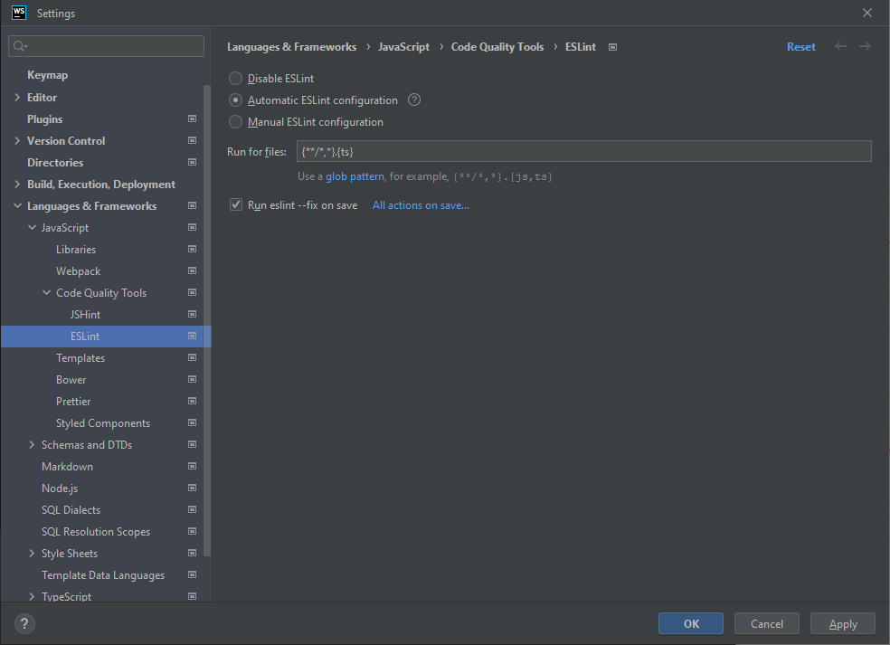

# Development

The repository is a monorepo consisting of the CLI, server, docs and tests.

## Repository

First, clone the repository and install the dependencies.

```
git clone https://github.com/opentosca/opentosca-vintner
cd opentosca-vintner
yarn --frozen-lockfile
```

## JetBrains

We recommend to use [IntelliJ IDEA](https://www.jetbrains.com/idea){target=_blank} or [WebStorm](https://www.jetbrains.com/webstorm){target=_blank} installed using [JetBrains Toolbox](https://www.jetbrains.com/toolbox-app){target=_blank}.
Both are [for free](https://www.jetbrains.com/community/education/#students){target=_blank} for students.
Open the Project Settings using `Ctrl + Alt + A` and configure ESLint and Prettier Settings as given in the figures below with the following pattern.

```
{**/*,*}.{ts,json,yaml,yml}
```

<figure markdown>
  {class=shadow}
  <figcaption>Figure 1: IntelliJ ESLint Settings</figcaption>
</figure>

<figure markdown>
  {class=shadow}
  <figcaption>Figure 2: IntelliJ Prettier Settings</figcaption>
</figure>

## Command Line Interface

!!! Info
    `yarn cli` uses `src/cli/index.ts` while `yarn vintner` uses `build/cli/index.js`.
    Therefore, run `yarn cli` to execute the current code without building it first.

The CLI is build using [commander.js](https://github.com/tj/commander.js){target=_blank}.
The entry point is `src/cli/index.ts`.
To execute a CLI command during development, run

```
yarn cli [command] [options]
```

## Server 

The server is build using [express](https://github.com/expressjs/express){target=_blank}.
The entry point is `src/server/index.ts`.
To run a development server on [http://localhost:3000](http://localhost:3000){target=_blank} with live-reload, run

```
yarn server:serve
```

## Docs

{{ linux_only_notice() }}

The documentation is powered by [Material for MkDocs](https://squidfunk.github.io/mkdocs-material){target=_blank}.
Corresponding files are located in the `docs` directory.
Custom macros are implemented in `docs/macros.py` using [mkdocs-macros](https://mkdocs-macros-plugin.readthedocs.io){target=_blank}.
With the following command you can install `mkdocs-material` along with its requirements globally on your system.
We expect that Python is already installed.

```
yarn docs:install
```

To start a local development server on [http://localhost:8000](http://localhost:8000){target=_blank}, run

```
yarn docs:serve
```

Once the server is running, run the following command to open the docs in your browser

```
yarn docs:open
```

To generate the documentation for the CLI and REST API, run the following command.
This command is also executed during the `release` workflow and, therefore, overwrites respective files.

```
yarn interface:generate
```

The documentation is build and published using GitHub Pages on pushes to the `main` branch.


## Autogenerated Markdown

Some Markdown files are autogenerated, e.g., [Dependencies]({{ fix_url('dependencies') }}){target=_blank} or [Interface]({{ fix_url('interface') }}){target=_blank}.
To warn the developer, include the following custom marco at the top of the template

```

{{ autogenerated_notice('yarn licenses:generate') }}

```

This will render the following warning, if the docs are served using `yarn docs:serve`.

{{ autogenerated_notice('yarn licenses:generate', True) }}

Behind the scenes, the following Markdown is injected.

```
{{ autogenerated_notice('yarn licenses:generate', True) }}
```

## Casts

{{ linux_only_notice() }}

The docs contain recorded demos. Thereby, we use the following tools

-   [asciinema](https://asciinema.org/){target=_blank} to record a terminal session
-   [demo-magic](https://github.com/paxtonhare/demo-magic){target=_blank} to automate the terminal session
-   [asciinema-player](https://github.com/asciinema/asciinema-player){target=_blank} embed casts in a standalone manner

Casts are not recorded during any workflow. 
The following command can be used to record the `home` cast for the landing page

```
yarn record:home
```

A cast can be embedded using the custom macro `asciinema_player` as follows inside a Markdown file.

```

{{ asciinema_player('getting-started') }}

```

This will embed the cast `docs/docs/assets/casts/getting-started.cast` inside the page as follows.

{{ asciinema_player('getting-started') }}

Behind the scenes, the following HTML is injected.

```
{{ asciinema_player('getting-started') }}
```

## Tests

We use [mocha](https://mochajs.org){target=_blank} and [chai](https://www.chaijs.com){target=_blank} for testing.
Respective tests are inside the `tests` directory. 
To run the tests, use

```
yarn test
```

To run the tests inside docker, use
```
yarn test:docker
```

On pushes to the `main` branch these tests are executed.

## Benchmark 

Run the following command, to run to benchmark the variability resolving.

```
yarn benchmark
```

## Lint

[ESLint](https://eslint.org){target=_blank} is used for linting.
To lint typescript, run the following command

```
yarn lint:check
```

To fix lint problems, run the following command

```
yarn lint:fix
```

## Pretty

[Prettier](https://prettier.io){target=_blank} is used to format code.
To prettify typescript, run the following command

```
yarn pretty:check
```

To fix pretty problems, run the following command

```
yarn pretty:fix
```

## Licenses

[license-checker](https://github.com/davglass/license-checker){target=_blank} is used for handling licenses of (transitive) dependencies.
To check that (transitive) dependencies are licensed as expected, run the following command.
This check is also executed inside workflows.

```
yarn licenses:check
```

To generate a list of licenses for all (transitive) dependencies, run the following command

```
yarn licenses:generate
```

The list includes information such as package name, version, license, etc. and is written to a CSV file.
At the same time, the [Dependencies]({{ fix_url('dependencies') }}){target=_blank} page is generated.
This command is also executed during the `release` workflow and, therefore, overwrites respective files.


## Build 

To locally build the project, run the following command. 
This will generate Javascript inside the `/build` directory.

```
yarn build
```

## Package 

{{ linux_only_notice() }}

To locally package the project, run the following command. 
This will package the previously build Javascript using [`pkg`](https://github.com/vercel/pkg){target=_blank} and generate binaries inside the `/dist` directory.

```
yarn package
```

## Release

On pushes to the `main` branch, the `release` workflow is triggered.
This workflow runs several tests, builds and packages the project and creates a new release.
Thereby, an existing release and `latest` tag is deleted. 
There is only one release at total.
During the workflow the string `__VERSION__` inside a Javascript file is replace with the current commit hash.
As a consequence, `vintner --version` returns the commit hash.

