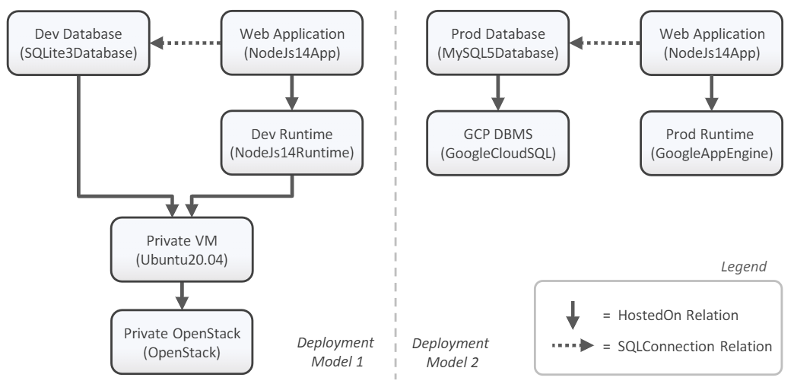

# Motivation Scenario

In the following, we provide a detailed step-by-step tutorial to deploy the development variant of the motivation scenario.

<figure markdown>
  { width="700" }
  <figcaption>Figure 1: Motivation Scenario</figcaption>
</figure>

## Environment

We expect that the following is installed on a Linux machine.

- [x] [xOpera CLI](https://github.com/xlab-si/xopera-opera){target=_blank}
- [x] [Google Cloud CLI](https://cloud.google.com/sdk/gcloud){target=_blank}
- [x] [Ansible Galaxy Collection `openstack.cloud`](https://galaxy.ansible.com/openstack/cloud){target=_blank}

## Preparation

First, install the tool.
For more information see [Installation]({{ fix_url('installation')}}){target=_blank}.

```
wget -q https://github.com/opentosca/opentosca-vintner/releases/download/latest/vintner-linux-x64
mv vintner-linux-x64 /usr/bin/vintner
chmod +x /usr/bin/vintner
vintner setup init
```

## Orchestrator

We currently support xOpera and Unfurl.
Since both can only be installed on Linux, we implemented a WSL integration for both.
In our case, we run on a Linux machine and use xOpera.
For more information see [Installation]({{ fix_url('installation')}}){target=_blank}.

```
vintner orchestrators init opera
vintner orchestrators enable --orchestrator opera
```

## Deployment

Deploy the development variant of the motivation scenario.
Therefore, import the template, create an instance, resolve the variability and finally deploy the application.
An example for the deployment inputs is given in [`examples/opera-motivation/inputs.example.yaml`]({{ get_repo_url('examples/opera-motivation/inputs.example.yaml') }}){target=_blank}

```
# Add variable service template
vintner templates import --template motivation --path motivation

# Add instance
vintner instances create --instance motivation --template motivation

# Resolve variability
vintner instances resolve --instance motivation --preset dev

# (optional) Inspect service template
vintner instances inspect --instance motivation

# Deploy instance
# See examples/opera-motivation/inputs.example.yaml as reference
vintner instances deploy --instance motivation --inputs ${INPUTS_PATH}
```

## Undeployment

Cleanup the deployment.
Therefore, undeploy the instance and cleanup the filesystem.

```
# Undeploy instance
vintner instances undeploy --instance motivation

# Cleanup
vintner setup clean
```
