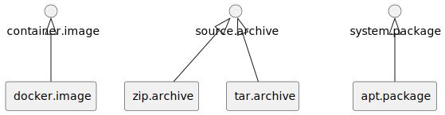
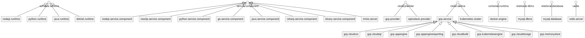

--8<-- "enumerate.html"

# TOSCA Vintner Profile 1.0 Release Candidate

{{ autogenerated_notice('./task docs:generate:normative') }}

This document specifies the TOSCA Vintner profile.
This profile includes normative TOSCA types for the domain of cloud computing.
Standardizing such normative TOSCA types improves interoperability.
The specification is under active development and is not backwards compatible with any previous versions.


## TOSCA Vintner Core Profile

The core normative TOSCA type definitions contain high-level type definitions.


### Metadata

We define the following metadata.

| Metadata | Description |
| --- | --- |
| `vintner_ignore` | Flag for ignoring an entity (type) during generation, e.g., to omit a property from the environment. |
| `vintner_name` | Overrides the original name, e.g., override a property name with its correct environment name. |
| `vintner_generated` | Flag for marking an entity (type) that has been generated. |
| `vintner_orchestrator` | Orchestrator name for which the entity (type) has been generated. |
| `vintner_abstract` | Flag for marking an entity type as abstract. |
| `vintner_normative` | Flag for marking an entity type as normative (considering this specification). |
| `vintner_link` | URL which points, e.g., to the documentation page of the entity type. |


### Artifact Types

We specify the following normative artifact types.
An overview is given in Figure tosca-vintner-profile-core1.

<figure markdown>

<figcaption>Figure C1: TOSCA Vintner Core Artifact Types</figcaption>
</figure>

#### artifact


```yaml linenums="1"
artifact:
    derived_from: tosca.artifacts.Root
    metadata:
        vintner_normative: 'true'
```

#### source.archive

application packaged as archive

```yaml linenums="1"
source.archive:
    derived_from: artifact
    metadata:
        vintner_normative: 'true'
    properties:
        extra_opts:
            type: list
            entry_schema:
                type: string
            required: false
```

#### system.package


```yaml linenums="1"
system.package:
    derived_from: artifact
    metadata:
        vintner_normative: 'true'
    properties:
        script:
            type: string
            required: false
            description: URL of an installation script
        repository:
            type: string
            required: false
            description: name of the repository (required if source is set)
        key:
            type: string
            required: false
            description: URL of the apt key which signs the apt repository (required if source is set)
        source:
            type: string
            required: false
            description: source of the repository
        dependencies:
            type: string
            required: false
            description: Comma separated list of apt packages that are additionally installed
        env:
            type: string
            required: false
            description: Space separated env variables
```

#### container.image

expects image reference in &#34;file&#34;

```yaml linenums="1"
container.image:
    derived_from: artifact
    metadata:
        vintner_normative: 'true'
```

#### machine.image

expects image reference in &#34;file&#34;

```yaml linenums="1"
machine.image:
    derived_from: artifact
    metadata:
        vintner_normative: 'true'
```

### Interface Types

We specify the following normative interface types.
An overview is given in Figure tosca-vintner-profile-core2.

<figure markdown>

<figcaption>Figure C2: TOSCA Vintner Core Interface Types</figcaption>
</figure>

#### interface


```yaml linenums="1"
interface:
    derived_from: tosca.interfaces.Root
    metadata:
        vintner_normative: 'true'
```

#### management


```yaml linenums="1"
management:
    derived_from: interface
    metadata:
        vintner_normative: 'true'
    operations:
        create:
            description: management lifecycle create operation.
        configure:
            description: management lifecycle configure operation.
        start:
            description: management lifecycle start operation.
        stop:
            description: management lifecycle stop operation.
        delete:
            description: management lifecycle delete operation.
```

### Node Types

We specify the following normative node types.
An overview is given in Figure tosca-vintner-profile-core3.

<figure markdown>

<figcaption>Figure C3: TOSCA Vintner Core Node Types</figcaption>
</figure>

#### node


```yaml linenums="1"
node:
    derived_from: tosca.nodes.Root
    metadata:
        vintner_normative: 'true'
        vintner_abstract: 'true'
```

#### cloud.provider


```yaml linenums="1"
cloud.provider:
    derived_from: node
    metadata:
        vintner_normative: 'true'
        vintner_abstract: 'true'
    capabilities:
        host:
            type: tosca.capabilities.Compute
```

#### cloud.service


```yaml linenums="1"
cloud.service:
    derived_from: node
    metadata:
        vintner_normative: 'true'
        vintner_abstract: 'true'
    capabilities:
        host:
            type: tosca.capabilities.Compute
    requirements:
        - host:
              capability: tosca.capabilities.Compute
              relationship: tosca.relationships.HostedOn
```

#### software.application


```yaml linenums="1"
software.application:
    derived_from: node
    metadata:
        vintner_normative: 'true'
        vintner_abstract: 'true'
    properties:
        application_name:
            type: string
    requirements:
        - host:
              capability: tosca.capabilities.Compute
              relationship: tosca.relationships.HostedOn
    interfaces:
        management:
            type: management
```

#### service.application


```yaml linenums="1"
service.application:
    derived_from: software.application
    metadata:
        vintner_normative: 'true'
        vintner_abstract: 'true'
    properties:
        application_language:
            type: string
        application_port:
            type: string
            metadata:
                vintner_name: PORT
        application_protocol:
            type: string
    attributes:
        application_address:
            type: string
        application_endpoint:
            type: string
```

#### software.runtime


```yaml linenums="1"
software.runtime:
    derived_from: software.application
    metadata:
        vintner_normative: 'true'
        vintner_abstract: 'true'
    capabilities:
        host:
            type: tosca.capabilities.Compute
```

#### container.runtime


```yaml linenums="1"
container.runtime:
    derived_from: software.runtime
    metadata:
        vintner_normative: 'true'
        vintner_abstract: 'true'
```

#### virtual.machine


```yaml linenums="1"
virtual.machine:
    derived_from: node
    metadata:
        vintner_normative: 'true'
    properties:
        machine_name:
            type: string
        ports:
            type: list
            entry_schema:
                type: string
        flavor:
            type: string
            default: m1.medium
        network:
            type: string
        ssh_user:
            type: string
        ssh_key_name:
            type: string
        ssh_key_file:
            type: string
    attributes:
        management_address:
            type: string
        application_address:
            type: string
    capabilities:
        host:
            type: tosca.capabilities.Compute
```

#### physical.machine


```yaml linenums="1"
physical.machine:
    derived_from: node
    metadata:
        vintner_normative: 'true'
    properties:
        machine_name:
            type: string
        ports:
            type: list
            entry_schema:
                type: string
        flavor:
            type: string
            default: m1.medium
        network:
            type: string
        ssh_user:
            type: string
        ssh_key_name:
            type: string
        ssh_key_file:
            type: string
    attributes:
        management_address:
            type: string
        application_address:
            type: string
    capabilities:
        host:
            type: tosca.capabilities.Compute
```

#### database


```yaml linenums="1"
database:
    derived_from: node
    metadata:
        vintner_normative: 'true'
        vintner_abstract: 'true'
```

#### relational.database


```yaml linenums="1"
relational.database:
    derived_from: database
    metadata:
        vintner_normative: 'true'
        vintner_abstract: 'true'
```

#### dbms


```yaml linenums="1"
dbms:
    derived_from: software.application
    metadata:
        vintner_normative: 'true'
        vintner_abstract: 'true'
```

#### relational.dbms


```yaml linenums="1"
relational.dbms:
    derived_from: dbms
    metadata:
        vintner_normative: 'true'
        vintner_abstract: 'true'
```

#### ingress


```yaml linenums="1"
ingress:
    derived_from: node
    metadata:
        vintner_normative: 'true'
    properties:
        application_name:
            type: string
        application_port:
            type: string
        application_protocol:
            type: string
    attributes:
        application_address:
            type: string
    requirements:
        - application:
              capability: tosca.capabilities.Endpoint
              relationship: tosca.relationships.ConnectsTo
        - host:
              capability: tosca.capabilities.Compute
              relationship: tosca.relationships.HostedOn
```


## TOSCA Vintner Extended Profile

The extended normative TOSCA type definitions contain additional provider-specific type definitions which are derived from the core type definitions.


### Artifact Types

We specify the following normative artifact types.
An overview is given in Figure tosca-vintner-profile-extended1.

<figure markdown>

<figcaption>Figure E1:  Artifact Types</figcaption>
</figure>

#### docker.image

expects image reference in &#34;file&#34;

```yaml linenums="1"
docker.image:
    derived_from: container.image
    metadata:
        vintner_normative: 'true'
```

#### zip.archive


```yaml linenums="1"
zip.archive:
    derived_from: source.archive
    metadata:
        vintner_normative: 'true'
```

#### tar.archive


```yaml linenums="1"
tar.archive:
    derived_from: source.archive
    metadata:
        vintner_normative: 'true'
```

#### apt.package


```yaml linenums="1"
apt.package:
    derived_from: system.package
    metadata:
        vintner_normative: 'true'
    properties:
        script:
            type: string
            required: false
            description: URL of an installation script
        repository:
            type: string
            required: false
            description: name of the repository (required if source is set)
        key:
            type: string
            required: false
            description: URL of the apt key which signs the apt repository (required if source is set)
        source:
            type: string
            required: false
            description: source of the repository
        dependencies:
            type: string
            required: false
            description: Comma separated list of apt packages that are additionally installed
        env:
            type: string
            required: false
            description: Space separated env variables
```

### Node Types

We specify the following normative node types.
An overview is given in Figure tosca-vintner-profile-extended2.

<figure markdown>

<figcaption>Figure E2:  Node Types</figcaption>
</figure>

#### nodejs.runtime


```yaml linenums="1"
nodejs.runtime:
    derived_from: software.runtime
    metadata:
        vintner_normative: 'true'
    properties:
        application_name:
            type: string
            default: nodejs
    artifacts:
        apt_package:
            type: apt.package
            file: nodejs
            properties:
                script: https://deb.nodesource.com/setup_18.x
    attributes:
        management_address:
            type: string
    capabilities:
        host:
            type: tosca.capabilities.Compute
```

#### nodejs.service.application


```yaml linenums="1"
nodejs.service.application:
    derived_from: service.application
    metadata:
        vintner_normative: 'true'
        vintner_abstract: 'true'
    properties:
        application_language:
            type: string
            default: nodejs18
    interfaces:
        management:
            type: management
            operations:
                configure: npm ci
                start: npm start
```

#### python.runtime


```yaml linenums="1"
python.runtime:
    derived_from: software.runtime
    metadata:
        vintner_normative: 'true'
    artifacts:
        apt_package:
            type: apt.package
            file: python-is-python3
            properties:
                dependencies:
                    type: string
                    default: python3 python3-pip python3-venv
    attributes:
        management_address:
            type: string
    capabilities:
        host:
            type: tosca.capabilities.Compute
```

#### python.service.application


```yaml linenums="1"
python.service.application:
    derived_from: service.application
    metadata:
        vintner_normative: 'true'
        vintner_abstract: 'true'
    properties:
        application_language:
            type: string
            default: python3
    interfaces:
        management:
            type: management
            operations:
                configure: pip install -r requirements.txt
                start: python main.py
```

#### go.service.application


```yaml linenums="1"
go.service.application:
    derived_from: service.application
    metadata:
        vintner_normative: 'true'
        vintner_abstract: 'true'
    properties:
        application_language:
            type: string
            default: go122
```

#### java.runtime


```yaml linenums="1"
java.runtime:
    derived_from: software.runtime
    metadata:
        vintner_normative: 'true'
    properties:
        application_name:
            type: string
            default: java
    artifacts:
        apt_package:
            type: apt.package
            file: openjdk-18-jre-headless
    attributes:
        management_address:
            type: string
    capabilities:
        host:
            type: tosca.capabilities.Compute
```

#### java.service.application


```yaml linenums="1"
java.service.application:
    derived_from: service.application
    metadata:
        vintner_normative: 'true'
        vintner_abstract: 'true'
    properties:
        application_language:
            type: string
            default: java21
```

#### dotnet.runtime


```yaml linenums="1"
dotnet.runtime:
    derived_from: software.runtime
    metadata:
        vintner_normative: 'true'
    properties:
        application_name:
            type: string
            default: java
    artifacts:
        apt_package:
            type: apt.package
            file: dotnet-sdk-8.0
    attributes:
        management_address:
            type: string
    capabilities:
        host:
            type: tosca.capabilities.Compute
```

#### csharp.service.application


```yaml linenums="1"
csharp.service.application:
    derived_from: service.application
    metadata:
        vintner_normative: 'true'
        vintner_abstract: 'true'
    properties:
        application_language:
            type: string
            default: dotnet8
```

#### binary.service.application


```yaml linenums="1"
binary.service.application:
    derived_from: service.application
    metadata:
        vintner_normative: 'true'
        vintner_abstract: 'true'
    properties:
        application_language:
            type: string
            default: binary
```

#### gcp.provider


```yaml linenums="1"
gcp.provider:
    derived_from: cloud.provider
    metadata:
        vintner_normative: 'true'
        vintner_abstract: 'true'
    properties:
        _hosting:
            type: string
            default: gcp
        gcp_region:
            type: string
        gcp_service_account_file:
            type: string
        gcp_project:
            type: string
    interfaces:
        Standard:
            operations:
                create: exit 0
                delete: exit 0
```

#### gcp.service


```yaml linenums="1"
gcp.service:
    derived_from: cloud.service
    metadata:
        vintner_normative: 'true'
        vintner_abstract: 'true'
    properties:
        _hosting:
            type: string
            default: gcp
        gcp_service:
            type: string
```

#### gcp.cloudrun


```yaml linenums="1"
gcp.cloudrun:
    derived_from: gcp.service
    metadata:
        vintner_normative: 'true'
    properties:
        gcp_service:
            type: string
            default: run.googleapis.com
```

#### gcp.cloudsql


```yaml linenums="1"
gcp.cloudsql:
    derived_from: gcp.service
    metadata:
        vintner_normative: 'true'
    properties:
        gcp_service:
            type: string
            default: sqladmin.googleapis.com
```

#### gcp.appengine


```yaml linenums="1"
gcp.appengine:
    derived_from: gcp.service
    metadata:
        vintner_normative: 'true'
    properties:
        gcp_service:
            type: string
            default: appengine.googleapis.com
    requirements:
        - build:
              capability: tosca.capabilities.Root
              relationship: tosca.relationships.DependsOn
        - reporting:
              capability: tosca.capabilities.Root
              relationship: tosca.relationships.DependsOn
```

#### gcp.appenginereporting


```yaml linenums="1"
gcp.appenginereporting:
    derived_from: gcp.service
    metadata:
        vintner_normative: 'true'
    properties:
        gcp_service:
            type: string
            default: appenginereporting.googleapis.com
```

#### gcp.cloudbuild


```yaml linenums="1"
gcp.cloudbuild:
    derived_from: gcp.service
    metadata:
        vintner_normative: 'true'
    properties:
        gcp_service:
            type: string
            default: cloudbuild.googleapis.com
```

#### docker.engine


```yaml linenums="1"
docker.engine:
    derived_from: container.runtime
    metadata:
        vintner_normative: 'true'
    properties:
        application_name:
            type: string
            default: docker
        _hosting:
            type: string
            default: docker
    attributes:
        management_address:
            type: string
    capabilities:
        host:
            type: tosca.capabilities.Compute
```

#### kubernetes.cluster


```yaml linenums="1"
kubernetes.cluster:
    derived_from: cloud.service
    metadata:
        vintner_normative: 'true'
        vintner_abstract: 'true'
    properties:
        _hosting:
            type: string
            default: kubernetes
        k8s_host:
            type: string
        k8s_ca_cert_file:
            type: string
        k8s_client_cert_file:
            type: string
        k8s_client_key_file:
            type: string
    capabilities:
        host:
            type: tosca.capabilities.Compute
    interfaces:
        Standard:
            operations:
                create: exit 0
                delete: exit 0
```

#### openstack.provider


```yaml linenums="1"
openstack.provider:
    derived_from: cloud.provider
    metadata:
        vintner_normative: 'true'
        vintner_abstract: 'true'
    properties:
        _hosting:
            type: string
            default: openstack
        os_region_name:
            type: string
        os_auth_type:
            type: string
        os_auth_url:
            type: string
        os_identity_api_version:
            type: string
        os_interface:
            type: string
        os_application_credential_id:
            type: string
        os_application_credential_secret:
            type: string
    interfaces:
        Standard:
            operations:
                create: exit 0
                delete: exit 0
```

#### mysql.dbms


```yaml linenums="1"
mysql.dbms:
    derived_from: relational.dbms
    metadata:
        vintner_normative: 'true'
    properties:
        dbms_name:
            type: string
        application_name:
            type: string
        dbms_version:
            type: string
            default: '5.7'
        dbms_password:
            type: string
        dbms_ssl_mode:
            type: string
            default: None
    attributes:
        application_address:
            type: string
        application_port:
            type: string
        management_address:
            type: string
        management_port:
            type: string
    capabilities:
        host:
            type: tosca.capabilities.Compute
    requirements:
        - host:
              capability: tosca.capabilities.Compute
              relationship: tosca.relationships.HostedOn
```

#### mysql.database


```yaml linenums="1"
mysql.database:
    derived_from: relational.database
    metadata:
        vintner_normative: 'true'
    properties:
        database_name:
            type: string
        database_user:
            type: string
        database_password:
            type: string
    attributes:
        application_address:
            type: string
        application_port:
            type: string
    capabilities:
        database:
            type: tosca.capabilities.Endpoint.Database
    requirements:
        - host:
              capability: tosca.capabilities.Compute
              relationship: tosca.relationships.HostedOn
```


## Appendix A "TOSCA Vintner Profile"

This appendix contains the TOSCA Vintner profile.
The profile is also available as [download](tosca-vintner-profile.yaml){download=tosca-vintner-profile.yaml}.

```yaml linenums="1"
--8<-- "normative/tosca-vintner-profile.yaml"
```

## Appendix B "TOSCA Vintner Core Profile"

This appendix contains the TOSCA Vintner Core profile.
The profile is also available as [download](tosca-vintner-profile-core.yaml){download=tosca-vintner-profile-core.yaml}.

```yaml linenums="1"
--8<-- "normative/tosca-vintner-profile-core.yaml"
```

## Appendix C "TOSCA Vintner Extended Profile"

This appendix contains the TOSCA Vintner Extended profile.
The profile is also available as [download](tosca-vintner-profile-extended.yaml){download=tosca-vintner-profile-extended.yaml}.

```yaml linenums="1"
--8<-- "normative/tosca-vintner-profile-extended.yaml"
```

--8<-- "acd.md"
