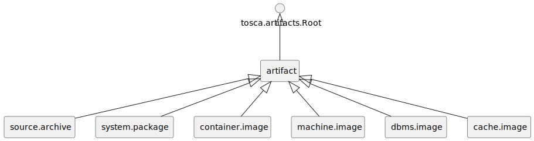
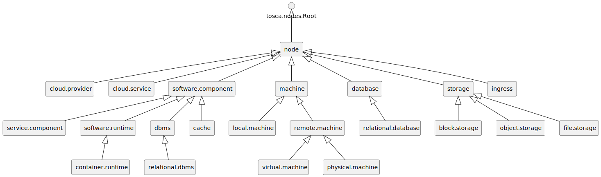

### Artifact Types

We specify the following normative artifact types.
An overview is given in Figure c1.

<figure markdown>

<figcaption>Figure c1:  Artifact Types</figcaption>
</figure>

#### artifact


```yaml linenums="1"
artifact:
    derived_from: tosca.artifacts.Root
    metadata:
        vintner_normative: 'true'
```

#### source.archive

application packaged as archive

```yaml linenums="1"
source.archive:
    derived_from: artifact
    metadata:
        vintner_normative: 'true'
    properties:
        extra_opts:
            type: list
            entry_schema:
                type: string
            required: false
```

#### system.package


```yaml linenums="1"
system.package:
    derived_from: artifact
    metadata:
        vintner_normative: 'true'
    properties:
        script:
            type: string
            required: false
            description: URL of an installation script
        repository:
            type: string
            required: false
            description: name of the repository (required if source is set)
        key:
            type: string
            required: false
            description: URL of the apt key which signs the apt repository (required if source is set)
        source:
            type: string
            required: false
            description: source of the repository
        dependencies:
            type: string
            required: false
            description: Comma separated list of apt packages that are additionally installed
        env:
            type: string
            required: false
            description: Space separated env variables
```

#### container.image

expects image reference in &#34;file&#34;

```yaml linenums="1"
container.image:
    derived_from: artifact
    metadata:
        vintner_normative: 'true'
```

#### machine.image

expects image reference in &#34;file&#34;

```yaml linenums="1"
machine.image:
    derived_from: artifact
    metadata:
        vintner_normative: 'true'
```

### Interface Types

We specify the following normative interface types.
An overview is given in Figure c2.

<figure markdown>

<figcaption>Figure c2:  Interface Types</figcaption>
</figure>

#### interface


```yaml linenums="1"
interface:
    derived_from: tosca.interfaces.Root
    metadata:
        vintner_normative: 'true'
```

#### management


```yaml linenums="1"
management:
    derived_from: interface
    metadata:
        vintner_normative: 'true'
    operations:
        create:
        configure:
        start:
        stop:
        delete:
```

### Node Types

We specify the following normative node types.
An overview is given in Figure c3.

<figure markdown>

<figcaption>Figure c3:  Node Types</figcaption>
</figure>

#### node


```yaml linenums="1"
node:
    derived_from: tosca.nodes.Root
    metadata:
        vintner_normative: 'true'
        vintner_abstract: 'true'
```

#### cloud.provider


```yaml linenums="1"
cloud.provider:
    derived_from: node
    metadata:
        vintner_normative: 'true'
        vintner_abstract: 'true'
    capabilities:
        host:
            type: tosca.capabilities.Compute
```

#### cloud.service


```yaml linenums="1"
cloud.service:
    derived_from: node
    metadata:
        vintner_normative: 'true'
        vintner_abstract: 'true'
    capabilities:
        host:
            type: tosca.capabilities.Compute
    requirements:
        - host:
              capability: tosca.capabilities.Compute
              relationship: tosca.relationships.HostedOn
```

#### software.application


```yaml linenums="1"
software.application:
    derived_from: node
    metadata:
        vintner_normative: 'true'
        vintner_abstract: 'true'
    properties:
        application_name:
            type: string
    requirements:
        - host:
              capability: tosca.capabilities.Compute
              relationship: tosca.relationships.HostedOn
    interfaces:
        management:
            type: management
```

#### service.application


```yaml linenums="1"
service.application:
    derived_from: software.application
    metadata:
        vintner_normative: 'true'
        vintner_abstract: 'true'
    properties:
        application_language:
            type: string
        application_port:
            type: string
            metadata:
                vintner_name: PORT
        application_protocol:
            type: string
    attributes:
        application_address:
            type: string
        application_endpoint:
            type: string
```

#### software.runtime


```yaml linenums="1"
software.runtime:
    derived_from: software.application
    metadata:
        vintner_normative: 'true'
        vintner_abstract: 'true'
    capabilities:
        host:
            type: tosca.capabilities.Compute
```

#### container.runtime


```yaml linenums="1"
container.runtime:
    derived_from: software.runtime
    metadata:
        vintner_normative: 'true'
        vintner_abstract: 'true'
```

#### virtual.machine


```yaml linenums="1"
virtual.machine:
    derived_from: node
    metadata:
        vintner_normative: 'true'
    properties:
        machine_name:
            type: string
        ports:
            type: list
            entry_schema:
                type: string
        flavor:
            type: string
            default: m1.medium
        network:
            type: string
        ssh_user:
            type: string
        ssh_key_name:
            type: string
        ssh_key_file:
            type: string
    attributes:
        management_address:
            type: string
        application_address:
            type: string
    capabilities:
        host:
            type: tosca.capabilities.Compute
```

#### physical.machine


```yaml linenums="1"
physical.machine:
    derived_from: node
    metadata:
        vintner_normative: 'true'
    properties:
        machine_name:
            type: string
        ports:
            type: list
            entry_schema:
                type: string
        flavor:
            type: string
            default: m1.medium
        network:
            type: string
        ssh_user:
            type: string
        ssh_key_name:
            type: string
        ssh_key_file:
            type: string
    attributes:
        management_address:
            type: string
        application_address:
            type: string
    capabilities:
        host:
            type: tosca.capabilities.Compute
```

#### database


```yaml linenums="1"
database:
    derived_from: node
    metadata:
        vintner_normative: 'true'
        vintner_abstract: 'true'
```

#### relational.database


```yaml linenums="1"
relational.database:
    derived_from: database
    metadata:
        vintner_normative: 'true'
        vintner_abstract: 'true'
```

#### dbms


```yaml linenums="1"
dbms:
    derived_from: software.application
    metadata:
        vintner_normative: 'true'
        vintner_abstract: 'true'
```

#### relational.dbms


```yaml linenums="1"
relational.dbms:
    derived_from: dbms
    metadata:
        vintner_normative: 'true'
        vintner_abstract: 'true'
```

#### ingress


```yaml linenums="1"
ingress:
    derived_from: node
    metadata:
        vintner_normative: 'true'
    properties:
        application_name:
            type: string
        application_port:
            type: string
        application_protocol:
            type: string
    attributes:
        application_address:
            type: string
    requirements:
        - application:
              capability: tosca.capabilities.Endpoint
              relationship: tosca.relationships.ConnectsTo
        - host:
              capability: tosca.capabilities.Compute
              relationship: tosca.relationships.HostedOn
```


