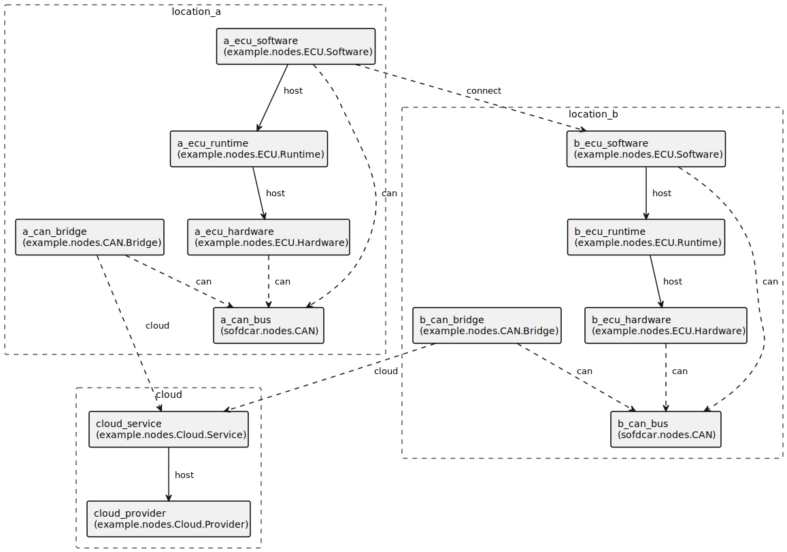

---
tags:
- SofDCar
- Guide
---

# Distributed Locations

This document holds an example of two geographically distributed ECUs using the TOSCA SofDCar profile.

## Scenario

In this example, there are two ECUs. 
These two ECUs communicate via CAN which is bridged over the cloud, as shown in Figure 1.
Thereby, we model the CAN communication application-centric via a direct relationship between the two software
components as well as network-centric via explicitly modeling the CAN busses and their connections to the underlying
hardware.

<figure markdown>
  {width="700"}
  <figcaption>Figure 1: Distributed Locations</figcaption>
</figure>

## Appendix A "Service Template"

This appendix contains the service template of this guide.
The service template is also available as [download](service-template.yaml){download=service-template.yaml}.

```yaml linenums="1"
--8<-- "sofdcar/guides/location/service-template.yaml"
```

## Appendix B "Type Definitions"

This appendix contains the type definitions of this guide.
The type definitions are also available as [download](types.yaml){download=types.yaml}

```yaml linenums="1"
--8<-- "sofdcar/guides/location/types.yaml"
```
