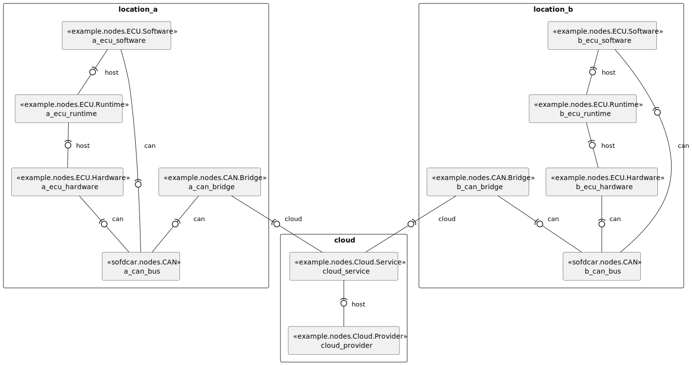

# Distributed Locations

In this document, we discuss an example of two geographically distributed ECUs which are connected via the cloud.

<figure markdown>
  {width="700"}
  <figcaption>Figure 1: Distributed Locations</figcaption>
</figure>

## Downloads 

- [Template](template.yaml){download=template.yaml}
- [Types](types.yaml){download=types.yaml}

## Service Template

```yaml linenums="1"
--8<-- "sofdcar/guides/location/template.yaml"
```

## Type Definitions

```yaml linenums="1"
--8<-- "sofdcar/guides/location/types.yaml"
```