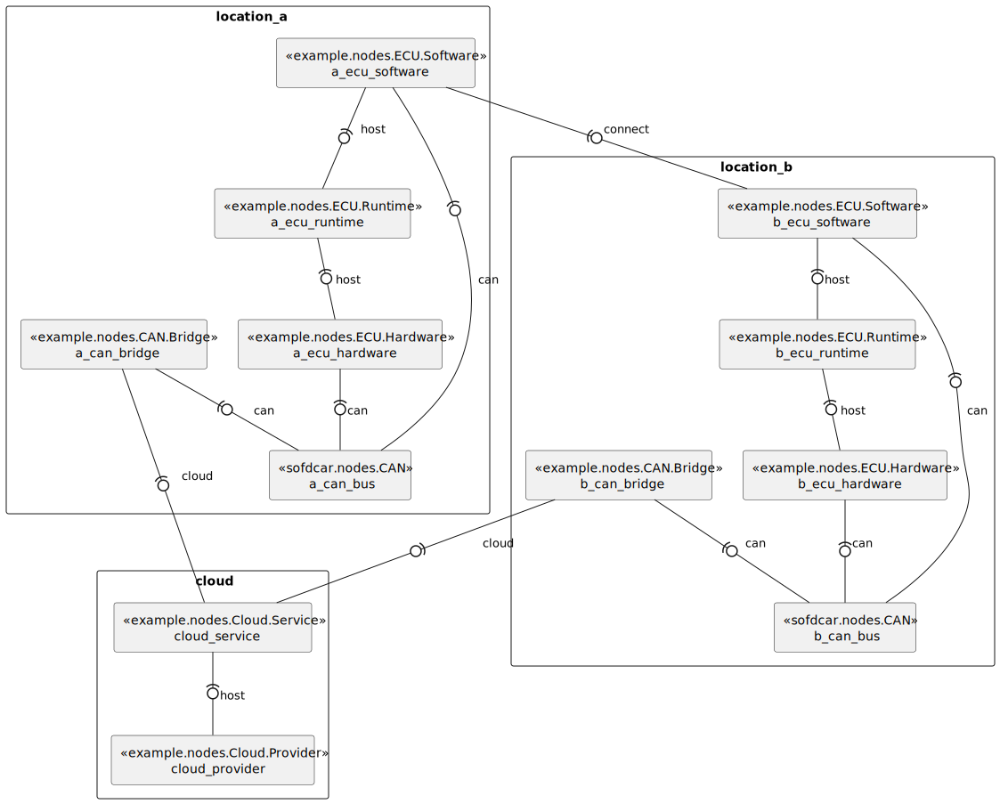

# Distributed Locations

In this document, we discuss an example of two geographically distributed ECUs, as shown in Figure 1.
These two ECUs communicate via CAN which is bridged over the cloud.
Thereby, we model the CAN communication application-centric via a direct relationship between the two software
components as well as network-centric via explicitly modeling the CAN busses and their connections to the underlying
hardware.

<figure markdown>
  {width="700"}
  <figcaption>Figure 1: Distributed Locations</figcaption>
</figure>

## Appendix A "Service Template"

This appendix contains the complete service template of this guide.
You can also download the service template [here](service-template.yaml){download=service-template.yaml}.

```yaml linenums="1"
--8<-- "sofdcar/guides/location/service-template.yaml"
```

## Appendix B "Type Definitions"

This appendix contains the complete type definitions of this guide.
You can also download the type definitions [here](types.yaml){download=types.yaml}

```yaml linenums="1"
--8<-- "sofdcar/guides/location/types.yaml"
```
