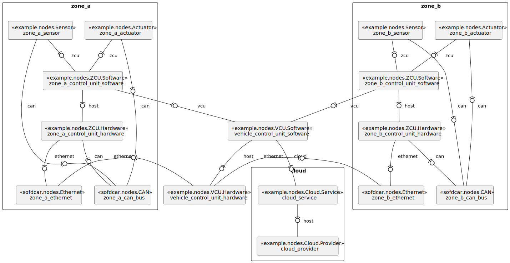

# Zonal Architecture

In this document, we discuss an example of a zonal architecture connected to the cloud using the TOSCA SofDCar profile.

!!! Warning TODO
    - description
    - figure

<figure markdown>
  {width="700"}
  <figcaption>Figure 1: Zonal Architecture</figcaption>
</figure>

## Appendix A "Service Template"

This appendix contains the complete service template of this guide.
You can also download the service template [here](service-template.yaml){download=service-template.yaml}.

```yaml linenums="1"
--8<-- "sofdcar/guides/zone/template.yaml"
```

## Appendix B "Type Definitions"

This appendix contains the complete type definitions of this guide.
You can also download the type definitions [here](types.yaml){download=types.yaml}

```yaml linenums="1"
--8<-- "sofdcar/guides/zone/types.yaml"
```
