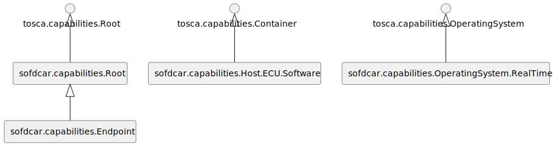
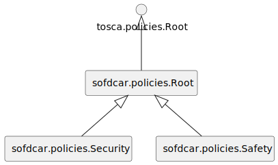
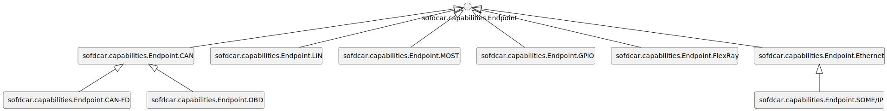
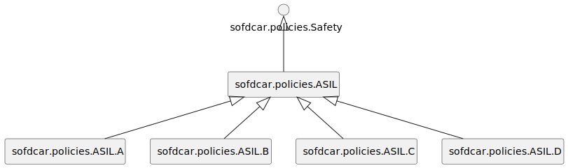

--8<-- "enumerate.html"

# TOSCA Software-Defined Car (SofDCar) Profile 1.0 Release Candidate

{{ autogenerated_notice('./task docs:generate:sofdcar') }}

This document specifies the TOSCA Software-Defined Car (SofDCar) profile.
This profile includes normative TOSCA types for the domain of software-defined cars.
Standardizing such normative TOSCA types improves interoperability.
For example, an ECU supplier can model and distribute the deployment and management of their ECUs using these types.
Various OEMs can then import provided models and integrate them into their cars.
The specification is under active development and is not backwards compatible with any previous versions.


## TOSCA SofDCar Core Profile

The core normative TOSCA type definitions contain high-level type definitions which are mainly derived from the normative TOSCA type definitions of the [TOSCA Simple Profile in YAML 1.3](https://docs.oasis-open.org/tosca/TOSCA-Simple-Profile-YAML/v1.3/os/TOSCA-Simple-Profile-YAML-v1.3-os.html){target=_blank}.
These types mainly concern the following topics.

- Hardware and software of electronic computing units (ECUs) which are typically microcontrollers
- Hardware and software of high performance computing platforms (HPCs) which are typically microprocessors
- Sensors and actuators
- Communication channels

Considering the modeling communication, the TOSCA modeling approach is application centric meaning that, e.g., a CAN communication is modeled by relationships between the communicating software components.
Thus, no (physical) CAN bus is modeled between the ECUs.
However, this might not provide all required information.
This issue is also discussed in the [networking section of the TOSCA specification](https://docs.oasis-open.org/tosca/TOSCA-Simple-Profile-YAML/v1.3/os/TOSCA-Simple-Profile-YAML-v1.3-os.html#_Toc26969482){target=_blank}.
In this section, the authors of TOSCA propose to have a TOSCA model for the application and a second separate one for the networking.
Therefore, we provide type definitions to model such an automotive TOSCA networking model which includes, e.g., a physical CAN bus.


### Artifact Types

We specify the following normative artifact types.
An overview is given in Figure C1.

<figure markdown>

<figcaption>Figure C1: TOSCA SofDCar Core Artifact Types</figcaption>
</figure>

#### sofdcar.artifacts.Root

The artifact all other artifacts are derived from.

```yaml linenums="1"
sofdcar.artifacts.Root:
    derived_from: tosca.artifacts.Root
```

#### sofdcar.artifacts.Deployment

The artifact all other deployment artifacts are derived from.

```yaml linenums="1"
sofdcar.artifacts.Deployment:
    derived_from: tosca.artifacts.Deployment
```

#### sofdcar.artifacts.Implementation

The artifact all other implementation artifacts are derived from.

```yaml linenums="1"
sofdcar.artifacts.Implementation:
    derived_from: tosca.artifacts.Implementation
```

### Capability Types

We specify the following normative capability types.
An overview is given in Figure C2.

<figure markdown>

<figcaption>Figure C2: TOSCA SofDCar Core Capability Types</figcaption>
</figure>

#### sofdcar.capabilities.Root

The capability all other capabilities are derived from.

```yaml linenums="1"
sofdcar.capabilities.Root:
    derived_from: tosca.capabilities.Root
```

#### sofdcar.capabilities.Host.ECU.Software

The capability to host an ECU software.

```yaml linenums="1"
sofdcar.capabilities.Host.ECU.Software:
    derived_from: tosca.capabilities.Container
```

#### sofdcar.capabilities.OperatingSystem.RealTime

The capability to provide a real-time operating system.

```yaml linenums="1"
sofdcar.capabilities.OperatingSystem.RealTime:
    derived_from: tosca.capabilities.OperatingSystem
    properties:
        time_guarantee:
            type: integer
            required: false
        guarantee_type:
            type: string
            constraints:
                - valid_values:
                      - hard
                      - firm
                      - soft
```

#### sofdcar.capabilities.Endpoint

The capability to provide an endpoint to which a client can connect to.

```yaml linenums="1"
sofdcar.capabilities.Endpoint:
    derived_from: sofdcar.capabilities.Root
```

### Data Types

We specify the following normative data types.
An overview is given in Figure C3.

<figure markdown>

<figcaption>Figure C3: TOSCA SofDCar Core Data Types</figcaption>
</figure>

#### sofdcar.data.Root

The data all other data are derived from.

```yaml linenums="1"
sofdcar.data.Root:
    derived_from: tosca.datatypes.Root
```

### Group Types

We specify the following normative group types.
An overview is given in Figure C4.

<figure markdown>

<figcaption>Figure C4: TOSCA SofDCar Core Group Types</figcaption>
</figure>

#### sofdcar.groups.Root

The group all other groups are derived from.

```yaml linenums="1"
sofdcar.groups.Root:
    derived_from: tosca.groups.Root
```

#### sofdcar.groups.Location

The geographical location of nodes.

```yaml linenums="1"
sofdcar.groups.Location:
    derived_from: sofdcar.groups.Root
```

#### sofdcar.groups.Domain

The domain in a domain-oriented architecture.

```yaml linenums="1"
sofdcar.groups.Domain:
    derived_from: sofdcar.groups.Root
```

#### sofdcar.groups.Zone

The zone in a zone-oriented architecture.

```yaml linenums="1"
sofdcar.groups.Zone:
    derived_from: sofdcar.groups.Root
```

### Interface Types

We specify the following normative interface types.
An overview is given in Figure C5.

<figure markdown>

<figcaption>Figure C5: TOSCA SofDCar Core Interface Types</figcaption>
</figure>

#### sofdcar.interfaces.Root

The interface all other interfaces are derived from.

```yaml linenums="1"
sofdcar.interfaces.Root:
    derived_from: tosca.interfaces.Root
```

#### sofdcar.interfaces.Nodes

The standard management interface of nodes.

```yaml linenums="1"
sofdcar.interfaces.Nodes:
    derived_from: tosca.interfaces.node.lifecycle.Standard
    operations:
        build:
            description: Builds deployment artifacts.
```

#### sofdcar.interfaces.Relationship

The standard management interface for relationships.

```yaml linenums="1"
sofdcar.interfaces.Relationship:
    derived_from: tosca.interfaces.relationship.Configure
```

### Node Types

We specify the following normative node types.
An overview is given in Figure C6.

<figure markdown>

<figcaption>Figure C6: TOSCA SofDCar Core Node Types</figcaption>
</figure>

#### sofdcar.nodes.Root

The node all other nodes are derived from.

```yaml linenums="1"
sofdcar.nodes.Root:
    derived_from: tosca.nodes.Root
```

#### sofdcar.nodes.Vehicle

The node all other vehicles are derived from.

```yaml linenums="1"
sofdcar.nodes.Vehicle:
    derived_from: sofdcar.nodes.Root
```

#### sofdcar.nodes.Cloud

The node all other clouds are derived from.

```yaml linenums="1"
sofdcar.nodes.Cloud:
    derived_from: sofdcar.nodes.Root
```

#### sofdcar.nodes.ECU.Hardware

The hardware of an ECU.

```yaml linenums="1"
sofdcar.nodes.ECU.Hardware:
    derived_from: sofdcar.nodes.Root
    capabilities:
        host:
            type: sofdcar.capabilities.Host.ECU.Software
            valid_source_types:
                - sofdcar.nodes.ECU.Software
```

#### sofdcar.nodes.ECU.Software

The software running on an ECU.

```yaml linenums="1"
sofdcar.nodes.ECU.Software:
    derived_from: sofdcar.nodes.Root
    requirements:
        - host:
              capability: sofdcar.capabilities.Host.ECU.Software
              relationship: tosca.relationships.HostedOn
```

#### sofdcar.nodes.ECU.Runtime

The runtime for an ECU software.

```yaml linenums="1"
sofdcar.nodes.ECU.Runtime:
    derived_from: sofdcar.nodes.ECU.Software
    capabilities:
        host:
            type: sofdcar.capabilities.Host.ECU.Software
            valid_source_types:
                - sofdcar.nodes.ECU.Software
    requirements:
        - host:
              capability: sofdcar.capabilities.Host.ECU.Software
              relationship: tosca.relationships.HostedOn
```

#### sofdcar.nodes.HPC.Software

The software running on an HPC.

```yaml linenums="1"
sofdcar.nodes.HPC.Software:
    derived_from: tosca.nodes.SoftwareComponent
```

#### sofdcar.nodes.HPC.Hardware

The hardware of an HPC.

```yaml linenums="1"
sofdcar.nodes.HPC.Hardware:
    derived_from: sofdcar.nodes.Root
    capabilities:
        host:
            type: tosca.capabilities.Compute
            valid_source_types:
                - tosca.nodes.SoftwareComponent
```

#### sofdcar.nodes.Actuator

The node all other actuators are derived from.

```yaml linenums="1"
sofdcar.nodes.Actuator:
    derived_from: sofdcar.nodes.Root
```

#### sofdcar.nodes.Accelerator

The node all other accelerators are derived from.

```yaml linenums="1"
sofdcar.nodes.Accelerator:
    derived_from: sofdcar.nodes.Actuator
```

#### sofdcar.nodes.Brake

The node all other brakes are derived from.

```yaml linenums="1"
sofdcar.nodes.Brake:
    derived_from: sofdcar.nodes.Actuator
```

#### sofdcar.nodes.Steering

The node all other steerings are derived from.

```yaml linenums="1"
sofdcar.nodes.Steering:
    derived_from: sofdcar.nodes.Actuator
```

#### sofdcar.nodes.Light

The node all other lights are derived from.

```yaml linenums="1"
sofdcar.nodes.Light:
    derived_from: sofdcar.nodes.Actuator
```

#### sofdcar.nodes.Cooling

The node all other coolings are derived from.

```yaml linenums="1"
sofdcar.nodes.Cooling:
    derived_from: sofdcar.nodes.Actuator
```

#### sofdcar.nodes.Airbag

The node all other airbags are derived from.

```yaml linenums="1"
sofdcar.nodes.Airbag:
    derived_from: sofdcar.nodes.Actuator
```

#### sofdcar.nodes.Sensor

The node all other sensors are derived from.

```yaml linenums="1"
sofdcar.nodes.Sensor:
    derived_from: sofdcar.nodes.Root
```

#### sofdcar.nodes.RADAR

The node all other RADAR are derived from.

```yaml linenums="1"
sofdcar.nodes.RADAR:
    derived_from: sofdcar.nodes.Sensor
```

#### sofdcar.nodes.Camera

The node all other cameras are derived from.

```yaml linenums="1"
sofdcar.nodes.Camera:
    derived_from: sofdcar.nodes.Sensor
```

#### sofdcar.nodes.LIDAR

The node all other LIDAR are derived from.

```yaml linenums="1"
sofdcar.nodes.LIDAR:
    derived_from: sofdcar.nodes.Sensor
```

#### sofdcar.nodes.Ultrasonic

The node all other ultrasonics are derived from.

```yaml linenums="1"
sofdcar.nodes.Ultrasonic:
    derived_from: sofdcar.nodes.Sensor
```

#### sofdcar.nodes.Microphone

The node all other microphones are derived from.

```yaml linenums="1"
sofdcar.nodes.Microphone:
    derived_from: sofdcar.nodes.Sensor
```

#### sofdcar.nodes.Channel

The node all other communication channels are derived from.

```yaml linenums="1"
sofdcar.nodes.Channel:
    derived_from: sofdcar.nodes.Root
    capabilities:
        endpoint:
            type: sofdcar.capabilities.Endpoint
            occurrences:
                - 0
                - UNBOUNDED
```

#### sofdcar.nodes.Battery

The node all other batteries are derived from.

```yaml linenums="1"
sofdcar.nodes.Battery:
    derived_from: sofdcar.nodes.Root
```

#### sofdcar.nodes.Feature

The node all other features are derived from.

```yaml linenums="1"
sofdcar.nodes.Feature:
    derived_from: sofdcar.nodes.Root
```

### Policy Types

We specify the following normative policy types.
An overview is given in Figure C7.

<figure markdown>

<figcaption>Figure C7: TOSCA SofDCar Core Policy Types</figcaption>
</figure>

#### sofdcar.policies.Root

The policy all other policies are derived from.

```yaml linenums="1"
sofdcar.policies.Root:
    derived_from: tosca.policies.Root
```

#### sofdcar.policies.Security

The policy all other security-related policies are derived from.

```yaml linenums="1"
sofdcar.policies.Security:
    derived_from: sofdcar.policies.Root
```

#### sofdcar.policies.Safety

The policy all other safety-related policies are derived from.

```yaml linenums="1"
sofdcar.policies.Safety:
    derived_from: sofdcar.policies.Root
```

### Relationship Types

We specify the following normative relationship types.
An overview is given in Figure C8.

<figure markdown>

<figcaption>Figure C8: TOSCA SofDCar Core Relationship Types</figcaption>
</figure>

#### sofdcar.relationships.Root

The relationship all other relationships are derived from.

```yaml linenums="1"
sofdcar.relationships.Root:
    derived_from: tosca.relationships.Root
```


## TOSCA SofDCar Extended Profile

The extended normative TOSCA type definitions contain additional high-level type definitions which are derived from the core type definitions.
These types mainly concern specific communications, such as CAN or FlexRay, but also ECUs and HPCs, such as Arduino or Raspberry Pi.


### Capability Types

We specify the following normative capability types.
An overview is given in Figure E1.

<figure markdown>

<figcaption>Figure E1:  Capability Types</figcaption>
</figure>

#### sofdcar.capabilities.Endpoint.CAN

The capability to provide a CAN endpoint.

```yaml linenums="1"
sofdcar.capabilities.Endpoint.CAN:
    derived_from: sofdcar.capabilities.Endpoint
```

#### sofdcar.capabilities.Endpoint.CAN-FD

The capability to provide a CAN-FD endpoint.

```yaml linenums="1"
sofdcar.capabilities.Endpoint.CAN-FD:
    derived_from: sofdcar.capabilities.Endpoint.CAN
```

#### sofdcar.capabilities.Endpoint.LIN

The capability to provide a LIN endpoint.

```yaml linenums="1"
sofdcar.capabilities.Endpoint.LIN:
    derived_from: sofdcar.capabilities.Endpoint
```

#### sofdcar.capabilities.Endpoint.MOST

The capability to provide a MOST endpoint.

```yaml linenums="1"
sofdcar.capabilities.Endpoint.MOST:
    derived_from: sofdcar.capabilities.Endpoint
```

#### sofdcar.capabilities.Endpoint.GPIO

The capability to provide a GPIO endpoint.

```yaml linenums="1"
sofdcar.capabilities.Endpoint.GPIO:
    derived_from: sofdcar.capabilities.Endpoint
```

#### sofdcar.capabilities.Endpoint.FlexRay

The capability to provide a FlexRay endpoint.

```yaml linenums="1"
sofdcar.capabilities.Endpoint.FlexRay:
    derived_from: sofdcar.capabilities.Endpoint
```

#### sofdcar.capabilities.Endpoint.Ethernet

The capability to provide an Ethernet endpoint.

```yaml linenums="1"
sofdcar.capabilities.Endpoint.Ethernet:
    derived_from: sofdcar.capabilities.Endpoint
```

#### sofdcar.capabilities.Endpoint.OBD

The capability to provide an OBD endpoint.

```yaml linenums="1"
sofdcar.capabilities.Endpoint.OBD:
    derived_from: sofdcar.capabilities.Endpoint.CAN
```

#### sofdcar.capabilities.Endpoint.SOME/IP

The capability to provide a SOME/IP endpoint.

```yaml linenums="1"
sofdcar.capabilities.Endpoint.SOME/IP:
    derived_from: sofdcar.capabilities.Endpoint.Ethernet
```

### Data Types

We specify the following normative data types.
An overview is given in Figure E2.

<figure markdown>

<figcaption>Figure E2:  Data Types</figcaption>
</figure>

#### sofdcar.data.GPIO.Pin

The GPIO pin used, e.g., when connecting using GPIO.

```yaml linenums="1"
sofdcar.data.GPIO.Pin:
    derived_from: sofdcar.data.Root
    properties:
        pin:
            type: integer
        direction:
            type: string
            constraints:
                - valid_values:
                      - in
                      - out
                      - in/out
```

### Node Types

We specify the following normative node types.
An overview is given in Figure E3.

<figure markdown>

<figcaption>Figure E3:  Node Types</figcaption>
</figure>

#### sofdcar.nodes.CAN

The CAN channel all other CAN channels are derived from.

```yaml linenums="1"
sofdcar.nodes.CAN:
    derived_from: sofdcar.nodes.Channel
    properties:
        bitrate:
            type: integer
            required: false
    capabilities:
        endpoint:
            type: sofdcar.capabilities.Endpoint.CAN
            occurrences:
                - 0
                - UNBOUNDED
```

#### sofdcar.nodes.CAN-FD

The CAN-FD channel all other CAN-FD channels are derived from.

```yaml linenums="1"
sofdcar.nodes.CAN-FD:
    derived_from: sofdcar.nodes.CAN
    capabilities:
        endpoint:
            type: sofdcar.capabilities.Endpoint.CAN-FD
            occurrences:
                - 0
                - UNBOUNDED
```

#### sofdcar.nodes.LIN

The LIN channel all other LIN channels are derived from.

```yaml linenums="1"
sofdcar.nodes.LIN:
    derived_from: sofdcar.nodes.Channel
    capabilities:
        endpoint:
            type: sofdcar.capabilities.Endpoint.LIN
            occurrences:
                - 0
                - UNBOUNDED
```

#### sofdcar.nodes.MOST

The MOST channel all other MOST channels are derived from.

```yaml linenums="1"
sofdcar.nodes.MOST:
    derived_from: sofdcar.nodes.Channel
    capabilities:
        endpoint:
            type: sofdcar.capabilities.Endpoint.MOST
            occurrences:
                - 0
                - UNBOUNDED
```

#### sofdcar.nodes.GPIO

The GIP channel all other GIP channels are derived from.

```yaml linenums="1"
sofdcar.nodes.GPIO:
    derived_from: sofdcar.nodes.Channel
    capabilities:
        endpoint:
            type: sofdcar.capabilities.Endpoint.GPIO
            occurrences:
                - 2
                - 2
```

#### sofdcar.nodes.FlexRay

The FlexRay channel all other FlexRay channels are derived from.

```yaml linenums="1"
sofdcar.nodes.FlexRay:
    derived_from: sofdcar.nodes.Channel
    capabilities:
        endpoint:
            type: sofdcar.capabilities.Endpoint.FlexRay
            occurrences:
                - 0
                - UNBOUNDED
```

#### sofdcar.nodes.Ethernet

The ethernet channel all other ethernet channels are derived from.

```yaml linenums="1"
sofdcar.nodes.Ethernet:
    derived_from: sofdcar.nodes.Channel
    capabilities:
        endpoint:
            type: sofdcar.capabilities.Endpoint.Ethernet
            occurrences:
                - 2
                - 2
```

#### sofdcar.nodes.SOME/IP

The SOME/IP channel all other SOME/IP channels are derived from.

```yaml linenums="1"
sofdcar.nodes.SOME/IP:
    derived_from: sofdcar.nodes.Ethernet
    capabilities:
        endpoint:
            type: sofdcar.capabilities.Endpoint.SOME/IP
            occurrences:
                - 2
                - 2
```

#### sofdcar.nodes.Python.Application

Non-normative python application running on an HPC. This application requires a python runtime.


```yaml linenums="1"
sofdcar.nodes.Python.Application:
    derived_from: sofdcar.nodes.HPC.Software
    requirements:
        - host:
              capability: tosca.capabilities.Compute
              relationship: tosca.relationships.HostedOn
```

#### sofdcar.nodes.Python.Runtime

Non-normative python runtime running on an HPC. This runtime is able to host python applications and requires a host.


```yaml linenums="1"
sofdcar.nodes.Python.Runtime:
    derived_from: sofdcar.nodes.HPC.Software
    capabilities:
        host:
            type: tosca.capabilities.Compute
            valid_source_types:
                - sofdcar.nodes.Python.Application
    requirements:
        - host:
              capability: tosca.capabilities.Compute
              relationship: tosca.relationships.HostedOn
```

#### sofdcar.nodes.RaspberryPi.Hardware

The hardware of a Raspberry Pi serving as an HPC hardware. This Raspberry Pi is able to host HPC software. Furthermore, the Raspberry Pi is able to directly host python applications without explicit python runtime since a python runtime is already installed on the Raspberry Pi.


```yaml linenums="1"
sofdcar.nodes.RaspberryPi.Hardware:
    derived_from: sofdcar.nodes.HPC.Hardware
    capabilities:
        host:
            type: tosca.capabilities.Compute
            valid_source_types:
                - sofdcar.nodes.HPC.Software
                - sofdcar.nodes.Python.Application
```

#### sofdcar.nodes.Arduino.Software

The software running on an Arduino.

```yaml linenums="1"
sofdcar.nodes.Arduino.Software:
    derived_from: sofdcar.nodes.ECU.Software
```

#### sofdcar.nodes.Arduino.Software.C++

C++ software running on an Arduino.

```yaml linenums="1"
sofdcar.nodes.Arduino.Software.C++:
    derived_from: sofdcar.nodes.Arduino.Software
```

#### sofdcar.nodes.Arduino.Hardware

The hardware of an Arduino serving as ECU hardware. The Arduino is able to host Arduino software.


```yaml linenums="1"
sofdcar.nodes.Arduino.Hardware:
    derived_from: sofdcar.nodes.ECU.Hardware
    capabilities:
        host:
            type: sofdcar.capabilities.Host.ECU.Software
            valid_source_types:
                - sofdcar.nodes.Arduino.Software
```

### Policy Types

We specify the following normative policy types.
An overview is given in Figure E4.

<figure markdown>

<figcaption>Figure E4:  Policy Types</figcaption>
</figure>

#### sofdcar.policies.ASIL

The policy that all other ASIL policies are derived from.

```yaml linenums="1"
sofdcar.policies.ASIL:
    derived_from: sofdcar.policies.Safety
```

#### sofdcar.policies.ASIL.A

The policy that represents the ASIL level A.

```yaml linenums="1"
sofdcar.policies.ASIL.A:
    derived_from: sofdcar.policies.ASIL
```

#### sofdcar.policies.ASIL.B

The policy that represents the ASIL level B.

```yaml linenums="1"
sofdcar.policies.ASIL.B:
    derived_from: sofdcar.policies.ASIL
```

#### sofdcar.policies.ASIL.C

The policy that represents the ASIL level C.

```yaml linenums="1"
sofdcar.policies.ASIL.C:
    derived_from: sofdcar.policies.ASIL
```

#### sofdcar.policies.ASIL.D

The policy that represents the ASIL level D.

```yaml linenums="1"
sofdcar.policies.ASIL.D:
    derived_from: sofdcar.policies.ASIL
```

### Relationship Types

We specify the following normative relationship types.
An overview is given in Figure E5.

<figure markdown>

<figcaption>Figure E5:  Relationship Types</figcaption>
</figure>

#### sofdcar.relationships.CAN

The relationship for CAN connections.

```yaml linenums="1"
sofdcar.relationships.CAN:
    derived_from: sofdcar.relationships.Root
    properties:
        interface:
            type: string
            description: The interface name at the source at which the CAN bus is available.
            default: can0
        target_interface:
            type: string
            description: The interface name at the target at which the CAN bus is available.
            required: false
        bitrate:
            type: integer
            description: The bitrate of the CAN bus.
            required: false
```

#### sofdcar.relationships.CAN-FD

The relationship for CAN-FD connections.

```yaml linenums="1"
sofdcar.relationships.CAN-FD:
    derived_from: sofdcar.relationships.CAN
```

#### sofdcar.relationships.LIN

The relationship for LIN connections.

```yaml linenums="1"
sofdcar.relationships.LIN:
    derived_from: sofdcar.relationships.Root
```

#### sofdcar.relationships.MOST

The relationships for MOST connections.

```yaml linenums="1"
sofdcar.relationships.MOST:
    derived_from: sofdcar.relationships.Root
```

#### sofdcar.relationships.GPIO

The relationship for GPIO connections.

```yaml linenums="1"
sofdcar.relationships.GPIO:
    derived_from: sofdcar.relationships.Root
    properties:
        pins:
            type: list
            entry_schema:
                type: sofdcar.data.GPIO.Pin
```

#### sofdcar.relationships.FlexRay

The relationship for FlexRay connections.

```yaml linenums="1"
sofdcar.relationships.FlexRay:
    derived_from: sofdcar.relationships.Root
```

#### sofdcar.relationships.Ethernet

The relationship for Ethernet connections.

```yaml linenums="1"
sofdcar.relationships.Ethernet:
    derived_from: sofdcar.relationships.Root
```

#### sofdcar.relationships.OBD

The relationship for OBD connections.

```yaml linenums="1"
sofdcar.relationships.OBD:
    derived_from: sofdcar.relationships.CAN
```

#### sofdcar.relationships.SOME/IP

The relationship for SOME/IP connections.

```yaml linenums="1"
sofdcar.relationships.SOME/IP:
    derived_from: sofdcar.relationships.Ethernet
```


## Appendix A "TOSCA SofDCar Profile"

This appendix contains the TOSCA SofDCar profile.
The profile is also available as [download](tosca-sofdcar-profile.yaml){download=tosca-sofdcar-profile.yaml}.

```yaml linenums="1"
--8<-- "sofdcar/tosca-sofdcar-profile.yaml"
```

## Appendix B "TOSCA SofDCar Core Profile"

This appendix contains the TOSCA SofDCar Core profile.
The profile is also available as [download](tosca-sofdcar-profile-core.yaml){download=tosca-sofdcar-profile-core.yaml}.

```yaml linenums="1"
--8<-- "sofdcar/tosca-sofdcar-profile-core.yaml"
```

## Appendix C "TOSCA SofDCar Extended Profile"

This appendix contains the TOSCA SofDCar Extended profile.
The profile is also available as [download](tosca-sofdcar-profile-extended.yaml){download=tosca-sofdcar-profile-extended.yaml}.

```yaml linenums="1"
--8<-- "sofdcar/tosca-sofdcar-profile-extended.yaml"
```

--8<-- "acd.md"
