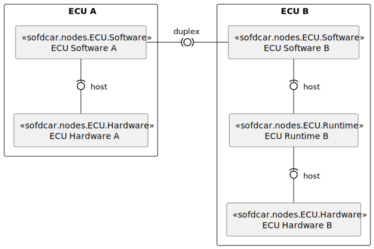
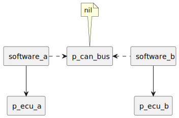
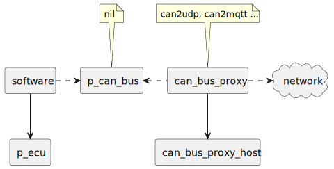
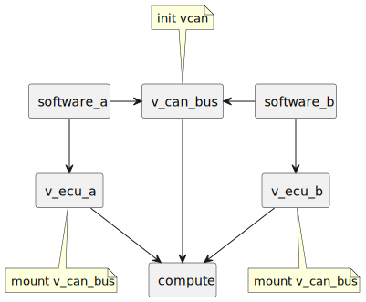
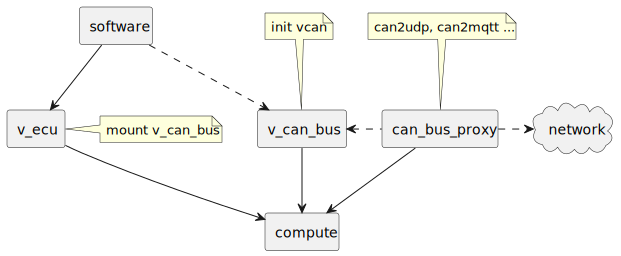

# SofDCar Normative Types

> Normative TOSCA Type Definitions for Software-Defined Cars.

- [Types](types.yaml)

## Examples (Deprecated)

### ECU Software and Hardware

### Physical CAN

### Physical OTA CAN

### Virtual CAN

### Virtual OTA CAN

