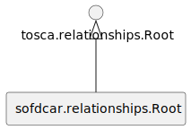

### Artifact Types

We specify the following normative artifact types.
An overview is given in Figure c1.

<figure markdown>

<figcaption>Figure c1: TOSCA SofDCar Core Artifact Types</figcaption>
</figure>

#### sofdcar.artifacts.Root

The artifact all other artifacts are derived from.

```yaml linenums="1"
sofdcar.artifacts.Root:
  derived_from: tosca.artifacts.Root
```

#### sofdcar.artifacts.Deployment

The artifact all other deployment artifacts are derived from.

```yaml linenums="1"
sofdcar.artifacts.Deployment:
  derived_from: tosca.artifacts.Deployment
```

#### sofdcar.artifacts.Implementation

The artifact all other implementation artifacts are derived from.

```yaml linenums="1"
sofdcar.artifacts.Implementation:
  derived_from: tosca.artifacts.Implementation
```

### Capability Types

We specify the following normative capability types.
An overview is given in Figure c2.

<figure markdown>

<figcaption>Figure c2: TOSCA SofDCar Core Capability Types</figcaption>
</figure>

#### sofdcar.capabilities.Root

The capability all other capabilities are derived from.

```yaml linenums="1"
sofdcar.capabilities.Root:
  derived_from: tosca.capabilities.Root
```

#### sofdcar.capabilities.Host.ECU.Software

The capability to host an ECU software.

```yaml linenums="1"
sofdcar.capabilities.Host.ECU.Software:
  derived_from: tosca.capabilities.Container
```

#### sofdcar.capabilities.OperatingSystem.RealTime

The capability to provide a real-time operating system.

```yaml linenums="1"
sofdcar.capabilities.OperatingSystem.RealTime:
  derived_from: tosca.capabilities.OperatingSystem
  properties:
    time_guarantee:
      type: integer
      required: false
    guarantee_type:
      type: string
      constraints:
        - valid_values:
            - hard
            - firm
            - soft
```

#### sofdcar.capabilities.Endpoint

The capability to provide an endpoint to which a client can connect to.

```yaml linenums="1"
sofdcar.capabilities.Endpoint:
  derived_from: sofdcar.capabilities.Root
```

### Data Types

We specify the following normative data types.
An overview is given in Figure c3.

<figure markdown>

<figcaption>Figure c3: TOSCA SofDCar Core Data Types</figcaption>
</figure>

#### sofdcar.data.Root

The data all other data are derived from.

```yaml linenums="1"
sofdcar.data.Root:
  derived_from: tosca.datatypes.Root
```

### Group Types

We specify the following normative group types.
An overview is given in Figure c4.

<figure markdown>

<figcaption>Figure c4: TOSCA SofDCar Core Group Types</figcaption>
</figure>

#### sofdcar.groups.Root

The group all other groups are derived from.

```yaml linenums="1"
sofdcar.groups.Root:
  derived_from: tosca.groups.Root
```

#### sofdcar.groups.Location

The geographical location of nodes.

```yaml linenums="1"
sofdcar.groups.Location:
  derived_from: sofdcar.groups.Root
```

#### sofdcar.groups.Domain

The domain in a domain-oriented architecture.

```yaml linenums="1"
sofdcar.groups.Domain:
  derived_from: sofdcar.groups.Root
```

#### sofdcar.groups.Zone

The zone in a zone-oriented architecture.

```yaml linenums="1"
sofdcar.groups.Zone:
  derived_from: sofdcar.groups.Root
```

### Interface Types

We specify the following normative interface types.
An overview is given in Figure c5.

<figure markdown>

<figcaption>Figure c5: TOSCA SofDCar Core Interface Types</figcaption>
</figure>

#### sofdcar.interfaces.Root

The interface all other interfaces are derived from.

```yaml linenums="1"
sofdcar.interfaces.Root:
  derived_from: tosca.interfaces.Root
```

#### sofdcar.interfaces.Nodes

The standard management interface of nodes.

```yaml linenums="1"
sofdcar.interfaces.Nodes:
  derived_from: tosca.interfaces.node.lifecycle.Standard
  operations:
    build:
      description: Builds deployment artifacts.
```

#### sofdcar.interfaces.Relationship

The standard management interface for relationships.

```yaml linenums="1"
sofdcar.interfaces.Relationship:
  derived_from: tosca.interfaces.relationship.Configure
```

### Node Types

We specify the following normative node types.
An overview is given in Figure c6.

<figure markdown>

<figcaption>Figure c6: TOSCA SofDCar Core Node Types</figcaption>
</figure>

#### sofdcar.nodes.Root

The node all other nodes are derived from.

```yaml linenums="1"
sofdcar.nodes.Root:
  derived_from: tosca.nodes.Root
```

#### sofdcar.nodes.Vehicle

The node all other vehicles are derived from.

```yaml linenums="1"
sofdcar.nodes.Vehicle:
  derived_from: sofdcar.nodes.Root
```

#### sofdcar.nodes.Cloud

The node all other clouds are derived from.

```yaml linenums="1"
sofdcar.nodes.Cloud:
  derived_from: sofdcar.nodes.Root
```

#### sofdcar.nodes.ECU.Hardware

The hardware of an ECU.

```yaml linenums="1"
sofdcar.nodes.ECU.Hardware:
  derived_from: sofdcar.nodes.Root
  capabilities:
    host:
      type: sofdcar.capabilities.Host.ECU.Software
      valid_source_types:
        - sofdcar.nodes.ECU.Software
```

#### sofdcar.nodes.ECU.Software

The software running on an ECU.

```yaml linenums="1"
sofdcar.nodes.ECU.Software:
  derived_from: sofdcar.nodes.Root
  requirements:
    - host:
        capability: sofdcar.capabilities.Host.ECU.Software
        relationship: tosca.relationships.HostedOn
```

#### sofdcar.nodes.ECU.Runtime

The runtime for an ECU software.

```yaml linenums="1"
sofdcar.nodes.ECU.Runtime:
  derived_from: sofdcar.nodes.ECU.Software
  capabilities:
    host:
      type: sofdcar.capabilities.Host.ECU.Software
      valid_source_types:
        - sofdcar.nodes.ECU.Software
  requirements:
    - host:
        capability: sofdcar.capabilities.Host.ECU.Software
        relationship: tosca.relationships.HostedOn
```

#### sofdcar.nodes.HPC.Software

The software running on an HPC.

```yaml linenums="1"
sofdcar.nodes.HPC.Software:
  derived_from: tosca.nodes.SoftwareComponent
```

#### sofdcar.nodes.HPC.Hardware

The hardware of an HPC.

```yaml linenums="1"
sofdcar.nodes.HPC.Hardware:
  derived_from: sofdcar.nodes.Root
  capabilities:
    host:
      type: tosca.capabilities.Compute
      valid_source_types:
        - tosca.nodes.SoftwareComponent
```

#### sofdcar.nodes.Actuator

The node all other actuators are derived from.

```yaml linenums="1"
sofdcar.nodes.Actuator:
  derived_from: sofdcar.nodes.Root
```

#### sofdcar.nodes.Accelerator

The node all other accelerators are derived from.

```yaml linenums="1"
sofdcar.nodes.Accelerator:
  derived_from: sofdcar.nodes.Actuator
```

#### sofdcar.nodes.Brake

The node all other brakes are derived from.

```yaml linenums="1"
sofdcar.nodes.Brake:
  derived_from: sofdcar.nodes.Actuator
```

#### sofdcar.nodes.Steering

The node all other steerings are derived from.

```yaml linenums="1"
sofdcar.nodes.Steering:
  derived_from: sofdcar.nodes.Actuator
```

#### sofdcar.nodes.Light

The node all other lights are derived from.

```yaml linenums="1"
sofdcar.nodes.Light:
  derived_from: sofdcar.nodes.Actuator
```

#### sofdcar.nodes.Airbag

The node all other airbags are derived from.

```yaml linenums="1"
sofdcar.nodes.Airbag:
  derived_from: sofdcar.nodes.Actuator
```

#### sofdcar.nodes.Sensor

The node all other sensors are derived from.

```yaml linenums="1"
sofdcar.nodes.Sensor:
  derived_from: sofdcar.nodes.Root
```

#### sofdcar.nodes.RADAR

The node all other RADAR are derived from.

```yaml linenums="1"
sofdcar.nodes.RADAR:
  derived_from: sofdcar.nodes.Sensor
```

#### sofdcar.nodes.Camera

The node all other cameras are derived from.

```yaml linenums="1"
sofdcar.nodes.Camera:
  derived_from: sofdcar.nodes.Sensor
```

#### sofdcar.nodes.LIDAR

The node all other LIDAR are derived from.

```yaml linenums="1"
sofdcar.nodes.LIDAR:
  derived_from: sofdcar.nodes.Sensor
```

#### sofdcar.nodes.Ultrasonic

The node all other ultrasonics are derived from.

```yaml linenums="1"
sofdcar.nodes.Ultrasonic:
  derived_from: sofdcar.nodes.Sensor
```

#### sofdcar.nodes.Channel

The node all other communication channels are derived from.

```yaml linenums="1"
sofdcar.nodes.Channel:
  derived_from: sofdcar.nodes.Root
  capabilities:
    endpoint:
      type: sofdcar.capabilities.Endpoint
      occurrences:
        - 0
        - UNBOUNDED
```

#### sofdcar.nodes.Battery

The node all other batteries are derived from.

```yaml linenums="1"
sofdcar.nodes.Battery:
  derived_from: sofdcar.nodes.Root
```

### Policy Types

We specify the following normative policy types.
An overview is given in Figure c7.

<figure markdown>

<figcaption>Figure c7: TOSCA SofDCar Core Policy Types</figcaption>
</figure>

#### sofdcar.policies.Root

The policy all other policies are derived from.

```yaml linenums="1"
sofdcar.policies.Root:
  derived_from: tosca.policies.Root
```

#### sofdcar.policies.Security

The policy all other security-related policies are derived from.

```yaml linenums="1"
sofdcar.policies.Security:
  derived_from: sofdcar.policies.Root
```

#### sofdcar.policies.Safety

The policy all other safety-related policies are derived from.

```yaml linenums="1"
sofdcar.policies.Safety:
  derived_from: sofdcar.policies.Root
```

### Relationship Types

We specify the following normative relationship types.
An overview is given in Figure c8.

<figure markdown>

<figcaption>Figure c8: TOSCA SofDCar Core Relationship Types</figcaption>
</figure>

#### sofdcar.relationships.Root

The relationship all other relationships are derived from.

```yaml linenums="1"
sofdcar.relationships.Root:
  derived_from: tosca.relationships.Root
```


