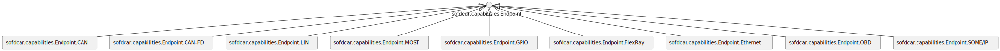
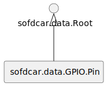
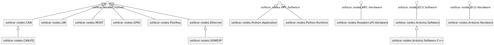
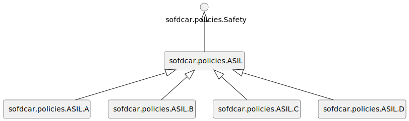

### Capability Types

We specify the following normative capability types.
An overview is given in Figure e1.

<figure markdown>

<figcaption>Figure e1:  Capability Types</figcaption>
</figure>

#### sofdcar.capabilities.Endpoint.CAN

The capability to provide a CAN endpoint.

```yaml linenums="1"
sofdcar.capabilities.Endpoint.CAN:
    derived_from: sofdcar.capabilities.Endpoint
```

#### sofdcar.capabilities.Endpoint.CAN-FD

The capability to provide a CAN-FD endpoint.

```yaml linenums="1"
sofdcar.capabilities.Endpoint.CAN-FD:
    derived_from: sofdcar.capabilities.Endpoint.CAN
```

#### sofdcar.capabilities.Endpoint.LIN

The capability to provide a LIN endpoint.

```yaml linenums="1"
sofdcar.capabilities.Endpoint.LIN:
    derived_from: sofdcar.capabilities.Endpoint
```

#### sofdcar.capabilities.Endpoint.MOST

The capability to provide a MOST endpoint.

```yaml linenums="1"
sofdcar.capabilities.Endpoint.MOST:
    derived_from: sofdcar.capabilities.Endpoint
```

#### sofdcar.capabilities.Endpoint.GPIO

The capability to provide a GPIO endpoint.

```yaml linenums="1"
sofdcar.capabilities.Endpoint.GPIO:
    derived_from: sofdcar.capabilities.Endpoint
```

#### sofdcar.capabilities.Endpoint.FlexRay

The capability to provide a FlexRay endpoint.

```yaml linenums="1"
sofdcar.capabilities.Endpoint.FlexRay:
    derived_from: sofdcar.capabilities.Endpoint
```

#### sofdcar.capabilities.Endpoint.Ethernet

The capability to provide an Ethernet endpoint.

```yaml linenums="1"
sofdcar.capabilities.Endpoint.Ethernet:
    derived_from: sofdcar.capabilities.Endpoint
```

#### sofdcar.capabilities.Endpoint.OBD

The capability to provide an OBD endpoint.

```yaml linenums="1"
sofdcar.capabilities.Endpoint.OBD:
    derived_from: sofdcar.capabilities.Endpoint.CAN
```

#### sofdcar.capabilities.Endpoint.SOME/IP

The capability to provide a SOME/IP endpoint.

```yaml linenums="1"
sofdcar.capabilities.Endpoint.SOME/IP:
    derived_from: sofdcar.capabilities.Endpoint.Ethernet
```

### Data Types

We specify the following normative data types.
An overview is given in Figure e2.

<figure markdown>

<figcaption>Figure e2:  Data Types</figcaption>
</figure>

#### sofdcar.data.GPIO.Pin

The GPIO pin used, e.g., when connecting using GPIO.

```yaml linenums="1"
sofdcar.data.GPIO.Pin:
    derived_from: sofdcar.data.Root
    properties:
        pin:
            type: integer
        direction:
            type: string
            constraints:
                - valid_values:
                      - in
                      - out
                      - in/out
```

### Node Types

We specify the following normative node types.
An overview is given in Figure e3.

<figure markdown>

<figcaption>Figure e3:  Node Types</figcaption>
</figure>

#### sofdcar.nodes.CAN

The CAN channel all other CAN channels are derived from.

```yaml linenums="1"
sofdcar.nodes.CAN:
    derived_from: sofdcar.nodes.Channel
    properties:
        bitrate:
            type: integer
            required: false
    capabilities:
        endpoint:
            type: sofdcar.capabilities.Endpoint.CAN
            occurrences:
                - 0
                - UNBOUNDED
```

#### sofdcar.nodes.CAN-FD

The CAN-FD channel all other CAN-FD channels are derived from.

```yaml linenums="1"
sofdcar.nodes.CAN-FD:
    derived_from: sofdcar.nodes.CAN
    capabilities:
        endpoint:
            type: sofdcar.capabilities.Endpoint.CAN-FD
            occurrences:
                - 0
                - UNBOUNDED
```

#### sofdcar.nodes.LIN

The LIN channel all other LIN channels are derived from.

```yaml linenums="1"
sofdcar.nodes.LIN:
    derived_from: sofdcar.nodes.Channel
    capabilities:
        endpoint:
            type: sofdcar.capabilities.Endpoint.LIN
            occurrences:
                - 0
                - UNBOUNDED
```

#### sofdcar.nodes.MOST

The MOST channel all other MOST channels are derived from.

```yaml linenums="1"
sofdcar.nodes.MOST:
    derived_from: sofdcar.nodes.Channel
    capabilities:
        endpoint:
            type: sofdcar.capabilities.Endpoint.MOST
            occurrences:
                - 0
                - UNBOUNDED
```

#### sofdcar.nodes.GPIO

The GIP channel all other GIP channels are derived from.

```yaml linenums="1"
sofdcar.nodes.GPIO:
    derived_from: sofdcar.nodes.Channel
    capabilities:
        endpoint:
            type: sofdcar.capabilities.Endpoint.GPIO
            occurrences:
                - 2
                - 2
```

#### sofdcar.nodes.FlexRay

The FlexRay channel all other FlexRay channels are derived from.

```yaml linenums="1"
sofdcar.nodes.FlexRay:
    derived_from: sofdcar.nodes.Channel
    capabilities:
        endpoint:
            type: sofdcar.capabilities.Endpoint.FlexRay
            occurrences:
                - 0
                - UNBOUNDED
```

#### sofdcar.nodes.Ethernet

The ethernet channel all other ethernet channels are derived from.

```yaml linenums="1"
sofdcar.nodes.Ethernet:
    derived_from: sofdcar.nodes.Channel
    capabilities:
        endpoint:
            type: sofdcar.capabilities.Endpoint.Ethernet
            occurrences:
                - 2
                - 2
```

#### sofdcar.nodes.SOME/IP

The SOME/IP channel all other SOME/IP channels are derived from.

```yaml linenums="1"
sofdcar.nodes.SOME/IP:
    derived_from: sofdcar.nodes.Ethernet
    capabilities:
        endpoint:
            type: sofdcar.capabilities.Endpoint.SOME/IP
            occurrences:
                - 2
                - 2
```

#### sofdcar.nodes.Python.Application

Non-normative python application running on an HPC. This application requires a python runtime.


```yaml linenums="1"
sofdcar.nodes.Python.Application:
    derived_from: sofdcar.nodes.HPC.Software
    requirements:
        - host:
              capability: tosca.capabilities.Compute
              relationship: tosca.relationships.HostedOn
```

#### sofdcar.nodes.Python.Runtime

Non-normative python runtime running on an HPC. This runtime is able to host python applications and requires a host.


```yaml linenums="1"
sofdcar.nodes.Python.Runtime:
    derived_from: sofdcar.nodes.HPC.Software
    capabilities:
        host:
            type: tosca.capabilities.Compute
            valid_source_types:
                - sofdcar.nodes.Python.Application
    requirements:
        - host:
              capability: tosca.capabilities.Compute
              relationship: tosca.relationships.HostedOn
```

#### sofdcar.nodes.RaspberryPi.Hardware

The hardware of a Raspberry Pi serving as an HPC hardware. This Raspberry Pi is able to host HPC software. Furthermore, the Raspberry Pi is able to directly host python applications without explicit python runtime since a python runtime is already installed on the Raspberry Pi.


```yaml linenums="1"
sofdcar.nodes.RaspberryPi.Hardware:
    derived_from: sofdcar.nodes.HPC.Hardware
    capabilities:
        host:
            type: tosca.capabilities.Compute
            valid_source_types:
                - sofdcar.nodes.HPC.Software
                - sofdcar.nodes.Python.Application
```

#### sofdcar.nodes.Arduino.Software

The software running on an Arduino.

```yaml linenums="1"
sofdcar.nodes.Arduino.Software:
    derived_from: sofdcar.nodes.ECU.Software
```

#### sofdcar.nodes.Arduino.Software.C++

C++ software running on an Arduino.

```yaml linenums="1"
sofdcar.nodes.Arduino.Software.C++:
    derived_from: sofdcar.nodes.Arduino.Software
```

#### sofdcar.nodes.Arduino.Hardware

The hardware of an Arduino serving as ECU hardware. The Arduino is able to host Arduino software.


```yaml linenums="1"
sofdcar.nodes.Arduino.Hardware:
    derived_from: sofdcar.nodes.ECU.Hardware
    capabilities:
        host:
            type: sofdcar.capabilities.Host.ECU.Software
            valid_source_types:
                - sofdcar.nodes.Arduino.Software
```

### Policy Types

We specify the following normative policy types.
An overview is given in Figure e4.

<figure markdown>

<figcaption>Figure e4:  Policy Types</figcaption>
</figure>

#### sofdcar.policies.ASIL

The policy that all other ASIL policies are derived from.

```yaml linenums="1"
sofdcar.policies.ASIL:
    derived_from: sofdcar.policies.Safety
```

#### sofdcar.policies.ASIL.A

The policy that represents the ASIL level A.

```yaml linenums="1"
sofdcar.policies.ASIL.A:
    derived_from: sofdcar.policies.ASIL
```

#### sofdcar.policies.ASIL.B

The policy that represents the ASIL level B.

```yaml linenums="1"
sofdcar.policies.ASIL.B:
    derived_from: sofdcar.policies.ASIL
```

#### sofdcar.policies.ASIL.C

The policy that represents the ASIL level C.

```yaml linenums="1"
sofdcar.policies.ASIL.C:
    derived_from: sofdcar.policies.ASIL
```

#### sofdcar.policies.ASIL.D

The policy that represents the ASIL level D.

```yaml linenums="1"
sofdcar.policies.ASIL.D:
    derived_from: sofdcar.policies.ASIL
```

### Relationship Types

We specify the following normative relationship types.
An overview is given in Figure e5.

<figure markdown>

<figcaption>Figure e5:  Relationship Types</figcaption>
</figure>

#### sofdcar.relationships.CAN

The relationship for CAN connections.

```yaml linenums="1"
sofdcar.relationships.CAN:
    derived_from: sofdcar.relationships.Root
    properties:
        interface:
            type: string
            description: The interface name at the source at which the CAN bus is available.
            default: can0
        target_interface:
            type: string
            description: The interface name at the target at which the CAN bus is available.
            required: false
        bitrate:
            type: integer
            description: The bitrate of the CAN bus.
            required: false
```

#### sofdcar.relationships.CAN-FD

The relationship for CAN-FD connections.

```yaml linenums="1"
sofdcar.relationships.CAN-FD:
    derived_from: sofdcar.relationships.CAN
```

#### sofdcar.relationships.LIN

The relationship for LIN connections.

```yaml linenums="1"
sofdcar.relationships.LIN:
    derived_from: sofdcar.relationships.Root
```

#### sofdcar.relationships.MOST

The relationships for MOST connections.

```yaml linenums="1"
sofdcar.relationships.MOST:
    derived_from: sofdcar.relationships.Root
```

#### sofdcar.relationships.GPIO

The relationship for GPIO connections.

```yaml linenums="1"
sofdcar.relationships.GPIO:
    derived_from: sofdcar.relationships.Root
    properties:
        pins:
            type: list
            entry_schema:
                type: sofdcar.data.GPIO.Pin
```

#### sofdcar.relationships.FlexRay

The relationship for FlexRay connections.

```yaml linenums="1"
sofdcar.relationships.FlexRay:
    derived_from: sofdcar.relationships.Root
```

#### sofdcar.relationships.Ethernet

The relationship for Ethernet connections.

```yaml linenums="1"
sofdcar.relationships.Ethernet:
    derived_from: sofdcar.relationships.Root
```

#### sofdcar.relationships.OBD

The relationship for OBD connections.

```yaml linenums="1"
sofdcar.relationships.OBD:
    derived_from: sofdcar.relationships.CAN
```

#### sofdcar.relationships.SOME/IP

The relationship for SOME/IP connections.

```yaml linenums="1"
sofdcar.relationships.SOME/IP:
    derived_from: sofdcar.relationships.Ethernet
```


