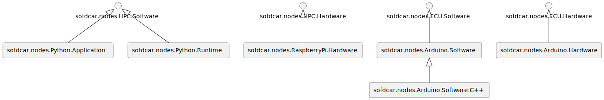

### Node Types

We specify the following node types.
An overview is given in the following Figure 1.

<figure markdown>

<figcaption>Figure 1: TOSCA SofDCar Node Types</figcaption>
</figure>

#### sofdcar.nodes.Python.Application

Non-normative python application running on an HPC. This application required a python runtime.


```yaml linenums="1"
sofdcar.nodes.Python.Application:
  derived_from: sofdcar.nodes.HPC.Software
  requirements:
    - host:
        capability: tosca.capabilities.Compute
        relationship: tosca.relationships.HostedOn
```

#### sofdcar.nodes.Python.Runtime

Non-normative python runtime running on an HPC. This runtime is able to host python applications and requires a host.


```yaml linenums="1"
sofdcar.nodes.Python.Runtime:
  derived_from: sofdcar.nodes.HPC.Software
  capabilities:
    host:
      type: tosca.capabilities.Compute
      valid_source_types:
        - sofdcar.nodes.Python.Application
  requirements:
    - host:
        capability: tosca.capabilities.Compute
        relationship: tosca.relationships.HostedOn
```

#### sofdcar.nodes.RaspberryPi.Hardware

The hardware of an Raspberry Pi serving as a HPC hardware. This Raspberry Pi is able to host HPC software. Furthermore, the Raspberry Pi is able to directly host python applications without explicit python runtime since a python runtime is already installed on the Raspberry Pi.


```yaml linenums="1"
sofdcar.nodes.RaspberryPi.Hardware:
  derived_from: sofdcar.nodes.HPC.Hardware
  capabilities:
    host:
      type: tosca.capabilities.Compute
      valid_source_types:
        - sofdcar.nodes.HPC.Software
        - sofdcar.nodes.Python.Application
```

#### sofdcar.nodes.Arduino.Software

The software running on an Arduino.

```yaml linenums="1"
sofdcar.nodes.Arduino.Software:
  derived_from: sofdcar.nodes.ECU.Software
```

#### sofdcar.nodes.Arduino.Software.C++

C++ software running on an Arduino.

```yaml linenums="1"
sofdcar.nodes.Arduino.Software.C++:
  derived_from: sofdcar.nodes.Arduino.Software
```

#### sofdcar.nodes.Arduino.Hardware

The hardware of an Arduino serving as ECU hardware. The Arduino is able to host Arduino software.


```yaml linenums="1"
sofdcar.nodes.Arduino.Hardware:
  derived_from: sofdcar.nodes.ECU.Hardware
  capabilities:
    host:
      type: sofdcar.capabilities.Host.ECU.Software
      valid_source_types:
        - sofdcar.nodes.Arduino.Software
```


