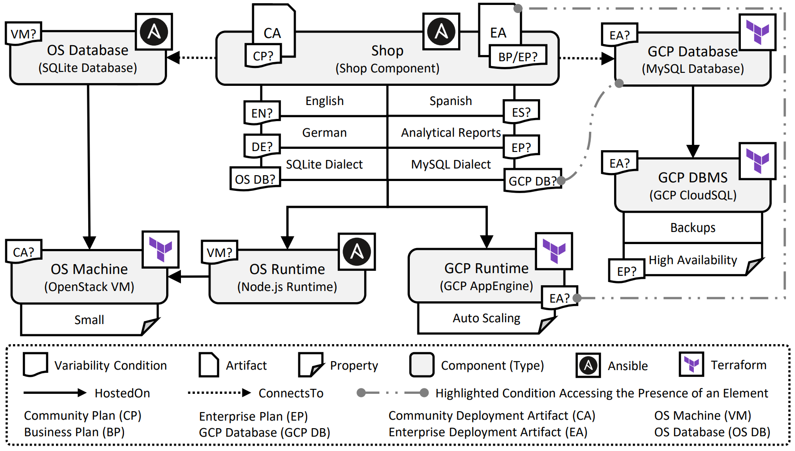

---
tags:
- Variability4TOSCA
- Guide
- Publication
- CoopIS 2023
---

# Conditional Deployment Artifacts and Conditional Properties

> TODO: add demo video

In the following, we provide a detailed step-by-step tutorial to deploy the enterprise plan of the shopping application to showcase conditional deployment artifacts and conditional properties, as presented in Figure 1.
The motivating scenario is a simple shopping application that consists of a shop component and a database. 
Thereby, we take the role of a SaaS provider which offers different pricing plans to his customers.
Furthermore, there are two different deployment artifacts: the community deployment artifact and the enterprise deployment artifact.
The community deployment artifact implements the core functionality of the shop component whereas the enterprise deployment artifact additionally implements analytical reporting functionalities.

There is a free community plan that deploys the community deployment artifact along with SQLite on a small virtual machine.
In contrast, the business plan is a paid plan that deploys the enterprise deployment artifact which contains analytical reporting functionalities along with MySQL on Google Cloud Platform (GCP).
However, to have full access to all analytical reporting functionalities, the enterprise plan is required. 
An important aspect of the deployment of the shop component is that the correct SQL dialect must be configured.

<figure markdown>
  {width="700"}
  <figcaption>Figure 1: The available plans of our motivating scenario.</figcaption>
</figure>

## Requirements

You need to fulfill the following requirements to follow this step-by-step tutorial.

- A machine having Ubuntu22.04 LTS installed
- Ipv6 support, thus, WSL is no suitable
- Access to a GCP project
- Gcloud CLI installed on your machine
- Git installed on your machine
- [Unfurl](https://github.com/onecommons/unfurl){target=_blank} installed on your machine
- Terraform installed (and authenticated) on your machine

## Preparation

First, install OpenTOSCA Vintner.
For more information see [Installation](../../../installation.md){target=_blank}.

```shell linenums="1"
curl -fsSL https://vintner.opentosca.org/install.sh | sudo bash -
vintner setup init
```

Next, we configure Unfurl as the orchestrator that should be used for the deployment.
For more information see [Orchestrators](../../../orchestrators.md){target=_blank}.

```shell linenums="1"
vintner orchestrators init unfurl
vintner orchestrators enable --orchestrator unfurl
```

## Import the Template

<figure markdown>
  {width="700"}
  <figcaption>Figure 2: The Variability4TOSCA service template (variable service template) of our motivating scenario.</figcaption>
</figure>


First, we clone the repository.
--8<-- "clone.md"

Then, we import the template and initialize an instance.

```shell linenums="1"
# Add variable service template
vintner templates import --template artifacts --path examples/unfurl-artifacts

# Add instance
vintner instances init --instance artifacts --template artifacts
```

We can optionally inspect the variable service template.
This template contains all possible elements having conditions assigned, as presented in Figure 2.
For example, the MySQL database has a condition assigned that checks if the enterprise deployment artifact is present.

```shell linenums="1"
# (optional) Inspect variable service template
vintner templates inspect --template artifacts
```

## Resolve Variability

We intend to deploy use the enterprise plan of the application.
Furthermore, we want to configure the display language of the shop component to be German.
Therefore, we need to resolve the variability by providing respective variability inputs.

```shell linenums="1"
# Resolve variability
vintner instances resolve --instance artifacts --inputs examples/unfurl-artifacts/tests/enterprise/inputs.yaml
```

You can optionally inspect the generated service template.
This template contains only the elements required for the enterprise plan.
Notably, the enterprise deployment artifacts is present and configured to use the MySQL dialect.

```shell linenums="1"
# (optional) Inspect service template
vintner instances inspect --instance artifacts
```


## Deployment

Finally, we can deploy the application.
Therefore, we need to provide deployment inputs.
An example for the deployment inputs is given in {{ repo_link('examples/unfurl-artifacts/deployment-inputs.example.yaml') }}.
The deployment will take around 15-20 minutes.

```shell linenums="1"
# Deploy instance
vintner instances deploy --instance artifacts --inputs ${INPUTS_PATH}
```

## Undeployment

Afterward, you can undeploy the application.

```shell linenums="1"
# Undeploy instance
vintner instances undeploy --instance artifacts
```

You can also optionally remove the instance or cleanup your filesystem.
Note, cleaning up the filesystem removes any vintner data including, e.g., all imported templates and created instances.

```shell linenums="1"
# (optional) Delete instance
vintner instances delete --instance artifacts

# (optional) Cleanup 
vintner setup clean --force
```

## Logs

This deployment is also executed in our integration pipeline which is executed one a week. 
The logs of the corresponding GitHub action job run can be accessed either [here](https://github.com/OpenTOSCA/opentosca-vintner/actions/runs/6100939642/job/16556255878){target=_blank}.
Relevant steps start with "UNFURL-ARTIFACTS".
However, a GitHub account is required to access these logs. 
Thus, the raw logs can be also accessed [here](./logs.txt){target=_blank} without requiring an GitHub account.

## Publication

This guide is part of our paper accepted at the main track of the CoopIS 2023.
Also, this guide is further extended by our demonstration paper submitted at the demo track also submitted at the CoopIS 2023.
Also check our other [publications](../../../publications.md){target=_blank}.