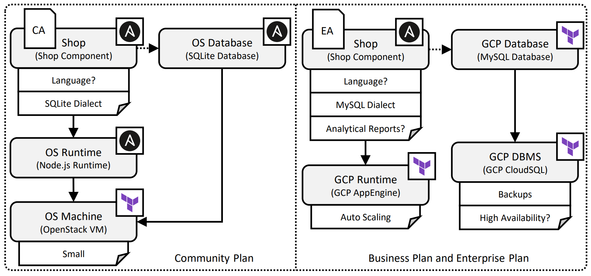
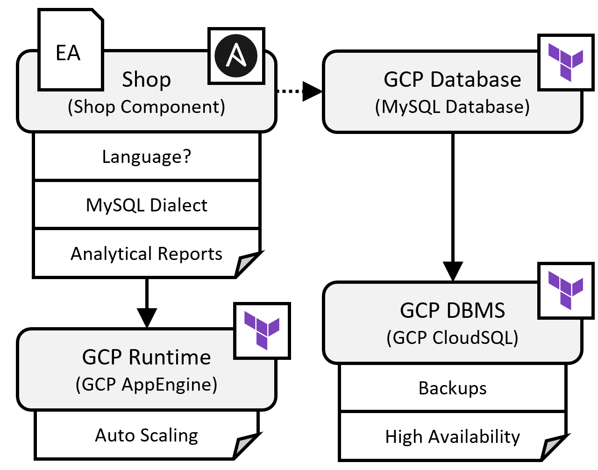

---
tags:
- Variability4TOSCA
- Guide
- Publication
- Zenodo
- CoopIS 2023
- Unfurl
---

# Conditional Deployment Artifacts and Conditional Properties

<div class="video-wrap">
  <div class="video-container">
    <iframe src="https://www.youtube.com/embed/6szIGJPuCsU?si=zlqebXF3O5yE4sAP" title="YouTube video player" frameborder="0" allow="accelerometer; autoplay; clipboard-write; encrypted-media; gyroscope; picture-in-picture; web-share" allowfullscreen></iframe>
 </div>
</div>

This document holds a detailed step-by-step guide to deploy the enterprise plan of a web shop application to showcase conditional deployment artifacts and conditional properties, as presented in Figure 1.
The motivating scenario is a simple shopping application that consists of a shop component and a database. 
Thereby, we take the role of a SaaS provider which offers different pricing plans to his customers.
Furthermore, there are two different deployment artifacts: the community deployment artifact and the enterprise deployment artifact.
The community deployment artifact implements the core functionality of the shop component whereas the enterprise deployment artifact additionally implements analytical reporting functionalities.

There is a free community plan that deploys the community deployment artifact along with SQLite on a small virtual machine.
In contrast, the business plan is a paid plan that deploys the enterprise deployment artifact which contains analytical reporting functionalities along with MySQL on Google Cloud Platform (GCP).
However, to have full access to all analytical reporting functionalities, the enterprise plan is required. 
An important aspect of the deployment of the shop component is that the correct SQL dialect must be configured.

<figure markdown>
  {width="700"}
  <figcaption>Figure 1: The different deployment variants.</figcaption>
</figure>

## Requirements

We need to fulfill the following requirements to follow this step-by-step guide.

- A machine having Ubuntu22.04 LTS installed
- Ipv6 support, thus, WSL is no suitable
- Access to a GCP project
- GCloud installed on your machine
- Git installed on your machine
- [Unfurl](https://github.com/onecommons/unfurl){target=_blank} installed on your machine
- Terraform installed on your machine

## Preparation

First, we install OpenTOSCA Vintner.
For more information see [Installation](../../../installation.md){target=_blank}.

--8<-- "install.md"

Next, we configure Unfurl as the orchestrator that should be used for the deployment.
For more information see [Orchestrators](../../../orchestrators.md){target=_blank}.

```shell linenums="1"
vintner orchestrators init unfurl
vintner orchestrators enable --orchestrator unfurl
```

## Import the Template

<figure markdown>
  {width="700"}
  <figcaption>Figure 2: The Variability4TOSCA template.</figcaption>
</figure>

First, we clone the repository.
--8<-- "clone.md"

Next, we import the template and initialize an instance.

```shell linenums="1"
vintner templates import --template artifacts --path examples/unfurl-artifacts
```

Next, we initialize an application instance.

```shell linenums="1"
vintner instances init --instance artifacts --template artifacts
```

We can optionally inspect the Variability4TOSCA template.
This template contains all possible elements having conditions assigned.
For example, the MySQL database has a condition assigned that checks if the enterprise deployment artifact is present.
An overview is given in Figure 2.

```shell linenums="1"
vintner templates inspect --template artifacts
```

## Resolve Variability

<figure markdown>
  {width="300"}
  <figcaption>Figure 3: The deployment variant.</figcaption>
</figure>

We intend to deploy the enterprise plan.
Furthermore, we want to configure the display language of the shop component to be German.
We specify this when resolving variability.

```shell linenums="1"
vintner instances resolve --instance artifacts --inputs examples/unfurl-artifacts/tests/enterprise/inputs.yaml
```

We can optionally inspect the generated TOSCA-compliant template.
This template contains only the elements required for the enterprise plan.
Notably, the enterprise deployment artifacts is present and configured to use the MySQL dialect.
An overview is given in Figure 3.

```shell linenums="1"
vintner instances inspect --instance artifacts
```


## Deploy the Application

Finally, we deploy the application.
Therefore, we need to provide deployment inputs, e.g., credentials to GCP.
Possible deployment inputs are specified in `topology_template.inputs` of the TOSCA-compliant template.
The deployment will take around 15-20 minutes.

```shell linenums="1"
vintner instances deploy --instance artifacts --inputs ${INPUTS_PATH}
```

## Undeploy the Application

Afterward, we can undeploy the application.

```shell linenums="1"
vintner instances undeploy --instance artifacts
```

Optionally, we can remove the instance and cleanup the filesystem.
Cleaning up the filesystem removes any data including, e.g., all imported templates and created instances.

```shell linenums="1"
vintner instances delete --instance pruning
vintner setup clean --force
```

## Complexity Analysis

The templates for our complexity analysis can be found {{ repo_link('examples/unfurl-artifacts/stats', 'here') }}.

## Logs

This deployment is also executed in our integration pipeline, which is executed once a week. 
The logs of the corresponding GitHub action job run can be accessed [here](https://github.com/OpenTOSCA/opentosca-vintner/actions/workflows/night.yaml){target=_blank}.
Relevant steps start with "UNFURL-ARTIFACTS".
Note, a GitHub account is required to access these logs. 
The raw logs of a recorded job are [available](./logs.txt){target=_blank} without requiring an GitHub account.

## Zenodo

The assets of this guide can be also found on [Zenodo](https://doi.org/10.5281/zenodo.10445089){target=_blank}.

## Publication

This guide is part of our [research paper](../../../publications.md#managing-the-variability-of-component-implementations-and-their-deployment-configurations-across-heterogeneous-deployment-technologies){target=_blank} published at the main track of the CoopIS 2023.
Also, this guide is further extended by our [demonstration paper](../../../publications.md#using-variability4tosca-and-opentosca-vintner-for-holistically-managing-deployment-variability){target=_blank} which was published at the demo track at the CoopIS 2023.
Also check our other [publications](../../../publications.md){target=_blank}.
