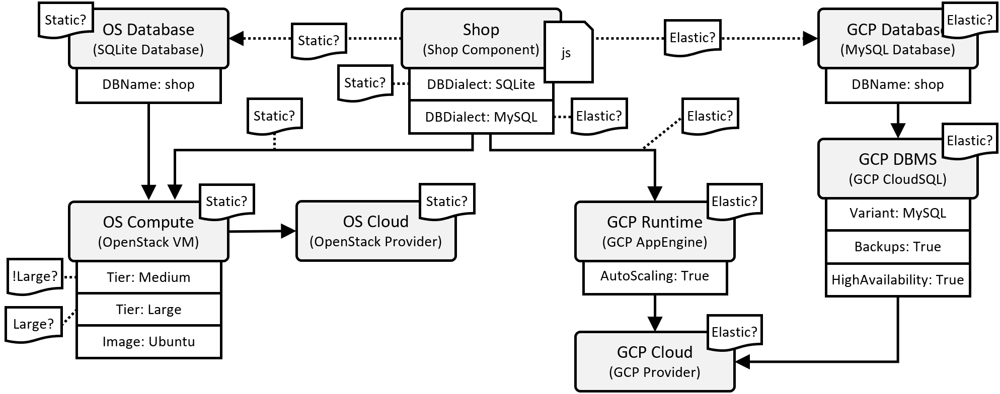
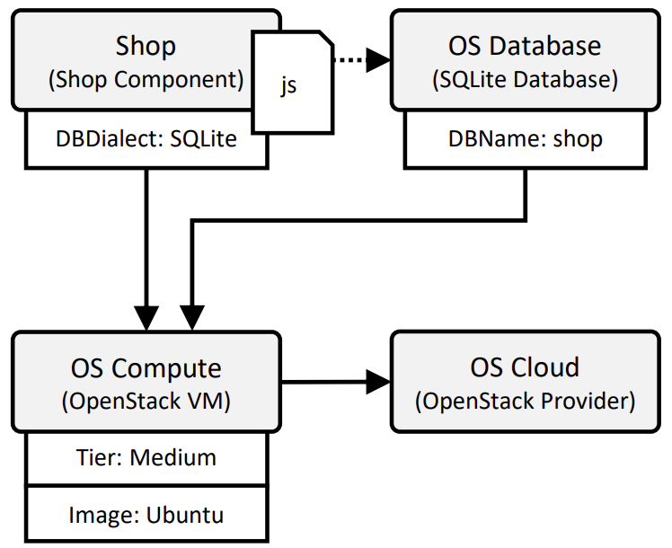

---
tags:
- Variability4TOSCA
- Guide
- Publication
- Zenodo
- CLOSER 2024
- xOpera
---

# Pruning Modes Case Study


This document holds a detailed step-by-step tutorial to deploy the medium-sized static deployment variant of a webshop application to showcase the Consistent-Loose Pruning Mode.
The webshop application can be deployed in the following deployment variants.

- static with medium resources on a single virtual machine on a local OpenStack (OS) instance
- static with large resources on a single virtual machine on a local OpenStack (OS) instance
- elastic with high availability and backups on Google Cloud Platform (GCP)


## Requirements

We need to fulfill the following requirements to follow this step-by-step tutorial.

- Linux machine, e.g., Ubuntu 22.04
- Access to an OpenStack instance


## Preparation

First, we install OpenTOSCA Vintner.
For more information see [Installation](../../../installation.md){target=_blank}.

--8<-- "install.md"

Next, install xOpera.

```shell linenums="1"
yarn vintner setup install --xopera
```

Next, we configure xOpera as the orchestrator that should be used for the deployment.

```shell linenums="1"
yarn vintner orchestrators init xopera --no-venv
yarn vintner orchestrators enable --orchestrator xopera
yarn vintner orchestrators attest --orchestrator xopera
```


## Import the Template

<figure>
  
  <figcaption>Figure 1: The Variability4TOSCA model of our webshop.</figcaption>
</figure>
<br/>
<br/>

First, we import the Variability4TOSCA template.

```shell linenums="1"
yarn vintner templates import --template pruning-mode --path examples/xopera-pruning-consistent-loose
```

Then, we initialize an application instance.

```shell linenums="1"
yarn vintner instances init --instance pruning-mode --template pruning-mode
```

We can optionally inspect the Variability4TOSCA model.
This model contains all possible elements having conditions assigned.
However, due to pruning, only a handful of condition must be modeled, e.g., the condition checking if a medium or large virtual machine is required.
This is shown in Figure 1.

```shell linenums="1"
yarn vintner templates inspect --template pruning-mode
```


## Resolve Variability

<figure>
  
  <figcaption>Figure 2: The medium-sized static deployment variant of the webshop.</figcaption>
</figure>

We want to deploy the medium-sized static variant of the webshop application using GCP.
We specify this when resolving variability as follows.

```shell linenums="1"
yarn vintner instances resolve --instance pruning-mode --presets static
```

You can optionally inspect the generated TOSCA-compliant model.
This template contains only the elements required for the elastic variant, e.g., the MySQL database.
This is shown in Figure 2.

```shell linenums="1"
yarn vintner instances inspect --instance pruning-mode
```


## Deploy the Application

Finally, we can deploy the elastic variant.
Therefore, we need to provide deployment inputs, e.g., credentials to OpenStack.
These inputs are specified in `topology_template.inputs` of the TOSCA-compliant model.
The following inputs must be defined.

```yaml linenums="1"
os_compute_network: <OS_COMPUTE_NETWORK>
os_compute_security_groups: <OS_COMPUTE_SECURITY_GROUPS>
os_compute_key_name: <OS_COMPUTE_KEY_NAME>
os_compute_ssh_user: <OS_COMPUTE_SSH_USER>
os_compute_ssh_key_file: <OS_COMPUTE_SSH_KEY_FILE>
os_region_name: <OS_REGION_NAME>
os_auth_type: <OS_AUTH_TYPE>
os_auth_url: <OS_AUTH_URL>
os_identity_api_version: <OS_IDENTITY_API_VERSION>
os_interface: <OS_INTERFACE>
os_application_credential_id: <OS_APPLICATION_CREDENTIAL_ID>
os_application_credential_secret: <OS_APPLICATION_CREDENTIAL_SECRET>

# Also required. Just fill them with dummy values.
database_password: <DATABASE_PASSWORD>
gcp_region: <GCP_REGION>
gcp_service_account_file: <GCP_SERVICE_ACCOUNT_FILE>
gcp_project: <GCP_PROJECT>
gcp_auto_scaling: <GCP_AUTO_SCALING>
```

Next, start the deployment. 
The deployment will take around 5 minutes.

```shell linenums="1"
yarn vintner instances deploy --instance pruning-mode --inputs ${INPUTS_PATH}
```


## Test the Application 

Next, we can test that the application is correctly working. 
Therefore, find out the hostname of the provisioned virtual machine.

```shell linenums="1"
curl --fail-with-body http://${HOSTNAME_OF_VM}:3000
```

If no hostname has been assigned, then use the IPv4 address.

```shell linenums="1"
curl --fail-with-body http://[${IPv4_ADDRESS_OF_VM}]:3000
```

This should return the following.

```yaml linenums="1"
{
   "MESSAGE": "Successfully executed query",
   "QUERY": "SELECT 1 + 1;",
   "DB_DIALECT": "sqlite",
   "DB_NAME": "shop",
   "DB_ADDRESS": "/var/lib/sqlite-databases/shop.db",
   "DB_USERNAME": "root",
   "DB_PASSWORD": "5e88"
}
```

We can observe the following.

- according to `MESSAGE`, the query has been successful
- according to `DB_DIALECT`, the SQLite has been used as dialect
- according to `DB_ADDRESS`, a local SQLite database has been used

Thus, we conclude that the application has been deployed as desired.


## Undeploy the Application

Afterward, we can undeploy the application.

```shell linenums="1"
yarn vintner instances undeploy --instance pruning-mode
```

We can also optionally remove the instance or cleanup the filesystem.
Note, cleaning up the filesystem removes any vintner data including, e.g., all imported templates and created instances.

```shell linenums="1"
yarn vintner instances delete --instance pruning-mode
yarn vintner setup clean --force
```

## Logs

This deployment is also executed in our integration pipeline, which is executed once a week.
The logs of the corresponding GitHub action can be accessed [here](https://github.com/OpenTOSCA/opentosca-vintner/actions/workflows/night.yaml){target=_blank}.
Relevant jobs start with "Unfurl Artifacts".
Note, a GitHub account is required to access these logs.
The raw logs are [available](../../../assets/documents/night.zip){target=_blank} without requiring an GitHub account.

## Zenodo

The assets of this guide can be also found on [Zenodo](https://doi.org/10.5281/zenodo.10363694){target=_blank}.

## Publication

This guide is part of our [paper](../../../publications.md#pruning-modes-for-deployment-models-from-manual-modeling-to-automated-removal-of-elements-and-their-implications){target=_blank} published at the CLOSER 2024.
Also check our other [publications](../../../publications.md){target=_blank}.
