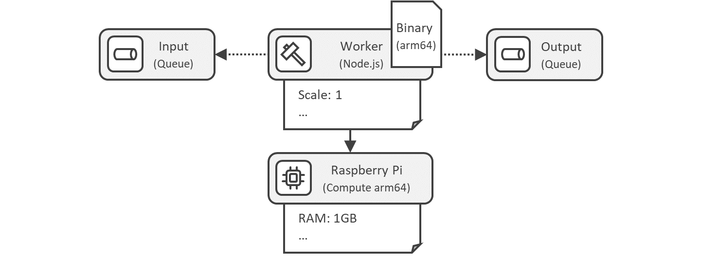
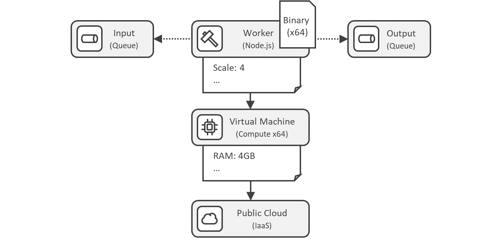

---
tags:
- Variability4TOSCA
- Guide
- xOpera
- Experimental
---

# Pipes and Filters Application

!!! Warning
    This document presents experimental features and is still in an early stage.

In the following, we provide a detailed step-by-step guide to deploy the Raspberry Pi variant of the pipes-and-filters application to showcase conditional deployment artifacts and properties.
The application can be either installed on a Raspberry Pi or on a virtual machine. 
Based on the underlying host, either an arm64 or x64 binary must be used. 
The application is also differently configured due to the different availability of RAM.

<figure markdown>
  {width="500"}
  <figcaption>Figure 1: Deployment Variant using Raspberry Pi</figcaption>
</figure>

<figure markdown>
  {width="500"}
  <figcaption>Figure 2: Deployment Variant using Virtual Machine</figcaption>
</figure>


## Environment

We expect that the [xOpera CLI](https://github.com/xlab-si/xopera-opera){target=_blank} is installed on a Linux machine and that a [Raspberry Pi 3 Model B+](https://www.raspberrypi.com/products/raspberry-pi-3-model-b-plus/){target=_blank} is available.

## Preparation

First, we install OpenTOSCA Vintner.
For more information see [Installation](../../../installation.md){target=_blank}.

--8<-- "install.md"

Next, we need to configure xOpera as the orchestrator that should be used for the deployment.
For more information see [Orchestrators](../../../orchestrators.md){target=_blank}.

```shell linenums="1"
vintner orchestrators init xopera
vintner orchestrators enable --orchestrator xopera
```

## Deployment

Deploy the Raspberry Pi variant of the pipes-and-filters application.
Therefore, import the template, create an instance, resolve the variability and finally deploy the application.

```shell linenums="1"
# Add variable service template
vintner templates import --template pipes-and-filters --path examples/xopera-pipes-and-filters

# Add instance
vintner instances init --instance pipes-and-filters --template pipes-and-filters

# Resolve variability
vintner instances resolve --instance pipes-and-filters --presets raspberry

# (optional) Inspect service template
vintner instances inspect --instance pipes-and-filters

# Deploy instance
vintner instances deploy --instance pipes-and-filters --inputs ${INPUTS_PATH}
```

## Undeployment

Cleanup the deployment.
Therefore, undeploy the instance and cleanup the filesystem.

```shell linenums="1"
# Undeploy instance
vintner instances undeploy --instance pipes-and-filters

# Cleanup
vintner setup clean --force
```
