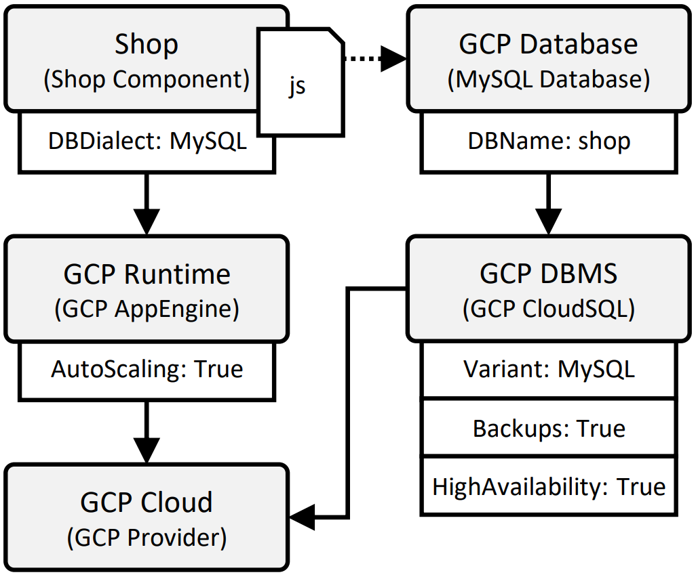

---
tags:
- Variability4TOSCA
- Guide
- Publication
- UCC 2023
---

# Pruning Elements

In the following, we provide a detailed step-by-step tutorial to deploy the elastic deployment variant of a web shop application to showcase the reduced modeling effort when pruning elements.
The web shop application can be deployed in the following deployment variants.

- static with medium resources on a single virtual machine on a local OpenStack (OS) instance 
- static with large resources on a single virtual machine on a local OpenStack (OS) instance
- elastic with high availability and backups on Google Cloud Platform (GCP)

## Requirements 

We need to fulfill the following requirements to follow this step-by-step tutorial.

- Linux machine, e.g., Ubuntu 22.04
- Git installed
- Ansible installed
- [xOpera](https://github.com/xlab-si/xopera-opera) installed (Version 0.6.9 is required!)
- [gcloud](https://cloud.google.com/sdk/docs/install) installed
- Access to a GCP project

## Preparation

First, install OpenTOSCA Vintner.
For more information see [Installation](../../../installation.md){target=_blank}.

--8<-- "install.md"

Next, we configure xOpera as the orchestrator that should be used for the deployment.
For more information see [Orchestrators](../../../orchestrators.md){target=_blank}.

```shell linenums="1"
vintner orchestrators init xopera
vintner orchestrators enable --orchestrator xopera
```

## Import the Template 

<figure markdown>
  {width="700"}
  <figcaption>Figure 1: The Variability4TOSCA model of our motivating scenario.</figcaption>
</figure>

First, we clone the repository.
--8<-- "clone.md"

Next, import the Variability4TOSCA template.

```shell linenums="1"
vintner templates import --template pruning --path examples/xopera-pruning
```

Next, initialize an application instance.

```shell linenums="1"
vintner instances init --instance pruning --template pruning
```

We can optionally inspect the Variability4TOSCA model.
This model contains all possible elements having conditions assigned.
However, due to pruning, only a handful of condition must be modeled, e.g., the condition checking if a medium or large virtual machine is required.
This is shown in Figure 1.

```shell linenums="1"
vintner templates inspect --template pruning
```

## Resolve Variability

<figure markdown>
  {width="300"}
  <figcaption>Figure 1: The elastic deployment variant of our motivating scenario.</figcaption>
</figure>

We want to deploy the elastic variant of the web shop application using GCP.
We specify this when resolving variability as follows.

```shell linenums="1"
vintner instances resolve --instance pruning --presets elastic
```

You can optionally inspect the generated TOSCA-compliant model.
This template contains only the elements required for the elastic variant, e.g., the MySQL database.
This is shown in Figure 2.

```shell linenums="1"
vintner instances inspect --instance pruning
```

## Deploy the Application

Finally, we deploy the elastic variant.
Therefore, we need to provide deployment inputs, e.g., credentials to GCP.
These inputs are specified in `topology_template.inputs` of the TOSCA-compliant model.
The deployment will take around 15-20 minutes.

```shell linenums="1"
vintner instances deploy --instance pruning --inputs ${INPUTS_PATH}
```

## Undeploy the Application 

Afterward, we undeploy the application.

```shell linenums="1"
vintner instances undeploy --instance pruning
```

We can also optionally remove the instance or cleanup the filesystem.
Note, cleaning up the filesystem removes any Vintner data including, e.g., all imported templates and created instances.

```shell linenums="1"
vintner instances delete --instance pruning
vintner setup clean --force
```

## Complexity Analysis

The models for our complexity analysis can be found {{ repo_link('examples/xopera-pruning/stats', 'here') }}.

## Logs

This deployment is also executed in our integration pipeline which is executed once a week.
The logs of the corresponding GitHub action job run can be accessed either [here](https://github.com/OpenTOSCA/opentosca-vintner/actions/runs/6677267360/job/18147105860){target=_blank}.
Relevant steps start with "XOPERA-PRUNING".
Note, a GitHub account is required to access these logs.
The raw logs can be also accessed [here](./logs.txt){target=_blank} without requiring an GitHub account.

## Zenodo

The assets of this guide can be also found on [Zenodo](https://doi.org/10.5281/zenodo.10050261){target=_blank}.

## Publication

This guide is part of our [paper](../../../publications.md#enhancing-deployment-variability-management-by-pruning-elements-in-deployment-models){target=_blank} accepted at the UCC 2023.
Also check our other [publications](../../../publications.md){target=_blank}.
