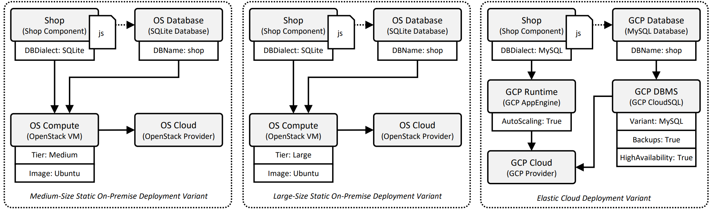
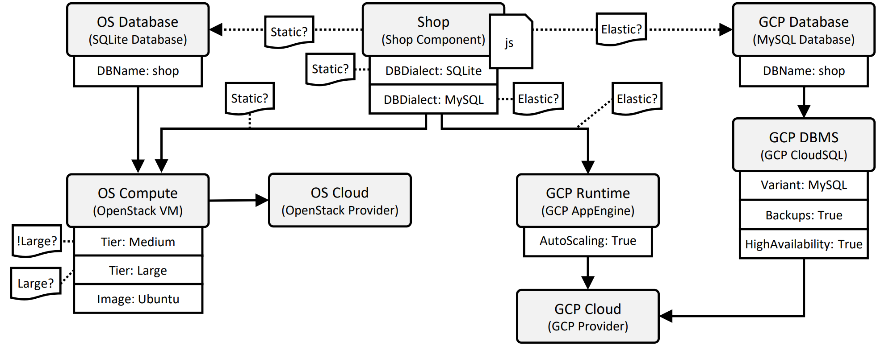
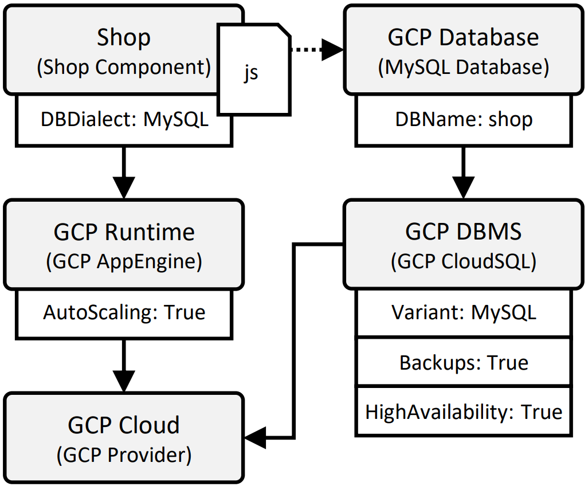

---
tags:
- Variability4TOSCA
- Guide
- Publication
- Zenodo
- UCC 2023
- xOpera
---

# Pruning Elements

<figure markdown>
  
  <figcaption>Figure 1: The different deployment variants.</figcaption>
</figure>

This document holds a detailed step-by-step guide to deploy the elastic deployment variant of a web shop application to showcase the reduced modeling effort when pruning elements.
The application can be deployed in the following deployment variants, see Figure 1.

- static with medium resources on a single virtual machine on a local OpenStack (OS) instance 
- static with large resources on a single virtual machine on a local OpenStack (OS) instance
- elastic with high availability and backups on Google Cloud Platform (GCP)

## Requirements

We need to fulfill the following requirements to follow this step-by-step guide.

- Ubuntu 22.04
- Access to a GCP project
- GCloud
- Git
- xOpera
- Ansible

## Preparation

First, we install OpenTOSCA Vintner.
For more information see [Installation](../../../installation.md){target=_blank}.

--8<-- "install.md"

Next, we configure xOpera as the orchestrator that should be used for the deployment.
For more information see [Orchestrators](../../../orchestrators.md){target=_blank}.

```shell linenums="1"
vintner orchestrators init xopera
vintner orchestrators enable --orchestrator xopera
```

## Import the Template 

<figure markdown>
  {width="700"}
  <figcaption>Figure 2: The Variability4TOSCA template.</figcaption>
</figure>

First, we clone the repository.
--8<-- "clone.md"

Next, we import the Variability4TOSCA template.

```shell linenums="1"
vintner templates import --template pruning --path examples/xopera-pruning
```

Next, we initialize an application instance.

```shell linenums="1"
vintner instances init --instance pruning --template pruning
```

We can optionally inspect the Variability4TOSCA template.
This template contains all possible elements having conditions assigned.
However, due to pruning, only a handful of condition must be modeled, e.g., the condition checking if a medium or large virtual machine is required.
An overview is given in Figure 2.

```shell linenums="1"
vintner templates inspect --template pruning
```

## Resolve Variability

<figure markdown>
  {width="300"}
  <figcaption>Figure 3: The deployment variant.</figcaption>
</figure>

We intend to deploy the elastic variant.
We specify this when resolving variability.

```shell linenums="1"
vintner instances resolve --instance pruning --presets elastic
```

We can optionally inspect the generated TOSCA-compliant template.
This template contains only the elements required for the elastic variant, e.g., the MySQL database.
An overview is given in Figure 3.

```shell linenums="1"
vintner instances inspect --instance pruning
```

## Deploy the Application

Finally, we deploy the application.
Therefore, we need to provide deployment inputs, e.g., credentials to GCP.
Possible deployment inputs are specified in `topology_template.inputs` of the TOSCA-compliant template.
The deployment will take around 15-20 minutes.

```shell linenums="1"
vintner instances deploy --instance pruning --inputs ${INPUTS_PATH}
```

## Undeploy the Application 

Afterward, we undeploy the application.

```shell linenums="1"
vintner instances undeploy --instance pruning
```

Optionally, we can remove the instance and cleanup the filesystem.
Cleaning up the filesystem removes any data including, e.g., all imported templates and created instances.

```shell linenums="1"
vintner instances delete --instance pruning
vintner setup clean --force
```

## Complexity Analysis

The templates for our complexity analysis can be found {{ repo_link('examples/xopera-pruning/stats', 'here') }}.

## Logs

This deployment is also executed in our integration pipeline, which is executed once a week.
The logs of the corresponding GitHub action job run can be accessed [here](https://github.com/OpenTOSCA/opentosca-vintner/actions/workflows/night.yaml){target=_blank}.
Relevant steps start with "UNFURL-ARTIFACTS".
Note, a GitHub account is required to access these logs.
The raw logs of a recorded job are [available](./logs.txt){target=_blank} without requiring an GitHub account.

## Zenodo

The assets of this guide can be also found on [Zenodo](https://doi.org/10.5281/zenodo.10050260){target=_blank}.

## Publication

This guide is part of our [paper](../../../publications.md#enhancing-deployment-variability-management-by-pruning-elements-in-deployment-models){target=_blank} published at the UCC 2023.
Also check our other [publications](../../../publications.md){target=_blank}.
