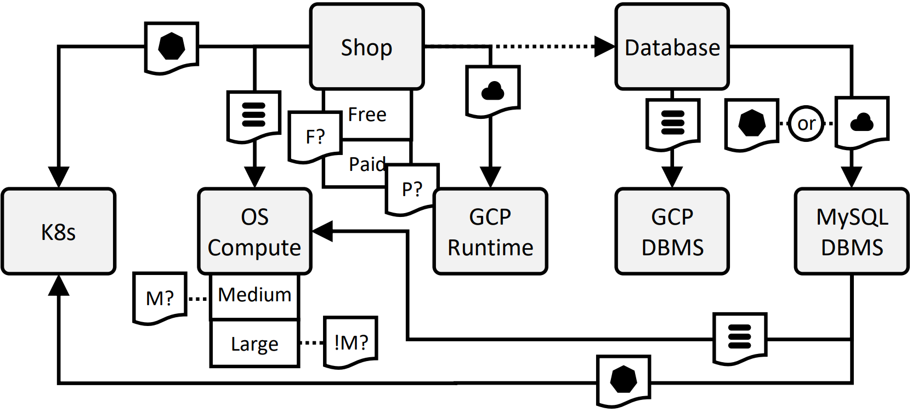
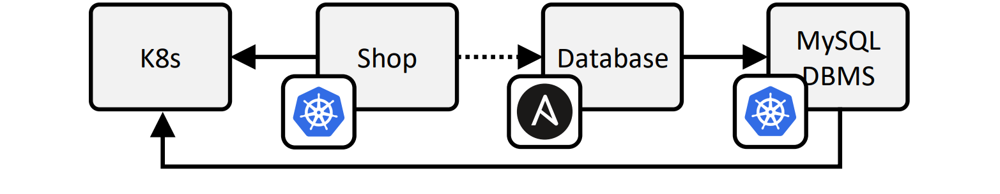

# Conditional Deployment Technologies

This document holds the step-by-step guide to deploy the Kubernetes deployment variant of the web shop application to showcase the conditional deployment technologies.
The application can be deployed in the following deployment variants.

- static on a single virtual machine on a local OpenStack (OS) instance
- elastic on Google Cloud Platform (GCP)
- elastic on Kubernetes


## Requirements

We need to fulfill the following requirements to follow this step-by-step tutorial.

- Linux machine, e.g., Ubuntu 22.04
- Access to a Kubernetes instance


## Preparation

First, we install OpenTOSCA Vintner.
For more information see [Installation](../../../installation.md){target=_blank}.

--8<-- "install.md"

Next, we install Unfurl.

```shell linenums="1"
vintner install unfurl
```

Next, we configure Unfurl as the orchestrator that should be used for the deployment.

```shell linenums="1"
vintner orchestrators init unfurl
vintner orchestrators enable --orchestrator unfurl
```

Next, we attest that Vintner can use unfurl.

```shell linenums="1"
vintner orchestrators attest --orchestrator unfurl
```


## Import the Template

<figure>
  
  <figcaption>Figure 1: The Variability4TOSCA model.</figcaption>
</figure>
<br/>
<br/>

Next, we import the Variability4TOSCA template.

```
vintner templates import --template aware --path examples/unfurl-technology---shop---plus-maintenance-automated
```

Then, we initialize an application instance.

```
vintner instances init --instance unfurl-technology --template unfurl-technology
```

We can optionally inspect the Variability4TOSCA model.
This model contains all possible elements having conditions assigned.
However, due to the automatic selection of technologies, no technologies must be modeled.
This is shown in Figure 1.

```
vintner templates inspect --template unfurl-technology
```


## Resolve Variability

<figure>
  
  <figcaption>Figure 2: The derived TOSCA model.</figcaption>
</figure>
<br/>
<br/>

We want to deploy the Kubernetes variant of the web shop application with the optional and the premiun feature enabled.
Therefore, we first create the following file.

```
# /tmp/variability-inputs.yaml

env: KUBERNETES
tier: LARGE
optional_feature: true
premium_feature: true
```

Next, we resolve the variability.

```
vintner instances resolve --instance unfurl-technology --inputs /tmp/variability-inputs.yaml
```

You can optionally inspect the generated TOSCA-compliant model.
This template contains only the elements required for the Kubernetes variant.
Moreover, deployment technologies have been assigned.
This is shown in Figure 2.

```
vintner instances inspect --instance unfurl-technology
```


## Deploy the Application

Finally, we can deploy the application.
Therefore, we need to provide deployment inputs, e.g., credentials to OpenStack.
These inputs are specified in `topology_template.inputs` of the TOSCA-compliant model.
The following inputs must be defined.

```
# /tmp/deployment-inputs.yaml

database_password: YOUR_DB_PASSWORD
database_password: YOUR_DBMS_PASSWORD
k8s_host: YOUR_K8S_HOST
k8s_ca_cert_file: YOUR_K8S_CA_CERT_FILE
k8s_client_cert_file: YOUR_K8S_CLIENT_CERT_FILE
k8s_client_key_file: YOUR_K8S_CLIENT_KEY_FILE
```

Next, we start the deployment. 
The deployment will take around 1-5 minutes.

```
vintner instances deploy --instance unfurl-technology --inputs /tmp/deployment-inputs.yaml
```


## Test the Application 

Next, we can test that the application is correctly working. 
Therefore, find out the endpoint assigned by the ingress.

```
curl --fail-with-body ${ENDPOINT}
```

This should return the following.

```
{
   "MESSAGE": "Successfully executed query",
   "QUERY": "SELECT 1 + 1;",
   "DB_DIALECT": "mysql",
   "DB_NAME": "shop",
   "DB_ADDRESS": "mysql",
   "DB_USERNAME": "root",
   "DB_PASSWORD": "5e88"
}
```

We can observe the following.

- according to `MESSAGE`, the query has been successful
- according to `DB_ADDRESS`, the MySQL instance running in Kubernetes has been used

Thus, we conclude that the application has been deployed as desired.


## Undeploy the Application

Afterward, we can undeploy the application.

```
vintner instances undeploy --instance unfurl-technology
```

We can also optionally remove the instance or cleanup the filesystem.
Note, cleaning up the filesystem removes any vintner data including, e.g., all imported templates and created instances.

```
vintner instances delete --instance unfurl-technology
vintner setup clean --force
```
