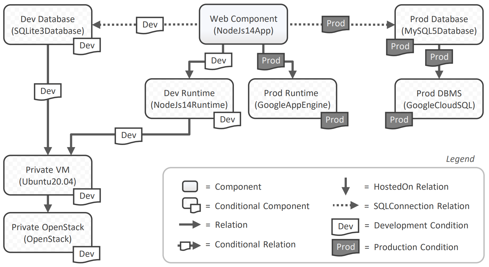
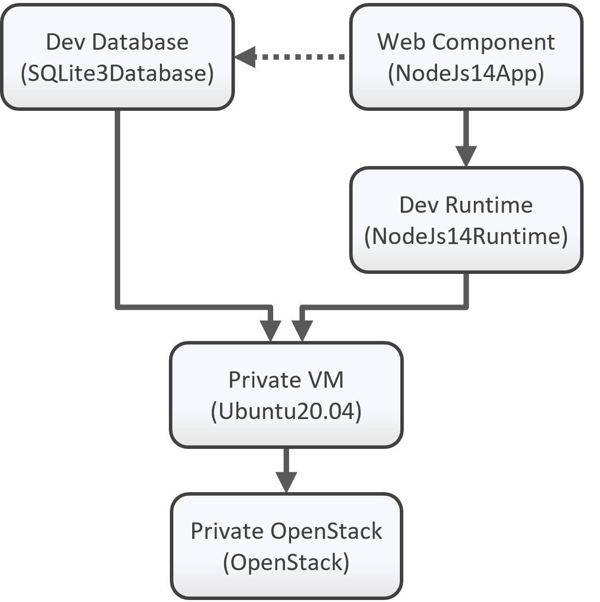

---
tags:
- Variability4TOSCA
- Guide
- Publication
- Algorithms 2022
- xOpera
---

# Motivation

<figure markdown>
  {width="700"}
  <figcaption>Figure 1: The different deployment variants.</figcaption>
</figure>

This document holds a detailed step-by-step guide to deploy the development variant of the motivating scenario.
The motivating scenario is a simple composite application that consists of a web component and a database, as presented in Figure 1.

This application can be deployed in different variants.
During development the application should be deployed on a single virtual machine.
However, for the productive operation, an elastic deployment is required and, therefore, the application is deployed on Google Cloud Platform (GCP).

## Requirements

We need to fulfill the following requirements to follow this step-by-step guide.

- Access to an OpenStack instance
- A machine having Ubuntu22.04 LTS installed
- Git installed on your machine
- Python3 installed on your machine
- [xOpera](https://github.com/xlab-si/xopera-opera){target=_blank} installed on your machine
- [Ansible Galaxy Collection `openstack.cloud`](https://galaxy.ansible.com/openstack/cloud){target=_blank} installed on your machine

## Preparation

First, we install OpenTOSCA Vintner.
For more information see [Installation](../../installation.md){target=_blank}.

--8<-- "install.md"

Next, we configure xOpera as the orchestrator that should be used for the deployment.
For more information see [Orchestrators](../../orchestrators.md){target=_blank}.

```shell linenums="1"
vintner orchestrators init xopera
vintner orchestrators enable --orchestrator xopera
```

## Import the Template

<figure markdown>
  {width="700"}
  <figcaption>Figure 2: The Variability4TOSCA template.</figcaption>
</figure>

First, we clone the repository.
--8<-- "clone.md"

Next, we import the Variability4TOSCA template.

```shell linenums="1"
vintner templates import --template motivation --path examples/motivation
```

Next, we initialize an application instance.

```shell linenums="1"
vintner instances init --instance motivation --template motivation
```

We can optionally inspect the Variability4TOSCA template.
This template contains all possible elements having conditions assigned.
For example, the virtual machine hosted on OpenStack has a condition assigned that checks if the development variant has been chosen.
An overview is given in Figure 2.

```shell linenums="1"
vintner templates inspect --template motivation
```


## Resolve Variability

<figure markdown>
  {width="300"}
  <figcaption>Figure 3: The deployment variant.</figcaption>
</figure>

We intend to deploy the development variant.
Therefore, we need to resolve the variability by providing respective variability inputs.
In our case, we use already predefined variability inputs by using a variability preset.

```shell linenums="1"
vintner instances resolve --instance motivation --presets dev
```

We can optionally inspect the generated TOSCA-compliant template. 
This template contains only the nodes required for the development variant.
An overview is given in Figure 3.

```shell linenums="1"
vintner instances inspect --instance motivation
```

## Deployment

Finally, we deploy the application.
Therefore, we need to provide deployment inputs which contain, e.g., credentials to OpenStack.
Possible deployment inputs are specified in `topology_template.inputs` of the TOSCA-compliant template.
The deployment will take some minutes.

```shell linenums="1"
vintner instances deploy --instance motivation --inputs ${INPUTS_PATH}
```

## Undeployment

Afterward, we can undeploy the application.

```shell linenums="1"
vintner instances undeploy --instance motivation
```

Optionally, we can remove the instance and cleanup the filesystem.
Cleaning up the filesystem removes any data including, e.g., all imported templates and created instances.

```shell linenums="1"
vintner instances delete --instance pruning
vintner setup clean --force
```

## Publication

This guide is part of our [paper](../../publications.md#modeling-different-deployment-variants-of-a-composite-application-in-a-single-declarative-deployment-model){target=_blank} published at the Algorithms 2022.
Also check our other [publications](../../../publications.md){target=_blank}.
