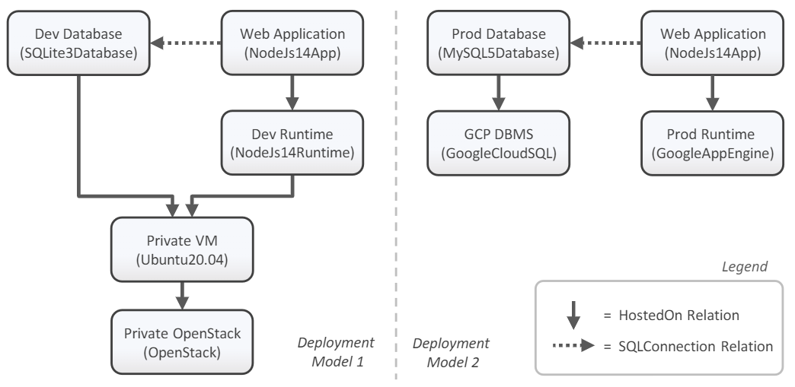

---
tags:
- Variability4TOSCA
- Guide
- Publication
- Algorithms 2022
---

# Motivation

In the following, we provide a detailed step-by-step tutorial to deploy the development variant of the motivating scenario, as presented in Figure 1.
The motivating scenario is a simple composite application that consists of a web component and a database.
This application can be deployed in different variants.
During development the application should be deployed on a single virtual machine.
However, for the productive operation, an elastic deployment is required and, therefore, the application is deployed on Google Cloud Platform (GCP).

<figure markdown>
  {width="700"}
  <figcaption>Figure 1: The TOSCA models of our motivating scenario. The development variant on the left and the production variant on the right.</figcaption>
</figure>

## Requirements

You need to fulfill the following requirements to follow this step-by-step tutorial.

- Access to an OpenStack instance
- A machine having Ubuntu22.04 LTS installed
- Git installed on your machine
- Python3 installed on your machine
- [xOpera](https://github.com/xlab-si/xopera-opera){target=_blank} installed on your machine
- [Ansible Galaxy Collection `openstack.cloud`](https://galaxy.ansible.com/openstack/cloud){target=_blank} installed on your machine

## Preparation

First, install OpenTOSCA Vintner.
For more information see [Installation](../../installation.md){target=_blank}.

```shell linenums="1"
curl -fsSL https://vintner.opentosca.org/install.sh | sudo bash -
vintner setup init
```

Next, we need to configure xOpera as the orchestrator that should be used for the deployment.
For more information see [Orchestrators](../../orchestrators.md){target=_blank}.

```shell linenums="1"
vintner orchestrators init xopera
vintner orchestrators enable --orchestrator xopera
```

## Import the Template

<figure markdown>
  {width="700"}
  <figcaption>Figure 2: The Variability4TOSCA service template (variable service template) of our motivating scenario.</figcaption>
</figure>

First, we clone the repository.
--8<-- "clone.md"

Then, we import the template and initialize an instance.

```shell linenums="1"
# Add variable service template
vintner templates import --template motivation --path opentosca-vintner/examples/motivation

# Add instance
vintner instances init --instance motivation --template motivation
```

We can optionally inspect the variable service template.
This template contains all possible elements having conditions assigned, as presented in Figure 2.
For example, the virtual machine hosted on OpenStack has a condition assigned that checks if the development variant has been chosen.

```shell linenums="1"
# (optional) Inspect variable service template
vintner templates inspect --template motivation
```


## Resolve Variability

We intend to deploy the development variant of the application.
Therefore, we need to resolve the variability by providing respective variability inputs.
In our case, we can use already predefined variability inputs by using a variability preset.

```shell linenums="1"
# Resolve variability
vintner instances resolve --instance motivation --presets dev
```

You can optionally inspect the generated service template. 
This template contains only the nodes required for the development variant, as presented on the left in Figure 1.

```shell linenums="1"
# (optional) Inspect service template
vintner instances inspect --instance motivation
```


## Deployment

Finally, we can deploy the application.
Therefore, we need to provide deployment inputs which contain, e.g., credentials for accessing OpenStack.
An example for the deployment inputs is given in {{ repo_link('examples/xopera-motivation/inputs.example.yaml') }}.
The deployment will take some minutes.

```shell linenums="1"
# Deploy instance
# See examples/xopera-motivation/deployment-inputs.example.yaml as reference
vintner instances deploy --instance motivation --inputs ${INPUTS_PATH}
```

## Undeployment

Afterward, you can undeploy the application.

```shell linenums="1"
# Undeploy instance
vintner instances undeploy --instance motivation
```

You can also optionally remove the instance or cleanup your filesystem.
Note, cleaning up the filesystem removes any vintner data including, e.g., all imported templates and created instances.

```shell linenums="1"
# (optional) Delete instance
vintner instances delete --instance motivation

# (optional) Cleanup 
vintner setup clean
```

## Publication

More information can be found in the following publication.
Also check our other [publications](../../publications.md){target=_blank}.

- Stötzner, Miles, Steffen Becker, Uwe Breitenbücher, Kálmán Képes, and Frank Leymann. 2022. "Modeling Different Deployment Variants of a Composite Application in a Single Declarative Deployment Model" Algorithms 15, no. 10: 382. [https://doi.org/10.3390/a15100382](https://doi.org/10.3390/a15100382){target=_blank}
