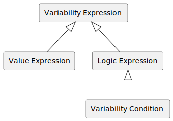

--8<-- "enumerate.html"

# Variability4TOSCA Specification 1.0 Release Candidate

This document specifies Variability4TOSCA which extends
[TOSCA Simple Profile in YAML Version 1.3](https://docs.oasis-open.org/tosca/TOSCA-Simple-Profile-YAML/v1.3/os/TOSCA-Simple-Profile-YAML-v1.3-os.html){target=_blank}
with conditional elements to model deployment variability.
This includes conditional node templates, relationship templates, properties, artifacts, groups, policies, types, inputs, and imports.
In the following, we discuss the differences and the [processes to resolve the variability](#processing).
The specification is under active development and is not backwards compatible with any previous versions.

## Terminology 

In the following, we quickly introduce some terminologies.

- A condition holds if the condition evaluates to true.
- An element is present if all assigned conditions hold.
- An element is absent if not all assigned conditions hold.
- A variability resolver is a TOSCA processor that resolves the variability of a variable service template, thus, derives a variability-resolved service template

## Service Template

A service template must have the TOSCA definitions version `tosca_variability_1_0`.
Such a service template is also called variable service template.

| Keyname                   | Mandatory | Type   | Description                                                              |
|---------------------------|-----------|--------|--------------------------------------------------------------------------|
| tosca_definitions_version | true       | String | The required TOSCA definitions version. Must be `tosca_variability_1_0`. |


## Topology Template

A topology template additionally contains a variability definition.
Such a topology template is also called variable topology template.

| Keyname     | Mandatory | Type                  | Description                                                                                 |
|-------------|-----------|-----------------------|---------------------------------------------------------------------------------------------|
| variability | true       | VariabilityDefinition | A required object for variability inputs, variability presets, and variability expressions. |


## Variability Definition

A variability definition defines variability inputs, variability presets, variability expressions, and variability options.

| Keyname                    | Mandatory | Type                               | Description                                                             |
|----------------------------|-----------|------------------------------------|-------------------------------------------------------------------------|
| inputs                     | true      | Map(String, VariabilityInput)      | A required map of input parameters used inside variability expressions. |
| presets                    | false     | Map(String, VariabilityPreset)     | An optional map of variability preset definitions.                      |
| expressions                | false     | Map(String, VariabilityExpression) | An optional map of variability expressions.                             |
| options                    | false     | Map(String, Boolean)               | An optional map of variability options.                                 |
| type_specific_conditions   | false     | TypeSpecificDefaultConditions      | An optional definition of type-specific default conditions.             |

The following non-normative and incomplete example contains a variability definition which declares the variability
input `mode` and  two variability presets `dev` and `prod` are defined which either assigns `mode` the value `dev` or `prod`.
Furthermore, two variability conditions `is_dev` and `is_prod` which evaluate if `mode` equals `dev` or `prod`, respectively.

```yaml linenums="1"
variability:
    inputs:
        mode:
            type: string

    presets:
        dev:
            name: Development
            description: Deploy the application on a private cloud
            inputs:
                mode: dev
        prod:
            name: Production
            description: Deploy the application on a public cloud
            inputs:
                mode: prod

    expressions:
        is_dev: { equal: [ { variability_input: mode }, dev ] }
        is_prod: { equal: [ { variability_input: mode }, prod ] }
```


## Variability Input

A variability input is an input parameter which additionally has the following keywords.

| Keyname            | Mandatory | Type            | Description                     |
|--------------------|-----------|-----------------|---------------------------------|
| default_expression | false     | ValueExpression | A value expression as default.  |

For example, the following variability input has a value expression as default value assigned. 

````yaml linenums="1"
inputs:
    mode:
        type: string
        default_expression: <ValueExpression>
````

## Variability Options

There are the following variability options.
More specific options override wider set options.
For example, the following options the mode `strict` is configured. 
This mode disables all default conditions and pruning.
However, pruning of nodes is explicitly set by `node_pruning`, thus, nodes are pruned regardless of the set mode.

````yaml linenums="1"
options: 
    mode: strict
    node_pruning: true
````

### General Options

The following options are general options.

| Keyname | Mandatory | Type                                                                                                     | Default | Description               |
|---------|-----------|----------------------------------------------------------------------------------------------------------|---------|---------------------------|
| mode    | false     | strict &#124; consistent-strict &#124; consistent-loose &#124; default &#124; default-loose &#124; loose | strict  | Configure resolving mode. |

### Default Condition Options

The following options are used to configure the default conditions of elements.

| Keyname                                | Mandatory | Type                                                                                                  | Default           | Description                                                         |
|----------------------------------------|-----------|-------------------------------------------------------------------------------------------------------|-------------------|---------------------------------------------------------------------|
| default_condition                      | false     | Boolean                                                                                               | false             | Enable all default conditions (consistency and semantic).           |
| node_default_condition                 | false     | Boolean                                                                                               | false             | Enable default condition for nodes (consistency and semantic).      |
| node_default_condition_mode            | false     | List(source &#124; incoming &#124; incomingnaive &#124; host &#124; artifact &#124; artifactnaive, -) | incoming-artifact | Configure the default condition for nodes.                          |
| node_default_consistency_condition     | false     | Boolean                                                                                               | false             | Enable default consistency condition for nodes.                     |
| node_default_semantic_condition        | false     | Boolean                                                                                               | false             | Enable default semantic condition for nodes.                        |
| relation_default_condition             | false     | Boolean                                                                                               | false             | Enable default condition for relations (consistency and semantic).  |
| relation_default_condition_mode        | false     | List(source &#124; target, -)                                                                         | source-target     | Configure the default condition for relations.                      |
| relation_default_consistency_condition | false     | Boolean                                                                                               | false             | Enable default semantic condition for relations.                    |
| relation_default_semantic_condition    | false     | Boolean                                                                                               | false             | Enable default consistency condition for relations.                 |
| policy_default_condition               | false     | Boolean                                                                                               | false             | Enable default condition for policies (consistency and semantic).   |
| policy_default_consistency_condition   | false     | Boolean                                                                                               | false             | Enable default consistency condition for policies.                  |
| policy_default_semantic_condition      | false     | Boolean                                                                                               | false             | Enable default semantic condition for policies.                     |
| group_default_condition                | false     | Boolean                                                                                               | false             | Enable default condition for groups (consistency and semantic).     |
| group_default_consistency_condition    | false     | Boolean                                                                                               | false             | Enable default consistency condition for groups.                    |
| group_default_semantic_condition       | false     | Boolean                                                                                               | false             | Enable default semantic condition for groups.                       |
| artifact_default_condition             | false     | Boolean                                                                                               | false             | Enable default condition for artifacts (consistency and semantic).  |
| artifact_default_consistency_condition | false     | Boolean                                                                                               | false             | Enable default consistency condition for artifacts.                 |
| artifact_default_semantic_condition    | false     | Boolean                                                                                               | false             | Enable default semantic condition for artifacts.                    |
| property_default_condition             | false     | Boolean                                                                                               | false             | Enable default condition for properties (consistency and semantic). |
| property_default_consistency_condition | false     | Boolean                                                                                               | false             | Enable default consistency condition for properties.                |
| property_default_semantic_condition    | false     | Boolean                                                                                               | false             | Enable default semantic condition for properties.                   |
| type_default_condition                 | false     | Boolean                                                                                               | false             | Enable default condition for types (consistency and semantic).      |
| type_default_consistency_condition     | false     | Boolean                                                                                               | false             | Enable default consistency condition for types.                     |
| type_default_semantic_condition        | false     | Boolean                                                                                               | false             | Enable default semantic condition for types.                        |

### Pruning Options

The following options are used to configure the pruning of elements.

| Keyname                      | Mandatory | Type                                      | Default       | Description                                                 |
|------------------------------|-----------|-------------------------------------------|---------------|-------------------------------------------------------------|
| pruning                      | false     | Boolean                                   | false         | Enable pruning of all elements  (consistency and semantic). |
| node_pruning                 | false     | Boolean                                   | false         | Enable pruning of nodes (consistency and semantic).         |
| node_consistency_pruning     | false     | Boolean                                   | false         | Enable consistency pruning of nodes.                        |
| node_semantic_pruning        | false     | Boolean                                   | false         | Enable semantic pruning of nodes.                           |
| relation_pruning             | false     | Boolean                                   | false         | Enable pruning of relations (consistency and semantic).     |
| relation_consistency_pruning | false     | Boolean                                   | false         | Enable consistency pruning of relations.                    |
| relation_semantic_pruning    | false     | Boolean                                   | false         | Enable semantic pruning of relations.                       |
| policy_pruning               | false     | Boolean                                   | false         | Enable pruning of policies (consistency and semantic).      |
| policy_consistency_pruning   | false     | Boolean                                   | false         | Enable consistency pruning of policies.                     |
| policy_semantic_pruning      | false     | Boolean                                   | false         | Enable semantic pruning of policies.                        |
| group_pruning                | false     | Boolean                                   | false         | Enable pruning of groups (consistency and semantic).        |
| group_consistency_pruning    | false     | Boolean                                   | false         | Enable consistency pruning of groups.                       |
| group_semantic_pruning       | false     | Boolean                                   | false         | Enable semantic pruning of groups.                          |
| artifact_pruning             | false     | Boolean                                   | false         | Enable pruning of artifacts (consistency and semantic).     |
| artifact_consistency_pruning | false     | Boolean                                   | false         | Enable consistency pruning of artifacts.                    |
| artifact_semantic_pruning    | false     | Boolean                                   | false         | Enable semantic pruning of artifacts.                       |
| property_pruning             | false     | Boolean                                   | false         | Enable pruning of properties (consistency and semantic).    |
| property_consistency_pruning | false     | Boolean                                   | false         | Enable consistency pruning of properties.                   |
| property_semantic_pruning    | false     | Boolean                                   | false         | Enable semantic pruning of properties.                      |
| type_pruning                 | false     | Boolean                                   | false         | Enable pruning of types (consistency and semantic).         |
| type_consistency_pruning     | false     | Boolean                                   | false         | Enable consistency pruning of types.                        |
| type_semantic_pruning        | false     | Boolean                                   | false         | Enable semantic pruning of types.                           |

### Checks Options

The following options are used to configure checks.

| Keyname                                      | Mandatory | Type      | Default | Description                                                                     |
|----------------------------------------------|-----------|-----------|---------|---------------------------------------------------------------------------------|
| checks                                       | false     | Boolean   | true    | Enable all checks.                                                              |
| consistency_checks                           | false     | Boolean   | true    | Enable all consistency checks.                                                  |
| semantic_checks                              | false     | Boolean   | true    | Enable all semantic checks.                                                     |
| relation_source_consistency_check            | false     | Boolean   | true    | Enable the consistency check regarding present relation sources.                |
| relation_target_consistency_check            | false     | Boolean   | true    | Enable the consistency check regarding present relation targets.                |
| ambiguous_hosting_consistency_check          | false     | Boolean   | true    | Enable the consistency check regarding at maximum one present hosting relation. |
| missing_artifact_container_consistency_check | false     | Boolean   | true    | Enable the consistency check regarding present container of artifacts.          |
| ambiguous_artifact_consistency_check         | false     | Boolean   | true    | Enable the consistency check regarding ambiguous present artifacts.             |
| missing_property_container_consistency_check | false     | Boolean   | true    | Enable the consistency check regarding present container of properties.         |
| ambiguous_property_consistency_check         | false     | Boolean   | true    | Enable the consistency check regarding ambiguous present properties.            |
| missing_type_container_consistency_check     | false     | Boolean   | true    | Enable the consistency check regarding present containers of types.             |
| ambiguous_type_consistency_check             | false     | Boolean   | ture    | Enable the consistency check regarding exactly one present type per container.  |
| expected_hosting_semantic_check              | false     | Boolean   | true    | Enable the semantic check regarding an expected present hosting relation.       |
| expected_incoming_relation_semantic_check    | false     | Boolean   | true    | Enable the semantic check regarding an expected incoming relation.              |
| expected_artifact_semantic_check             | false     | Boolean   | true    | Enable the semantic check regarding an expected artifact.                       |

### Optimization Options

_This is an experimental feature._

The following options are used to configure the optimization.

| Keyname                                   | Mandatory | Type                                      | Default       | Description                                                                                       |
|-------------------------------------------|-----------|-------------------------------------------|---------------|---------------------------------------------------------------------------------------------------|
| optimization                              | false     | Boolean &#124; min &#124; max             | min           | Configure optimization.                                                                           | 


### Resolving Modes

_This is an experimental feature._

There are several predefined resolving modes which provide different useful combinations of default conditions and the pruning of elements that can be directly used.

- `strict`: no default or pruning conditions are enabled at all
- `consistent-strict`: all default consistency conditions are enabled
- `consitent-loose`: consistency pruning is enabled
- `default`: all default conditions are enabled (consistency and semantic)
- `loose`: pruning is enabled everywhere (consistency and semantic)


## Default Conditions

There are element-generic default conditions and type-specific default conditions.
Element-generic default conditions are generic default conditions defined per element.
However, type-specific default conditions are defined per type, e.g., node type, and, thus, override element-generic default conditions.

### Element-Generic Default Conditions

The following element-generic default conditions can be assigned to elements.

| Element                                          | Consistency | Semantic | Default Conditions                                                                 |
|--------------------------------------------------|-------------|----------|------------------------------------------------------------------------------------|
| Node Template with Incoming Relations (incoming) | false       | true     | Check if any incoming relation is present.                                         |
| Node Template with Artifacts (artifact)          | false       | true     | Check if any artifact is present.                                                  |
| Property                                         | true        | false    | Check if the container, e.g., node template or policy, of the property is present. |
| Relation                                         | true        | false    | Check if the source and target of the relation is present.                         |
| Policy                                           | false       | true     | Check if the policy has any targets which are present.                             |
| Group                                            | false       | true     | Check if the group has any members which are present.                              |
| Artifact                                         | true        | false    | Check if the node template of the artifact is present.                             |
| Root                                             | true        | true     | The default condition of element always holds.                                     |

Thereby, we define a consistency condition a condition which targets the consistency of the metamodel, thus, ensuring that the metamodel can be correctly parsed, e.g., a property must have a container.
In contrast,  a semantic condition targets semantic aspect of elements or the type system, e.g., a node without incoming relations is not used and can be removed.

Depending on the context, other default conditions are more applicable.
The following default conditions can be chosen instead of the ones introduced above.

| Element                                               | Consistency | Semantic | Default Conditions                                                             |
|-------------------------------------------------------|-------------|----------|--------------------------------------------------------------------------------|
| Node Template with Incoming Relations (incomingnaive) | false       | true     | Check if any incoming relation is present using `has_incoming_relation_naive`. |
| Node Template with Incoming Relations (source)        | false       | true     | Check if any source of any incoming relation is present.                       |
| Node Template with Outgoing Relations (outgoing)      | false       | true     | Check if any outgoing relation is present.                                     |
| Node Template with Outgoing Relations (outgoingnaive) | false       | true     | Check if any outgoing relation is present using `has_outgoing_relation_naive`. |
| Node Template with Host (host)                        | false       | true     | Check if any host is present.                                                  |
| Node Template with Artifact (artifactnaive)           | false       | true     | Check if any artifact is present using `has_artifact_naive`.                   |
| Relation (Source)                                     | true        | false    | Check if the source of the relation is present.                                |
| Relation (Target)                                     | true        | false    | Check if the target of the relation is present.                                |


### Type-Specific Default Conditions

_Conditional types conflict with this feature!_

Type-specific default conditions can be defined to override element-generic default conditions for specific type.
A type-specific default condition is defined as follows and is supported for nodes, relations, properties, artifact, groups, and policies.

| Keyname           | Mandatory | Type                                                   | Default                                                                                                  | Description                                             |
|-------------------|-----------|--------------------------------------------------------|----------------------------------------------------------------------------------------------------------|---------------------------------------------------------|
| conditions        | true      | VariabilityCondition &#124; List(VariabilityCondition) | A variability condition. If a list is given, then the conditions are combined using the _and_ operation. |
| consistency       | false     | Boolean                                                | false                                                                                                    | Configures the condition to be a consistency condition. |
| semantic          | false     | Boolean                                                | true                                                                                                     | Configures the condition to be a semantic condition.    |

For example, the node type `scenario.monitor` defines a type-specific semantic default condition checking for the presence of its host.

```yaml linenums="1"
type_specific_conditions:
    node_types:
        scenario.monitor:
            conditions: {host_presence: SELF}
            semantic: true
```

## Variability Preset

A variability preset predefines values for variability inputs that might be used when resolving variability.

| Keyname     | Mandatory | Type                                  | Description                                         |
|-------------|-----------|---------------------------------------|-----------------------------------------------------|
| name        | false     | String                                | An optional name of the variability preset.         |
| description | false     | String                                | An optional description for the variability preset. |
| inputs      | true      | Map(String, InputParameterAssignment) | A required map of input parameter assignments.      |

For example, the following variability preset `dev` set the values of the two variability inputs `mode` and `another_input` but not of `another_another_input`.

```yaml linenums="1"
variability:
    inputs:
        mode:
            type: string
            
        another_input: 
           type: string
           
        another_another_input:
            type: string

    presets:
        dev:
            name: Development
            description: Deploy the application on a private cloud
            inputs:
                mode: dev
                another_input: another_value
```


## Variability Expression

A variability expression is an expression which consists of operators and functions which are listed below.
For example, the following expression returns the total amount of costs.
This result might be used inside a variability condition to ensure that the deployment costs are within a specific
budget.

```yaml linenums="1"
topology_template:
   variability: 
       expressions:
           my_expression: {add: [{variability_input: costs_offering_a}, {variability_input: costs_offering_b}]}
```

There are different kinds of variability expressions, as displayed in Figure 1.
Value expressions return any kind of value and logic expressions return Booleans.

<figure markdown>
   
   <figcaption>Figure 1: Different variability expressions types</figcaption>
</figure>


## Variability Condition

A variability condition is a logic expression targeting the presence of an element, as displayed in Figure 1.
Allowed operators and functions are listed below.
For example, the following variability condition `is_prod` evaluates to true if the variability input `mode` equals `prod`.

```yaml linenums="1"
topology_template: 
    variability:
        inputs: 
            mode: 
                type: string
                
        expressions:
            is_prod: {equal: [{variability_input: mode}, prod]}

    node_template:
        my_prod_node:
            type: my.prod.node
            conditions: {logic_expression: is_prod}
```

## Node Template

A node template is a conditional element, thus, variability conditions and other options can be assigned.
These conditions must hold otherwise the respective node template is not present.
A node template can also hold conditional types, artifact, and properties.

| Keyname                       | Mandatory | Type                                                                                 | Description                                                                                                                                                                                                              |
|-------------------------------|-----------|--------------------------------------------------------------------------------------|--------------------------------------------------------------------------------------------------------------------------------------------------------------------------------------------------------------------------|
| type                          | true      | String &#124; List(Map(String, TypeAssignment))                                      | The type or a list of conditional type assignments.                                                                                                                                                                      |
| conditions                    | false     | VariabilityCondition &#124; List(VariabilityCondition)                               | An optional variability condition. If a list is given, then the conditions are combined using the _and_ operation.                                                                                                       |
| artifacts                     | false     | Map(String, Artifact) &#124; List(Map(String, Artifact){single})                     | An optional map of artifact or a list of artifact maps. If a list is given, then each artifact map must contain only one artifact.                                                                                       | 
| properties                    | false     | Map(String, PropertyAssignment) &#124; List(Map(String, PropertyAssignment){single}) | An optional map of property assignments or a list of property assignments maps. If a list is given, then each property assignment map must contain only one property.                                                    | 
| default_condition             | false     | Boolean                                                                              | Enable the default condition for this element. This overrides the variability options of the variable topology template.                                                               |
| default_consistency_condition | false     | Boolean                                                                              | Enable the default consistency condition for this element. Default condition must be enabled for this element. This overrides the variability options of the variable topology template. |
| default_semantic_condition    | false     | Boolean                                                                              | Enable the default semantic condition for this element. Default condition must be enabled for this element. This overrides the variability options of the variable topology template.  |
| default_condition_mode        | false     | source &#124; relation &#124; host &#124; source-host &#124; relation-host           | Configure the default condition for this element.                                                                                                                                      |
| pruning                       | false     | Boolean                                                                              | Enable the pruning for this element. This overrides the variability options of the variable topology template.                                                                         |
| consistency_pruning           | false     | Boolean                                                                              | Enable the consistency pruning for this element. Pruning must be enabled for this element. This overrides the variability options of the variable topology template.                                                            |
| semantic_pruning              | false     | Boolean                                                                              | Enable the semantic pruning for this element. Pruning must be enabled for this element. This overrides the variability options of the variable topology template.                      |
| weight                        | false     | Boolean &#124; Non-Negative Number                                                   | Configure the weight of this element used during optimization (default is 1). _This is an experimental feature._                                                                                                         |

For example, the following node template has a variability condition assigned.

```yaml linenums="1"
prod_database:
    type: my.prod.db
    conditions: {logic_expression: is_prod}
```

## Type Assignment

A type is a conditional element, thus, variability conditions and further options can be assigned to a type assignment.
These conditions must hold otherwise the respective relationship is not present.

| Keyname              | Mandatory | Type                                                   | Description                                                                                                                                       |
|----------------------|-----------|--------------------------------------------------------|---------------------------------------------------------------------------------------------------------------------------------------------------|
| conditions           | false     | VariabilityCondition &#124; List(VariabilityCondition) | An optional variability condition. If a list is given, then the conditions are combined using the _and_ operation.                                |
| default_alternative  | false     | Boolean                                                | Declare the type as default. This overwrites assigned conditions. There must be only one default assignment.                                      |                                                                                                       |
| default_condition    | false     | Boolean                                                | Enable the default condition for this element. This overrides the variability options of the variable topology template.                                                                                                                                                  |
| default_consistency_condition | false     | Boolean                                                                              | Enable the default consistency condition for this element. Default condition must be enabled for this element. This overrides the variability options of the variable topology template. |
| default_semantic_condition    | false     | Boolean                                                                              | Enable the default semantic condition for this element. Default condition must be enabled for this element. This overrides the variability options of the variable topology template.    |
| pruning              | false     | Boolean                                                | Enable the pruning for this element. This overrides the variability options of the variable topology template. |
| consistency_pruning           | false     | Boolean                                                                              | Enable the consistency pruning for this element. Pruning must be enabled for this element. This overrides the variability options of the variable topology template.                                                               |
| semantic_pruning              | false     | Boolean                                                                              | Enable the semantic pruning for this element. Pruning must be enabled for this element. This overrides the variability options of the variable topology template.                        |

For example, the following node template `database` has a conditional type switching between a development and production database.

```yaml linenums="1"
database:
    type:
       - my.dev.db:
            conditions: <VariabilityCondition>
       - my.prod.db:
            conditions: <VariabilityCondition>
```

## Requirement Assignment

A requirement assignment is a conditional element, thus, variability conditions and other options can be assigned. 
These conditions must hold otherwise the respective relationship is not present.

| Keyname                | Mandatory | Type                                                   | Description                                                                                                                   |
|------------------------|-----------|--------------------------------------------------------|-------------------------------------------------------------------------------------------------------------------------------|
| conditions             | false     | VariabilityCondition &#124; List(VariabilityCondition) | An optional variability condition. If a list is given, then the conditions are combined using the _and_ operation.            |
| default_alternative    | false     | Boolean                                                | Declare the requirement assignment as default. This overwrites assigned conditions. There must be only one default assignment. |                                                                                                       |
| default_condition      | false     | Boolean                                                | Enable the default condition for this element. This overrides the variability options of the variable topology template.                                                    |
| default_consistency_condition | false     | Boolean                                                                              | Enable the default consistency condition for this element. Default condition must be enabled for this element. This overrides the variability options of the variable topology template. |
| default_semantic_condition    | false     | Boolean                                                                              | Enable the default semantic condition for this element. Default condition must be enabled for this element. This overrides the variability options of the variable topology template.    |
| default_condition_mode | false     | source-target &#124; source &#124; target              | Configure the default condition for this element. |
| pruning                | false     | Boolean                                                | Enable the pruning for this element. This overrides the variability options of the variable topology template.                                                              |
| consistency_pruning           | false     | Boolean                                                                              | Enable the consistency pruning for this element. Pruning must be enabled for this element. This overrides the variability options of the variable topology template.                                                               |
| semantic_pruning              | false     | Boolean                                                                              | Enable the semantic pruning for this element. Pruning must be enabled for this element. This overrides the variability options of the variable topology template.                        |

For example, the following requirement assignment `host` has a variability condition assigned.

```yaml linenums="1"
requirements:
    - host:
          node: dev_runtime
          conditions: {logic_expression: is_dev}
```

## Relationship Templates 

A relationship template can contain conditional properties.
Note, the presence of a relationship template is bound to the presence of the requirement assignment in which it is used.
A relationship template can also hold conditional properties.

| Keyname         | Mandatory | Type                                                                                 | Description                                                                                                                                                           |
|-----------------|-----------|--------------------------------------------------------------------------------------|-----------------------------------------------------------------------------------------------------------------------------------------------------------------------|
| type            | true      | String &#124; List(Map(String, TypeAssignment))                                      | The type or a list of conditional type assignments.                                                                                                                   |
| properties      | false     | Map(String, PropertyAssignment) &#124; List(Map(String, PropertyAssignment){single}) | An optional map of property assignments or a list of property assignments maps. If a list is given, then each property assignment map must contain only one property. |

For example, the following relationship templates contains conditional properties.

```yaml linenums="1"
relationship_templates:
    my_relationship:
        type: my.relationship
        properties:
            -   property_one:
                    value: value_one
                    conditions: <VariabilityCondition>
            -   property_two:
                    value: value_two
                    conditions: <VariabilityCondition>
```

## Property Assignment

A property is a conditional element, thus, variability conditions and other options can be assigned.
These conditions must hold otherwise the respective relationship is not present.
However, this only applies if the property assignment is wrapped as the following object and if it is used in a list.

| Keyname               | Mandatory | Type                                                   | Description                                                                                                              |
|-----------------------|-----------|--------------------------------------------------------|--------------------------------------------------------------------------------------------------------------------------|
| value                 | false     | (Original) PropertyAssignment                          | The value of the property.                                                                                               |
| expression            | false     | ValueExpression                                        | A value expressions which is evaluated and used as value.                                                                |
| conditions            | false     | VariabilityCondition &#124; List(VariabilityCondition) | An optional variability condition. If a list is given, then the conditions are combined using the _and_ operation.       |
| default_alternative   | false     | Boolean                                                | Declare the value as default. This overwrites assigned conditions. There must be only one default assignment.            |                                                                                                       |
| default_condition     | false     | Boolean                                                | Enable the default condition for this element. This overrides the variability options of the variable topology template. |
| default_consistency_condition | false     | Boolean                                                                              | Enable the default consistency condition for this element. Default condition must be enabled for this element. This overrides the variability options of the variable topology template. |
| default_semantic_condition    | false     | Boolean                                                                              | Enable the default semantic condition for this element. Default condition must be enabled for this element. This overrides the variability options of the variable topology template.    |
| pruning               | false     | Boolean                                                | Enable the pruning for this element. This overrides the variability options of the variable topology template.           |
| consistency_pruning           | false     | Boolean                                                                              | Enable the consistency pruning for this element. Pruning must be enabled for this element. This overrides the variability options of the variable topology template.                                                               |
| semantic_pruning              | false     | Boolean                                                                              | Enable the semantic pruning for this element. Pruning must be enabled for this element. This overrides the variability options of the variable topology template.                        |

These keywords are used to detect if a property assignment is wrapped. 
Thus, if any of these keywords must be used as value for property, then this property must be wrapped.
For example, the property `key_one` has the value `{value: the_value}` and, thus, must be wrapped.

```yaml linenums="1"
properties:
- key_one:
      value: {value: the_value}

- conditional_property:
      value: conditional_value
      conditions: <VariabilityCondition>
```

## Group Template

A group is conditional element, thus, variability conditions and other options can be assigned.
Depending on the group type the conditions are either assigned to the group itself or to the group members.
A group can also hold conditional types and properties.

In general, the conditions are assigned to the group itself.
These conditions must hold otherwise the respective group is not present.
We refer to such a group also as conditional group.

However, if the group is derived from `variability.groups.ConditionalMembers` then the conditions are assigned to the
group members.
These conditions must hold otherwise the respective group members are not present in the variability-resolved service template.
Furthermore, group elements can be node templates and requirement assignments.
We refer to such a group also as variability group.
A variability group is always absent and, thus, always removed when resolving variability.

| Keyname                     | Mandatory | Type                                                                       | Description                                                                                                                                                          |
|-----------------------------|-----------|----------------------------------------------------------------------------|----------------------------------------------------------------------------------------------------------------------------------------------------------------------|
| type                        | true      | String &#124; List(Map(String, TypeAssignment))                              | The type or a list of conditional type assignments.                                                                                                                  |
| members                     | false        | List(String &#124; Tuple(String, String) &#124; Tuple(String, Number))     | An optional list of node templates names or requirement assignment names/ index of a node template.                                                                  |
| conditions                  | false     | VariabilityCondition &#124; List(VariabilityCondition)                               | An optional variability condition. If a list is given, then the conditions are combined using the _and_ operation.                                                   |
| properties                  | false     | Map(String, PropertyAssignment) &#124; List(Map(String, PropertyAssignment){single}) | An optional map of property assignments or a list of property assignments maps. If a list is given, then each property assignment map must contain only one property. |
| pruning                     | false     | Boolean                                                                              | Enable the pruning for this element. This overrides the variability options of the variable topology template.                    |
| consistency_pruning           | false     | Boolean                                                                              | Enable the consistency pruning for this element. Pruning must be enabled for this element. This overrides the variability options of the variable topology template.                                                               |
| semantic_pruning              | false     | Boolean                                                                              | Enable the semantic pruning for this element. Pruning must be enabled for this element. This overrides the variability options of the variable topology template.                        |

For example, the following group `example_group` is a conditional group which is only present if assigned conditions hold.

```yaml linenums="1"
conditional_group:
    type: tosca.groups.Root
    members: [prod_database, [application, prod_connects_to]]
    conditions: {logic_expression: is_prod}
```

However, the following group `example_group` assigns its assigned conditions to its members, i.e., the node template `prod_database` and the requirement assignment `prod_connects_to` of the node template `application`.
In contrast to the previous example this group is not derived from `variability.groups.ConditionalMembers`.
Thus, the presence of the node template `prod_database` depends on condition `is_prod`.

```yaml linenums="1"
variability_group:
    type: variability.groups.ConditionalMembers
    members: [prod_database, [application, prod_connects_to]]
    conditions: {logic_expression: is_prod}
```

## Policy Template

A policy template is a conditional element, thus, variability conditions and other options can be assigned.
These conditions must hold otherwise the respective policy is not present.
A policy can also hold conditional types and properties.

| Keyname           | Mandatory | Type                                                                                 | Description                                                                                                                                                           |
|-------------------|-----------|--------------------------------------------------------------------------------------|-----------------------------------------------------------------------------------------------------------------------------------------------------------------------|
| type              | true      | String &#124; List(Map(String, TypeAssignment))                                      | The type or a list of conditional type assignments.                                                                                                                   |
| conditions        | false     | VariabilityCondition &#124; List(VariabilityCondition)                               | An optional variability condition. If a list is given, then the conditions are combined using the _and_ operation.                                                    |
| properties        | false     | Map(String, PropertyAssignment) &#124; List(Map(String, PropertyAssignment){single}) | An optional map of property assignments or a list of property assignments maps. If a list is given, then each property assignment map must contain only one property. |
| default_condition | false     | Boolean                                                                              | Enable the default condition for this element. This overrides the variability options of the variable topology template.                                              |
| default_consistency_condition | false     | Boolean                                                                              | Enable the default consistency condition for this element. Default condition must be enabled for this element. This overrides the variability options of the variable topology template. |
| default_semantic_condition    | false     | Boolean                                                                              | Enable the default semantic condition for this element. Default condition must be enabled for this element. This overrides the variability options of the variable topology template.    |
| pruning           | false     | Boolean                                                                              | Enable the pruning for this element. This overrides the variability options of the variable topology template.                                                        |
| consistency_pruning           | false     | Boolean                                                                              | Enable the consistency pruning for this element. Pruning must be enabled for this element. This overrides the variability options of the variable topology template.                                                               |
| semantic_pruning              | false     | Boolean                                                                              | Enable the semantic pruning for this element. Pruning must be enabled for this element. This overrides the variability options of the variable topology template.                        |

For example, the following policy template `anticollocation` has the variability condition `is_prod` assigned.
Depending on the presence of this policy, the node templates `wordpress` and `mysql` _must not_ be hosted on the same server, e.g., during production.
For more information about this example, take a look in the [TOSCA Simple Profile in YAML Version 1.3](https://docs.oasis-open.org/tosca/TOSCA-Simple-Profile-YAML/v1.3/os/TOSCA-Simple-Profile-YAML-v1.3-os.html#_Toc16506587){target=_blank}.

```yaml linenums="1"
node_templates:
    wordpress:
        type: tosca.nodes.WebServer
        requirements:
            - host:
                  node_filter:
                      capabilities:
                          - os:
                                properties:
                                    - architecture: x86_64
                                    - type: linux

    mysql:
        type: tosca.nodes.DBMS.MySQL
        requirements:
            - host:
                  node: tosca.nodes.Compute
                  node_filter:
                      capabilities:
                          - os:
                                properties:
                                    - architecture: x86_64
                                    - type: linux

policies:
    - anticollocation:
          type: tosca.policies.AntiCollocation
          targets: [wordpress_server, mysql]
          conditions: {logic_expression: is_prod}
```


## Artifact Template

An (deployment) artifact is a conditional element, thus, variability conditions and other options can be assigned.
These conditions must hold otherwise the respective artifact is not present.
An artifact can also hold conditional properties.

| Keyname             | Mandatory | Type                                                                         | Description                                                                                                                                                                              |
|---------------------|-----------|------------------------------------------------------------------------------|------------------------------------------------------------------------------------------------------------------------------------------------------------------------------------------|
| conditions          | false        | VariabilityCondition &#124; List(VariabilityCondition)                       | An optional variability condition. If a list is given, then the conditions are combined using the _and_ operation.                                                                       |
| default_alternative | false        | Boolean                                                                      | Declare the value as default. This overwrites assigned conditions. There must be only one default artifact.                                                                              |                                                                                                       |
| properties      | false     | Map(String, PropertyAssignment) &#124; List(Map(String, PropertyAssignment){single}) | An optional map of property assignments or a list of property assignments maps. If a list is given, then each property assignment map must contain only one property.                    |
| default_condition           | false     | Boolean                                                                              | Enable the default condition for this element. This overrides the variability options of the variable topology template.                                                                 |
| default_consistency_condition | false     | Boolean                                                                              | Enable the default consistency condition for this element. Default condition must be enabled for this element. This overrides the variability options of the variable topology template. |
| default_semantic_condition    | false     | Boolean                                                                              | Enable the default semantic condition for this element. Default condition must be enabled for this element. This overrides the variability options of the variable topology template.    |
| pruning                     | false     | Boolean                                                                              | Enable the pruning for this element. This overrides the variability options of the variable topology template.                                        |
| consistency_pruning           | false     | Boolean                                                                              | Enable the consistency pruning for this element. Pruning must be enabled for this element. This overrides the variability options of the variable topology template.                     |
| semantic_pruning              | false     | Boolean                                                                              | Enable the semantic pruning for this element. Pruning must be enabled for this element. This overrides the variability options of the variable topology template.                        |

For example, the following node template `my_node` has two artifacts `artifact_a` and `artifact_b` assigned which are both conditional.

```yaml linenums="1"
my_node:
    type: my.node
    artifacts:
        - artifact_a:
              conditions: <VariabilityCondition>
        - artifact_b:
              conditions: <VariabilityCondition>
```

## Topology Template Input

A topology template input is a conditional element, thus, variability conditions and other options can be assigned.
These conditions must hold otherwise the respective input is not present.

| Keyname    | Mandatory | Type                                                                       | Description                                                                                                                                                 |
|------------|-----------|----------------------------------------------------------------------------|-------------------------------------------------------------------------------------------------------------------------------------------------------------|
| conditions | false        | VariabilityCondition &#124; List(VariabilityCondition) | An optional variability condition. If a list is given, then the conditions are combined using the _and_ operation.                                          |

For example, the topology template input has a variability condition assigned.

```yaml linenums="1"
inputs:
   ssh_key_file:
       type: string
       conditions: <VariabilityCondition>
```

## Import Definition

An import definition is a conditional element, thus, variability conditions and other options can be assigned.
These conditions must hold otherwise the respective import is not present.

| Keyname           | Mandatory | Type                                                                                 | Description                                                                                                                                                           |
|-------------------|-----------|--------------------------------------------------------------------------------------|-----------------------------------------------------------------------------------------------------------------------------------------------------------------------|
| conditions        | false     | VariabilityCondition &#124; List(VariabilityCondition)                               | An optional variability condition. If a list is given, then the conditions are combined using the _and_ operation.                                                    |

For example, the following import has a variability condition assigned.

```yaml linenums="1"
import:
   - file: some_file
     conditions: <VariabilityCondition>
```

## Normative Group Types

There are two normative group types `variability.groups.Root` and `variability.groups.ConditionalMembers`.
The first group type is the root group every other variability-related group, such as `variability.groups.ConditionalMembers` should derive from.

```yaml linenums="1"
variability.groups.Root:
    derived_from: tosca.groups.Root
```

The second group type should be used for variability groups.

```yaml linenums="1"
variability.groups.ConditionalMembers:
    derived_from: variability.groups.Root
    conditions: VariabilityCondition | List(VariabilityCondition)    
```

## Normative Interface Types

The following normative interfaces define a management interface for nodes and relationships.
Currently, no management operations are defined.
The definition is intended to be extended in other specifications, e.g., for building deployment artifacts after resolving variability.

### Variability Management Interface for Nodes

The following interface manages the variability-related operations of nodes.

```yaml linenums="1"
tosca.interfaces.node.management.Variability:
    derived_from: tosca.interfaces.Root
```

### Variability Management Interface for Relationships

The following interface manages the variability-related operations of relationships.

```yaml linenums="1"
tosca.interfaces.relationship.management.Variability:
    derived_from: tosca.interfaces.Root
```

## Intrinsic Functions

The following intrinsic functions can be used inside a variability expression.

### Logical Operators

The following logical operators can be used inside a logic expression.

| Keyname  | Input                                       | Output  | Description                                        |
|----------|---------------------------------------------|---------|----------------------------------------------------|
| and      | List(BooleanExpression)                     | Boolean | Evaluates if all values are `true`.                |
| or       | List(BooleanExpression)                     | Boolean | Evaluates if at least one value is `true`.         |
| not      | BooleanExpression                           | Boolean | Negates the given value.                           |
| xor      | List(BooleanExpression)                     | Boolean | Evaluates if exactly one value is `true`.          |
| implies  | Tuple(BooleanExpression, BooleanExpression) | Boolean | Evaluates if first value implies the second value. |
| amo      | List(BooleanExpression)                     | Boolean | Evaluates if at most one value is `true`.          |

### Arithmetic Operators

The following arithmetic operators can be used inside a variability expression.

| Keyname | Input                                       | Output  | Description                               |
|---------|---------------------------------------------|---------|-------------------------------------------|
| add     | List(NumericExpression)                     | Numeric | Sums up given values.                     |
| sub     | List(NumericExpression)                     | Numeric | Subtracts values from the first one.      |
| mul     | List(NumericExpression)                     | Numeric | Multiplies given values.                  |
| div     | List(NumericExpression)                     | Numeric | Divides values from the first one.        |
| mod     | Tuple(NumericExpression, NumericExpression) | Numeric | Divides values and returns the remainder. |

### Presence Operators

The following presence operators can be used inside a logic expression.

| Keyname                     | Input                                                                               | Output  | Description                                                                                                                                                                      |
|-----------------------------|-------------------------------------------------------------------------------------|---------|----------------------------------------------------------------------------------------------------------------------------------------------------------------------------------|
| variability_input           | String                                                                              | Any     | Returns the value of a variability input.                                                                                                                                        |
| logic_expression            | String                                                                              | Boolean | Returns the value of the Logic Expression.                                                                                                                                       |
| value_expression            | String                                                                              | Any     | Returns the value of the Value Expression.                                                                                                                                       |
| node_presence               | Node: String &#124; CONTAINER                                                       | Boolean | Returns if node is present.                                                                                                                                                      |
| host_presence               | Node: String &#124; SELF &#124; CONTAINER                                           | Boolean | Returns if any host of the node is present. Note, an error will be thrown later when consistency is checked if there are multiple hosting relations present.                     |
| has_source                  | Node: String &#124; SELF &#124; CONTAINER                                           | Boolean | Returns if any source of any incoming relation of the node template is present.                                                                                                  |
| has_incoming_relation       | Node: String &#124; SELF &#124; CONTAINER                                           | Boolean | Returns if the node template is target of at least one present incoming relationship.                                                                                            |
| has_incoming_relation_naive | Node: String &#124; SELF &#124; CONTAINER                                           | Boolean | Returns if the node template is target of at least one present incoming relationship in a naive way that will result in a circle considering the default condition of relations. |
| has_outgoing_relation       | Node: String &#124; SELF &#124; CONTAINER                                           | Boolean | Returns if the node template is source of at least one present outgoing relationship.                                                                                            |
| has_outgoing_relation_naive | Node: String &#124; SELF &#124; CONTAINER                                           | Boolean | Returns if the node template is source of at least one present outgoing relationship in a naive way that will result in a circle considering the default condition of relations. |
| has_artifact                | Node: String &#124; SELF &#124; CONTAINER                                           | Boolean | Returns if any artifact of the node template is present.                                                                                                                         |
| has_artifact_naive          | Node: String &#124; SELF &#124; CONTAINER                                           | Boolean | Returns if any artifact of the node template is present in a naive way that will result in a circle considering the default condition of artifacts.                              |
| relation_presence           | Tuple(Node: String &#124; SELF &#124; CONTAINER, Relation: String &#124; Number)    | Boolean | Returns if relation is present.                                                                                                                                                  |
| artifact_presence           | Tuple(Node: String &#124; SELF &#124; CONTAINER, Artifact: String &#124; Number)    | Boolean | Returns if artifact is present.                                                                                                                                                  |
| policy_presence             | Policy: String &#124; Number                                                        | Boolean | Returns if policy is present.                                                                                                                                                    |
| group_presence              | Group: String                                                                       | Boolean | Returns if group is present.                                                                                                                                                     |
| input_presence              | Input: String                                                                       | Boolean | Returns if input is present.                                                                                                                                                     |
| source_presence             | SELF &#124; CONTAINER                                                               | Boolean | Returns if source node of relation is present. Can only be used inside a relation. Otherwise use `node_presence`.                                                                |
| target_presence             | SELF &#124; CONTAINER                                                               | Boolean | Returns if target node of relation is present. Can only be used inside a relation. Otherwise use `node_presence`.                                                                |
| has_present_target          | Policy: String &#124; Number &#124; SELF &#124; CONTAINER                           | Boolean | Returns if any target of the given policy is present.                                                                                                                            |
| has_present_member          | Group: String &#124; SELF &#124; CONTAINER                                          | Boolean | Returns if any member of the given group is present.                                                                                                                             |
| node_type_presence          | Tuple(Node: String, Type: String &#124; Number)                                     | Boolean | Returns if type of node is present.                                                                                                                                              |
| relation_type_presence      | Triple(Node: String, Relation: String &#124; Number, Type: String &#124; Number)    | Boolean | Returns if type of relation is present.                                                                                                                                          |
| group_type_presence         | Tuple(Group: String, Type: String &#124; Number)                                    | Boolean | Returns if type of group is present.                                                                                                                                             |
| policy_type_presence        | Tuple(Group: String, Type: String &#124; Number)                                    | Boolean | Returns if type of policy is present.                                                                                                                                            |
| node_property_presence      | Tuple(Node: String, Property: String &#124; Number)                                 | Boolean | Returns if property of node is present.                                                                                                                                          |
| relation_property_presence  | Tuple(Node: String, Relation: String &#124; Number, Property: String &#124; Number) | Boolean | Returns if property of relation is present.                                                                                                                                      |
| group_property_presence     | Tuple(Group: String, Property: String &#124; Number)                                | Boolean | Returns if property of group is present.                                                                                                                                         |
| policy_property_presence    | Tuple(Policy: String &#124; Number, Property: String &#124; Number)                 | Boolean | Returns if property of policy is present.                                                                                                                                        |
| artifact_property_presence  | Tuple(Node: String, Artifact: String &#124; Number, Property: String &#124; Number) | Boolean | Returns if property of artifact is present.                                                                                                                                      |
| container_presence          | SELF                                                                                | Boolean | Returns if container is present. Can only be used inside a property or artifact.                                                                                                 |
| import_presence             | Import: Number                                                                      | Boolean | Returns if import is present.                                                                                                                                                    |


### String Operators 

The following string operators can be used inside a variability expression.

| Keyname                | Input                                                                            | Output  | Description                                                                                                                                                  |
|------------------------|----------------------------------------------------------------------------------|---------|--------------------------------------------------------------------------------------------------------------------------------------------------------------|
| concat                 | List(ValueExpression)                                                            | String  | Concatenates the given values.                                                                                                                               |
| join                   | Tuple(List(ValueExpression), String)                                             | String  | Joins the given values using the provided delimiter.                                                                                                         |
| token                  | Tuple(ValueExpression, String, Number)                                           | String  | Splits a given value by the provided delimiter and returns the element specified by the provided index.                                                      |

### Constraint Operators

The following constraint operators can be used inside a variability expression.

| Keyname          | Input                                                                 | Output  | Description                                                           |
|------------------|-----------------------------------------------------------------------|---------|-----------------------------------------------------------------------|
| equal            | List(ValueExpression)                                                 | Boolean | Evaluates if the given values are equal.                              |
| greater     | Tuple(NumericExpression, NumericExpression)                           | Boolean | Evaluates if the first value is greater than the second value.        |
| greater_or_equal | Tuple(NumericExpression, NumericExpression)                           | Boolean | Evaluates if the first value is greater or equal to the second value. |
| less        | Tuple(NumericExpression, NumericExpression)                           | Boolean | Evaluates if the first value is less than the second value.           |
| less_or_equal    | Tuple(NumericExpression, NumericExpression)                           | Boolean | Evaluates if the first value is less or equal to the second value.    |
| in_range         | Tuple(NumericExpression, Tuple(NumericExpression, NumericExpression)) | Boolean | Evaluates if the value is in a given range.                           |
| valid_values     | Tuple(ValueExpression, List(ValueExpression))                         | Boolean | Evaluates if the value is element of the list.                        |
| length           | Tuple(ValueExpression, NumericExpression)                             | Boolean | Evaluates if the value has a given length.                            |
| min_length       | Tuple(ValueExpression, NumericExpression)                             | Boolean | Evaluates if the value has a minimum length.                          |
| max_length       | Tuple(ValueExpression, NumericExpression)                             | Boolean | Evaluates if the value has a maximum length.                          |

### Analytical Operators

The following analytical operators can be used inside a variability expression.

| Keyname                | Input                                             | Output  | Description                                          |
|------------------------|---------------------------------------------------|---------|------------------------------------------------------|
| sum                    | List(Number)                                      | Number  | Returns the sum of the given values.                 |
| count                  | List(Number)                                      | Number | Returns the count of the given values.               |
| min                    | List(Number)                                      | Number | Returns the min of the given values.                 |
| max                    | List(Number)                                      | Number | Returns the max of the given values.                 |
| mean                   | List(Number)                                      | Number | Returns the mean of the given values.                |
| median                 | List(Number)                                      | Number | Returns the median of the given values.              |
| variance               | List(Number)                                      | Number | Returns the variance of the given values.            |
| standard_deviation     | List(Number)                                      | Number | Returns the standard deviation of the given values.  |
| linear_regression      | List(List(Tuple(Number, Number)), Number)         | Number | Returns the prediction using linear regression.      |
| polynomial_regression  | List(List(Tuple(Number, Number)), Number, Number) | Number | Returns the prediction using polynomial regression.  |
| logarithmic_regression | List(List(Tuple(Number, Number)), Number)         | Number | Returns the prediction using logarithmic regression. |
| exponential_regression | List(List(Tuple(Number, Number)), Number)         | Number | Returns the prediction using exponential regression. |


### Date Operators

The following date operators can be used inside a variability expression.

| Keyname        | Input                                                                          | Output  | Description                                                                      |
|----------------|--------------------------------------------------------------------------------|---------|----------------------------------------------------------------------------------|
| weekday        | Empty List                                                                     | String  | Returns the current weekday.                                                     |
| same           | Tuple(String &#124; Number, String &#124; Number)                              | Boolean | Returns if first date is the same date as the second.                            |
| before         | Tuple(String &#124; Number, String &#124; Number)                              | Boolean | Returns if first date is before the second date.                                 |
| before_or_same | Tuple(String &#124; Number, String &#124; Number)                              | Boolean | Returns if first date is before or same as the second date.                      |
| after          | Tuple(String &#124; Number, String &#124; Number)                              | Boolean | Returns if first date is after the second date.                                  |
| after_or_same  | Tuple(String &#124; Number, String &#124; Number)                              | Boolean | Returns if first date is after or same as the second date.                       |
| within         | Tuple(String &#124; Number, Tuple(String &#124; Number, String &#124; Number)) | Boolean | Returns if given date is within the given dates. |

## Processing

In the following, we describe on a high-level the steps to derive a variability-resolved service template from a variable service template.

### Resolve Variability

To resolve the variability in a variable service template, conduct the following steps:

1. Ensure that TOSCA definitions version is `tosca_variability_1_0`.
1. Retrieve variability inputs assignments.
1. Check the presence of all elements.
1. Remove all elements, e.g., node templates or artifacts, which are not present.
1. Remove all group members which are not present from group template.
1. Remove all policy targets which are not present from policy template.
1. Remove all variability groups.
1. Remove all non-standard elements, e.g., variability definition, variability groups, or `conditions` at node templates.
1. Transform all lists introduced in this document, such as property lists, to maps as defined in TOSCA.
1. Set the TOSCA definitions version to `tosca_simple_yaml_1_3`.


### Retrieve Variability Inputs Assignments

Variability inputs can be assigned either directly or indirectly using (possibly multiple) variability presets.
Therefore, conduct the following steps: 

1. Merge all variability presets following the order in which they have been collected. 
1. Merge directly assigned variability inputs.

Thereby, inputs which are merged at a later step, override existing inputs.
Thus, directly assigned variability inputs have the highest priority.
For example, given the following variability definition.

```yaml linenums="1"
variability:
    inputs:
        mode:
            type: string
        another_input: 
            type: string
        another_another_input:
            type: string

    presets:
        dev:
            name: Development
            description: Deploy the application on a private cloud
            inputs:
                mode: dev
                another_input: dev
                another_another_input: dev
        prod:
            name: Production
            description: Deploy the application on a public cloud
            inputs:
                mode: prod
                another_input: prod
```

When the presets `dev` and `prod` are applied and the variability input `mode` is directly assigned to `override`, then the following variability inputs are retrieved. 

```yaml linenums="1"
mode: override
another_input: prod
another_another_input: dev
```

### Check Element Presence

To check if an element is present, check that all assigned conditions hold:

1. Collect all conditions which are assigned to the element via `conditions`.
1. Collect all conditions which are assigned to variability groups via `conditions` which the element is member of.
1. (Optional) Assign default conditions if no conditions have been collected yet.
1. (Optional) Assign pruning conditions.
1. Evaluate assigned conditions.

The element is present if all conditions hold.

### Conduct Checks

To conduct the consistency and semantic checks, conduct the following steps:

1. Ensure that each relation source of a present relation is present.
1. Ensure that each relation target of a present relation is present.
1. Ensure that every present node has at maximum one present hosting relation.
1. Ensure that the node of each present artifact is present.
1. Ensure that present artifacts have unique names within their node.
1. Ensure that the node of each present property is present.
1. Ensure that present properties have unique names within their node.
1. Ensure that the container of each present type is present.
1. Ensure that each present type container has exactly one present type.
1. Ensure that every present node has a present hosting relation if the node had at least one conditional relation in the variable
1. Ensure that every present node has a present incoming relation if the node had at least one incoming relation in the variable service template.
1. Ensure that every present node has a present deployment artifact if the node had at least one deployment artifact in the variable service template.

Since the derived variability-resolved service template might be further processed, e.g. by
[topology completion](https://cs.emis.de/LNI/Proceedings/Proceedings232/247.pdf){target=_blank},
some or all of these checks might be omitted.

### Pruning Elements

To further support modeling, elements can be pruned by additionally evaluating the respective default condition before evaluating assigned conditions.
For example, when evaluating if a property of a node template is present, then evaluate first if respective node template is present and then assigned conditions.
Such pruning propagates through the whole topology.
For example, the properties of a relationship template used in a requirement assignment of a node template which is not present are also not present.

There are element-generic default conditions and type-specific default conditions. 
Element-generic default conditions are generic default conditions defined per element. 
However, type-specific default conditions are defined per type, e.g., node type, and, thus, override element-generic default conditions.

### Optimization

_This is an experimental feature._

The variability-resolved service template can be optimized regarding minimal weight of node templates. 
The default weight of a node template is 1.
Thus, per default, the variability-resolved service template is optimized regarding the minimal number of node templates.
The primary intention is to minimize the deployment complexity, but optimization could be also used, e.g., to minimize overall costs.
The weight of a node template can be configured in its definition.

## Element System

When introducing conditional elements, we follow typically the approach of using a list whose entries are maps that contain a single element.
Thus, elements can just be defined as usual but in a list (instead of a map) and can even share the same names. 
This has some implication on managing elements which we are discussing in the following.

### Element Collections

As an overview, the following table shows the collections that are used in TOSCA and the ones which are used in Variability4TOSCA.

| Element    | TOSCA  | Variability4TOSCA  |
|------------|--------|--------------------|
| Inputs     | Map    | Map, List          |
| Nodes      | Map    | Map                |
| Relations  | List   | List               |
| Properties | Map    | Map, List          |
| Policies   | List   | List               |
| Groups     | Map    | Map, List          |
| Artifacts  | Map    | Map, List          |

### Element Uniqueness

As an overview, the following table shows the uniqueness of elements in TOSCA and in Variability4TOSCA in terms of identifiers such as the key in a map.
This is directly related to the used collections.

| Element    | TOSCA            | Variability4TOSCA   |
|------------|------------------|---------------------|
| Inputs     | :material-check: | :material-check:    |
| Nodes      | :material-check: | :material-check:    |
| Relations  | :material-close: | :material-close:    |
| Properties | :material-check: | :material-close:    |
| Policies   | :material-close: | :material-close:    |
| Groups     | :material-check: | :material-check:    |
| Artifacts  | :material-check: | :material-close:    |

### Element Identifier System

Each element has an identifier that is unique per (variable) service template.
This identifier system is required since some conditional elements, such as artifacts, can have non-unique names.
The identifier of an element is constructed as follows.

```text linenums="1"
<Element Type>.<Element Name>[@<Element Index>][.<Element Container ID>]
```

Available element types are `node`, `relation`, `property`, `group`, `policy`, `artifact`, `input`, `type`, and `import`.

For example, consider the given variable service template.

```yaml linenums="1"
node_templates:
    my_node:
        type: my.node
        properties:
           - my_property:
                value: first
                conditions: <VariabilityCondition>
           - my_property:
                value: second
                conditions: <VariabilityCondition>
        artifacts:
           - my_artifact:
                file: path/to/my_artifact_first
                conditions: <VariabilityCondition>
           - my_artifact:
                file: path/to/my_artifact_second
                conditions: <VariabilityCondition>
```


Then, the following identifiers, among others, exist.

- `node.my_node` for the node template `my_node`.
- `property.my_property@0.node.my_node` for the first property `my_property` of the node template `my_node`.
- `artifact.my_artifact@1.node.my_node` for the second artifact `my_artifact` of the node template `my_node`.


### Element Display System

Each element has a display representation that is unique per (variable) service template.
This display system is required since some conditional elements, such as artifacts, can have non-unique names.
The display representation of an element is constructed as follows.

```text linenums="1"
<Element Type> "<Element Name>[@<Element Index>]"[ of <Element Container Display>]
```

Available element types are `Node`, `Relation`, `Property`, `Group`, `Policy`, `Artifact`, `Input`, `Type`, and `Import`.

For example, consider the given variable service template.

```yaml linenums="1"
node_templates:
    my_node:
        type: my.node
        properties:
           - my_property:
                value: first
                conditions: <VariabilityCondition>
           - my_property:
                value: second
                conditions: <VariabilityCondition>
        artifacts:
           - my_artifact:
                file: path/to/my_artifact_first
                conditions: <VariabilityCondition>
           - my_artifact:
                file: path/to/my_artifact_second
                conditions: <VariabilityCondition>
```


Then, the following display representations, among others, exist.

- `Node "my_node"` for the node template `my_node`.
- `Property "my_property@0" of Node "my_node"` for the first property `my_property` of the node template `my_node`.
- `Artifact "my_artifact@1" of Node "my_node"` for the second artifact `my_artifact` of the node template `my_node`.

--8<-- "vacd.md"
